<h1 style="font-size: 2em;">Evaluation of performance and security strengths of library--based compartments created on Morello Boards</h1>

This report evaluates compartments created using the library--based compartmentalisation tool available on Morello Boards running the cheriBSD 24.5 operating system. It  evaluates the performance costs incurred by the compartments and the strengths of the memory isolation that they provide. It provides links to the Git repositories that store the C and Python codes used in the evaluation and the metrics collected in CSV files. It also includes the plots of the results, a discussion of our interpretation and detailed instructions to encourage practitioners to repeat our experiments and compare their results against ours. 


# 1. Experiments set up

We use a Morello Board, which is physically located in Toronto, within the premises of [TODAQ](https://engineering.todaq.net/), a non-funding partner of the [CAMB project](https://www.cl.cam.ac.uk/research/srg/projects/camb/). A laptop connected to the network of the [Applied Computing Research Group (GCA)](http://gca.unijui.edu.br/) at Unijuí, Brazil, is used to access the Morello Board via an SSH connection. Below is the main configuration of the Morello Board and additional parameters, including the CheriBSD commands required to output these configurations directly from the board. The Figure 1 illustrates the Morello Board's physical location and the network connection used to access it.

<p align="center">
  
</p>
<p align="center"><em>Figure 1: Morello Boards location.</em></p>


We specify the hardware and software configurations of the Morello Board used in the experiments in Table 1.

<div align="center">
<p><em>Table 1. Morello board configuration parameters used in the experiments and the online cheriBSD commands to output them.</em></p>

| **Component**       | **Specification**                                   | **Command**                                      |
|----------------------|-----------------------------------------------------|-------------------------------------------------|
| Operating System     | CheriBSD 24.5 (FreeBSD 15.0-CURRENT)                | `uname -a`                                      |
| Kernel Version       | FreeBSD 15.0-CURRENT, releng/24.05                  | `uname -v`                                      |
| Board                | Morello System Development Platform                 | `kenv | grep smbios.system.product`             |
| RAM                  | 17 GB detected (16 GB DDR4, 2933 MT/s, ECC)         | `dmidecode --type memory`                       |
| Storage              | SSD                                                | `camcontrol identify ada0`                      |
| Architecture         | aarch64c (with CHERI support)                       | `sysctl hw.machine_arch`                        |
| Processor Model      | Research Morello SoC r0p0                           | `sysctl hw.model`                               |
| Number of CPUs       | 4                                                   | `sysctl hw.ncpu`                                |
| Compiler             | clang (with Morello support)                        | `clang-morello --version`                       |
| Tool                 | proccontrol (for CHERI compartments)                | `proccontrol -m cheric18n -s enable ./binary`   |
| Python               | Python 3 (required for Experiments 1, 5, and 6)     | `python3 --version`                             |
| Scripts used         | `cheri-cap-experiment.py`<br>`cpu-in-experiment.c`<br>`memory-in-experiment.c`<br>`pipe-in-experiment.c`<br>`pipe-trampoline-in-experiment.c`<br>`library_a.c`<br>`library_b.c`<br>`memory_reader.py`<br>`integration_process` | Not applicable                                  |
| Access               | Remote via SSH                                      | `ssh -i private_key user@server`               |

</div>


It is worth explaining that, as shown in the CSV files available in this repository, we repeated the execution of each operation 30 times during our experiments, collected the measurements, and averaged the results. The choice of 30 repetitions was based on the Central Limit Theorem, which suggests that a sample size of 30 is often adequate to yield a statistically meaningful average [Statistics How To 2023](https://www.statisticshowto.com/probability-and-statistics/normal-distributions/central-limit-theorem-definition-examples/).


## 1.1. Compilation and Execution

The inclusion or exclusion of library-based compartments is determined at compilation and execution time, as documented in the manuals:
- [Gao, 2024](https://man.cheribsd.org/cgi-bin/man.cgi/c18n).
- [Cheri Team, 2022](https://github.com/CTSRD-CHERI/cheripedia/wiki/Library-based-%20Compartmentalisation)
- [Watson, 2019b](https://www.cl.cam.ac.uk/research/security/ctsrd/cheri/cheri-compartmentalization.html)


### 1.1.1. Compilation and Execution Without Library-Based Compartments

The normal compilation (without the inclusion of library-based compartments) is demonstrated in the following example for a `helloworld.c` program:

```bash
$ clang-morello -o hello hello.c
```

To execute `helloworld`, the programmer can type:

```bash
$ ./helloworld
```

### 1.1.2. Compilation and Execution With Library-Based Compartments

The following command demonstrates the compilation flags required to enable library-based compartments:

```bash
$ clang-morello -march=morello+c64 -mabi=purecap -o helloworld helloworld.c
```

- The `-march=morello+c64` parameter defines the 64-bit Morello architecture.
- The `-mabi=purecap` flag sets the Application Binary Interface (ABI) for the secure environment, representing all memory references and pointers as capabilities.

To execute the `helloworld` program in a library-based compartment, the programmer can type:

```bash
$ proccontrol -m cheric18n -s enable helloworld
```

The binary is executed with library compartmentalisation enabled using `proccontrol`.

We use the example shown above in subsequent sections to compile and execute the programs used in the evaluation.


# 2. Evaluation of the Maximum Number of Library-Based Compartments

The main aim of this experiment is to measure and analyse how the memory of a Morello Board is consumed by instances (also called replicas) of attestables. To this end, we create and attestable and load it with a C program compiled with the library compartmentalisation tool. We use the enterprise application integration (see yellow box) use case implemented in - [tee-compartimentalisation-study-case](https://github.com/gca-research-group/tee-compartimentalisation-study-case) repository (Repository available at: [https://github.com/gca-research-group/tee-compartimentalisation-study-case](https://github.com/gca-research-group/tee-compartimentalisation-study-case)).

The parameter to measure is the number of attestables that can be created on a Morello Board before consuming 90% of its memory. In addition to the number of attestables, we took the opportunity to collect metrics about the time it takes the operating system to wipe the memory used by the attestable. The setup of the experiment is shown in Figure 2.

<p align="center">
  
</p>
<p align="center"><em>Figure 2: Max number of attestables that can be created before exhausting memory.</em></p>

Imagine that user Alice is conducting the experiment. To create the attestables and collect the metrics, Alice executes the following steps:

1. **Initiation**: Alice initiates `cheri-cap-experiment.py` on a Morello Board.

2. **Launch**: Alice executes `cheri-cap-experiment.py` to launch the attestable:

   [cheri-cap-experiment.py](https://github.com/gca-research-group/tee-morello-performance-experiments/blob/main/cheri-caps-executable-performance/cheri-cap-experiment.py) (Repository available at: [https://github.com/gca-research-group/tee-morello-performance-experiments/blob/main/cheri-caps-executable-performance/cheri-cap-experiment.py](https://github.com/gca-research-group/tee-morello-performance-experiments/blob/main/cheri-caps-executable-performance/cheri-cap-experiment.py)).

3. `% python3 cheri-cap-experiment.py` runs incrementally, creating attestable replicas until it detects that the attestables have consumed 90% of the 17118.4 MB of the Morello Board's memory, that is, about 15406.5 MB.


## 2.1. Results

The results are logged in the CSV file [cheri-cap-experiment-results.csv](https://github.com/gca-research-group/tee-morello-performance-experiments/blob/main/cheri-caps-executable-performance/cheri-cap-experiment-results.csv), which contains detailed data on the number of compartments, memory usage, and elapsed time.

The first few lines of the CSV file are shown in Table 2 to be read as follows:


<div align="center">
<p><em>Table 2: Metrics of memory consumed by different numbers of attestables and elapsed time.</em></p>

| **Number of Compartments** | **Memory Used (MB)** | **Time Elapsed (ms)** |
|-----------------------------|----------------------|-----------------------|
| 1                           | 1628.40             | 514.99               |
| 2                           | 1631.00             | 3070.37              |
| 3                           | 1634.03             | 5656.81              |
| 4                           | 1637.11             | 8222.68              |
| 5                           | 1640.39             | 10808.39             |
| ...                         | ...                 | ...                  |
| 8991                        | 13066.42            | 26773287.54          |

</div>


The table contains the following measurements:

- **Number of Compartments:** The number of compartments created.
- **Memory Used (MB):** The amount of memory consumed by the given number of compartments.
- **Time Elapsed:** The time elapsed since the beginning of the experiment that is assumed to start at time zero.

Let us assume that the experiment stars at time zero, with 0 number of compartments which has consumed zero MB of memory.

The first row shows that it took 514.00 ms to `cheri-cap-experiment.py` to create one compartment that consumes 1628.40 MB of memory.  
As a second example take the 5th row. It shows that after 10808.39 ms, `cheri-cap-experiment.py` has created 5 compartments that have consumed 1640.39 MB.

The blue line in the plot of Figure 3 illustrates how memory is consumed as the number of compartments increases. The orange line illustrates the elapsed time as the number of compartments increases.

<p align="center">
  
</p>
<p align="center"><em>Figure 3: Memory consumed by incremental replication of compartments and time to create compartments.</em></p>

We initially expected memory consumption to increase steadily from 1,628.3 MB, corresponding to a single attestable replica, to 15,406.5 MB (90% of total memory) consumed by N attestable replicas. The objective was to determine the exact value of N.

However, the results revealed unexpected behaviour: memory consumption increased consistently only until approximately 3,800 attestable replicas consumed 14,582.5 MB. After this point, memory consumption began to decrease as the number of attestable replicas continued to rise. The final data point shows that 8,991 attestable replicas consumed 13,066.4 MB, or roughly 76% of the total memory.

We did not expect the behaviours exhibited by the blue line of Figure 3. We have no sound explanation for it. These preliminary results highlight an area for further exploration. Additionally, the analysis of the time required to wipe the memory of the attestable replicas remains pending.


# 3. Memory performance in the execution of allocate, release, read and write operations

To collect metrics we execute a C program compiled and executed without compartments and with compartments:

- **Compilation and execution without compartments:**  
  [memory-out-experiment.c](https://github.com/gca-research-group/tee-morello-performance-experiments/blob/main/memory-performance/outside-tee-exection/memory-out-experiment.c).

  We have compiled and executed it with the following cheriBSD commands:

  ```bash
  $ clang-morello -o memory-in-experiment memory-in-experiment.c -lm
  
  $ ./memory-in-experiment
  ```

- **Compilation and execution with compartments:**  
  [memory-in-experiment.c](https://github.com/gca-research-group/tee-morello-performance-experiments/blob/main/memory-performance/inside-tee-execution/memory-in-experiment.c).

  ```bash
  $ clang-morello -march=morello+c64 -mabi=purecap -o memory-in-experiment memory-in-experiment.c -lm
  
  $ proccontrol -m cheric18n -s enable memory-in-experiment
  ```

In this experiment, we use the code shown in Algorithm 1. It executes the following operations on large blocks of memory:

a) **allocation:** time required to allocate a block of memory.  
b) **write:** time required to write data to fill the entire memory block.  
c) **read:** time taken to read the data from the entire memory block.  
d) **free:** time taken to release the memory block back into the main memory.

As shown in Figure 4, we use blocks of `100, 200, 300,...,100 000 MB` as large blocks of memory. Blocks of these sizes are typical of applications that process images and access databases.

<p align="center">
  
</p>
<p align="center"><em>Figure 4: Performance of memory operations on memory blocks of different sizes.</em></p>


<pre style="border: 1px solid #ddd; padding: 10px; background-color: #f9f9f9; font-family: monospace;">
Algorithm 1: Execution of memory operations and metric collections of their executions

1. perform_tests(log_file, total_time)
2. begin
3.     foreach block_size in MIN_BLOCK_SIZE to MAX_BLOCK_SIZE step BLOCK_STEP do
4.         foreach test_num from 1 to NUM_TESTS do
5.             allocation_time = time(malloc(block_size))
6.             write_time = time(write_to_memory(block, block_size))
7.             read_time = time(read_from_memory(block, block_size))
8.             free_time = time(free(block))
9.             log(log_file, block_size, test_num, allocation_time, write_time, read_time, free_time)
10.        endfor
11.    endfor
12. end
</pre>


Execution begins with the `perform_tests` function (line 1), which receives a log file as an input parameter to store performance metrics, including the total time taken to run the tests.  
The for-loop (line 3) iterates over memory blocks of different sizes ranging from `MIN_BLOCK_SIZE` to `MAX_BLOCK_SIZE` with increments specified by `BLOCK_STEP`.  
The inner for-loop (line 4) repeats the test `NUM_TESTS` times for each block size. `NUM_TESTS` is defined by the programmer as a constant.

At each iteration, the memory allocation time is measured with the time function (line 5);   the time to write to the block is measured in line 6, the time to read the block is measured in line and, finally, the time to free the memory is measured in line 8. The metric collected  are recorded in the log file along with the test number (line 9).


## 3.1. Results

The results collected from the execution inside a compartment are available from [cpu-in-experiment-result.csv](https://github.com/gca-research-group/tee-morello-performance-experiments/blob/main/cpu-performance/inside-tee-execution/cpu_in-experiment-result.csv). Similarly, the results collected from the execution without a compartment are available from [cpu-out-experiment-result.csv](https://github.com/gca-research-group/tee-morello-performance-experiments/blob/main/cpu-performance/outside-tee-exection/cpu-out-experiment-result.csv).


<div align="center">
<p><em>Table 3: Metrics of runs inside a compartment, including mean and standard deviation.</em></p>

| **Block Size (MB)** | **Allocation Time (ms)** | **Write Time (ms)** | **Read Time (ms)** | **Free Time (ms)** |
|---------------------|--------------------------|---------------------|--------------------|--------------------|
| 100                 | 106 ± 162.81            | 295,308 ± 134.61    | 282,576 ± 9.12     | 97 ± 190.67        |
| 200                 | 138 ± 184.86            | 590,498 ± 258.80    | 565,152 ± 13.51    | 272 ± 453.06       |
| 300                 | 138 ± 197.84            | 885,784 ± 352.15    | 847,719 ± 16.11    | 318 ± 553.84       |
| 400                 | 141 ± 251.11            | 1,180,815 ± 488.16  | 1,130,297 ± 16.14  | 492 ± 837.55       |
| 500                 | 131 ± 287.53            | 1,476,014 ± 534.18  | 1,412,881 ± 21.82  | 321 ± 649.56       |
| 600                 | 168 ± 350.89            | 1,771,086 ± 665.76  | 1,695,456 ± 27.63  | 399 ± 800.15       |
| 700                 | 251 ± 507.21            | 2,066,147 ± 670.82  | 1,978,022 ± 28.73  | 725 ± 1,312.96     |
| 800                 | 235 ± 601.22            | 2,361,646 ± 980.32  | 2,260,586 ± 36.58  | 738 ± 1,365.85     |
| 900                 | 312 ± 878.94            | 2,656,590 ± 881.36  | 2,543,166 ± 48.78  | 1,197 ± 1,903.50   |
| 1000                | 265 ± 878.73            | 2,951,487 ± 1,017.72| 2,825,741 ± 45.21  | 405 ± 921.64       |

</div>


<div align="center">
<p><em>Table 4: Metrics of runs outside a compartment, including mean and standard deviation.</em></p>

| **Block Size (MB)** | **Allocation Time (ms)** | **Write Time (ms)** | **Read Time (ms)** | **Free Time (ms)** |
|---------------------|--------------------------|---------------------|--------------------|--------------------|
| 100                 | 2.37 ± 9.60             | 282,573.6 ± 21.01   | 322,943.5 ± 23.47  | 3.3 ± 2.85         |
| 200                 | 2.47 ± 6.40             | 565,140.4 ± 13.05   | 645,880.3 ± 10.00  | 4.47 ± 2.10        |
| 300                 | 1.43 ± 1.92             | 847,708.1 ± 15.14   | 968,813.5 ± 15.52  | 4.63 ± 1.99        |
| 400                 | 2.9 ± 5.79              | 1,130,294.0 ± 22.28 | 1,291,766.3 ± 22.70| 7.37 ± 3.22        |
| 500                 | 2.63 ± 5.39             | 1,412,856.5 ± 20.91 | 1,614,707.9 ± 23.45| 6.47 ± 1.55        |
| 600                 | 1.83 ± 2.38             | 1,695,426.4 ± 30.26 | 1,937,629.5 ± 29.14| 6.2 ± 1.86         |
| 700                 | 1.97 ± 1.83             | 1,977,999.2 ± 34.40 | 2,260,573.3 ± 36.07| 7.67 ± 1.95        |
| 800                 | 2.4 ± 2.99              | 2,260,592.6 ± 40.55 | 2,583,527.0 ± 30.94| 8.07 ± 1.31        |
| 900                 | 2.1 ± 0.80              | 2,543,150.9 ± 43.68 | 2,906,485.3 ± 52.49| 8.2 ± 1.79         |
| 1000                | 1.97 ± 0.96             | 2,825,742.3 ± 47.44 | 3,229,433.5 ± 44.77| 8.77 ± 2.56        |

</div>


<p align="center">
  
</p>
<p align="center"><em>Figure 5: Time to execute allocate, write, read and release memory operations.</em></p>


- **Allocation time:** A comparison of Table 1 against Table 2 reveals that it takes longer to allocate memory blocks inside compartments. For example, the allocation of 100 MB takes 2 ms without a compartment, while it takes 106 ms inside a compartment. Allocation times vary from 1 to 3 ms without a compartment but from 106 to 265 ms inside a compartment. In contrast, the time to allocate memory within  a compartment varies significantly from 106 to 265 and depends on the size of the block. Times range from 106 ms for 100 MB blocks to 251 ms for 700 MB blocks. In contrast, the time to allocate memory without compartments is shorter, it ranges from 2 to 7 ms for all block sizes.

- **Write time:** Both tables show a linear increase in write time as the block size increases. However, execution inside a compartment takes longer. The difference becomes more evident when the sizes of the blocks increases.

- **Read time:** The time to execute read operations increases linearly in both executions. However, execution within a compartment takes longer than execution without compartments.

- **Free time:** The metrics in the tables show contrasting performances. Table 3 shows that it takes significantly longer to free memory in executions inside a compartment. The times rages from 97 to 1 197 ms. In contrast, Table 4 shows times that range from 3 to 9 ms in executions without compartments.

Plots of the results from Tables 3 and 4 shown in Fig. 6. Full records are available from [memory-in-experiment-result.csv](https://github.com/gca-research-group/tee-morello-performance-experiments/blob/main/memory-performance/inside-tee-execution/memory-in-experiment-resuls.csv) and [memory-out-experiment-result.csv](https://github.com/gca-research-group/tee-morello-performance-experiments/blob/main/memory-performance/outside-tee-exection/memory-out-experiment-resuls.csv).


<p align="center">
  
</p>
<p align="center"><em>Figure 6: Dispersion of the time to execute allocate, write, read, and free operations.</em></p>


# 4. CPU performance in the execution of demanding arithmetic operations

We have carried out this experiment to determine if library--based compartments affect the performance of the CPU. Precisely, we have executed a program with functions that involve the execution of CPU--demanding arithmetic operations and collected metrics about execution time. The program that we have implemented for this purpose includes operations with integers (int), floating point (float), arrays, and complex mathematical functions (such as trigonometric and exponential functions) that are known to be CPU--demanding.

We use a C program that compile and run inside a library-based compartment and without compartments.

- **Compilation and execution inside a compartment**

  The program that we use is available from Git:  
  [cpu-in-experiment.c](https://github.com/gca-research-group/tee-morello-performance-experiments/blob/main/cpu-performance/inside-tee-execution/cpu-in-experiment.c)

  We compile and run it as follows:
  ```bash
  $ clang-morello -march=morello+c64 -mabi=purecap -o cpu-in-experiment cpu-in-experiment.c -lm
  
  $ proccontrol -m cheric18n -s enable cpu-in-experiment
  ```

- **Compilation and execution without a compartment**

  The program that we use is available from Git:  
  [cpu-out-experiment.c](https://github.com/gca-research-group/tee-morello-performance-experiments/blob/main/cpu-performance/outside-tee-exection/cpu-out-experiment.c)

  We compile and run it as follows:
  ```bash
  $ clang-morello -o cpu-out-experiment cpu-out-experiment.c -lm
  
  $ ./cpu-out-experiment
  ```

The choice of these operations is based on the variety of typical workloads in computer applications, covering operations that vary in CPU resource usage. Time collection was carried out in both environments, allowing a detailed comparison between performance in the compartmentalised environment and the Morello Board's normal operating environment.

Algorithm 2 contains the code that we have run to produce metrics about the CPU performance and store them in a CSV files.

<pre style="border: 1px solid #ddd; padding: 10px; background-color: #f9f9f9; font-family: monospace;">
Algorithm 2: CPUPerformance

1. perform_tests(log_file, total_time)
2. begin
3.     for test_num in NUM_TESTS do
4.         start_time = capture_time()
5.         execute_operations(WORKLOAD_SIZE)
6.         end_time = capture_time()
7.         cpu_time = calculate_cpu_time(start_time, end_time)
8.         results(log_file, test_num, cpu_time)
9.         total_time += cpu_time
10.    endfor
11. end
</pre>

The execution begins with the perform\_tests function (line 1), which receives the name of as a log file as input parameter to be used to store metrics about the execution of individual operations and the total time to complete the program. The function enters a repeat loop that is repeated the number of times specified by `NUM_TESTS` (line 3), where each iteration represents a test identified by `test_num`. In each iteration, the initial test time is recorded (line 4), followed by the execution of the computational operations determined by `WORKLOAD_SIZE` (line 5). At the end of execution, the final time is recorded (line 6), and the total CPU time elapsed is calculated by subtracting the `start_time` from the `end_time` (line 7). This time is recorded in the log file, along with the test number (line 8), and added to `total_time`, that accumulates the total time spent on all the tests (line 9).


## 4.1. Results

The results collected from the execution inside a compartment are available from [cpu-in-experiment-result.csv](https://github.com/gca-research-group/tee-morello-performance-experiments/blob/main/cpu-performance/inside-tee-execution/cpu_in-experiment-result.csv). Similarly, the results collected from the execution without a compartment are available from [cpu-out-experiment-result.csv](https://github.com/gca-research-group/tee-morello-performance-experiments/blob/main/cpu-performance/outside-tee-exection/cpu-out-experiment-result.csv).

Table 5 compares the average execution times of different operations in both executions.

<div align="center">
<p><em>Table 5: Times to execute CPU operations inside and without a compartment.</em></p>

| Test Type                     | CPU Time (ms) - Normal | CPU Time (ms) - Secure |
|-------------------------------|------------------------|-------------------------|
| Maths (trigon. and exp. func) | 46,696                | 69,998                 |
| Int                           | 923                   | 993                    |
| Float                         | 816                   | 785                    |
| Array                         | 1,419                 | 1,460                  |

</div>


The results show that complex mathematical operations (trigonometric and exponential functions) executed within a compartment took 69,998 ms on average. In contrast, the execution of the same operations without a compartment took only 46,696 ms. This represents a performance cost of approximately 49.74%. However, the execution of arithmetic operations with integers without a compartment takes 923 ms. This figure is similar to the 993 ms that it takes to execute the same operation inside a compartment. The difference is only 7.58%. Unexpectedly, the execution of floating point operations inside a compartment took 785 ms, which is slightly lower than the execution without a compartment, which took 816 ms. The difference is 3.80%. Finally, the execution of array manipulation operations took 1,460 ms inside a compartment. This is not very different from the 1,419 ms that it takes to execute the same operation without a compartment; precisely, the difference is only 2.89%.

As visualised in Fig. 6, these results indicate that there is a noticeable performance cost in the execution of complex math operations inside compartments. However, in the execution of int, float and array operations, the performance is similar with and without compartments; strikingly, it is slightly better in the run inside a compartment.

<p align="center">
  
</p>
<p align="center"><em>Figure 6: CPU performance in executions within and without compartments.</em></p>


# 5. Communication performance over pipes

This experiment was conducted to evaluate how the use of compartments affects the performance of communication over Unix pipes. To collect metrics, we have implemented a C program that communicates a parent with a child process over a pipe and collects metrics about writing to and reading from a pipe that interconnected them. As shown in Fig. 7, the parent process writes a message to the pipe and the child process reads it.

We run the C program within a compartment  
[pipe-in-experiment.c](https://github.com/gca-research-group/tee-morello-performance-experiments/blob/main/pipe-performance/inside-tee-execution/pipe-in-experiment-result.c)  
and without compartments  
[pipe-out-experiment.c](https://github.com/gca-research-group/tee-morello-performance-experiments/blob/main/pipe-performance/outside-tee-execution/pipe-out-experiment-result.c).

- **Compilation and execution inside a compartment**

  ```bash
  $ clang-morello -march=morello+c64 -mabi=purecap -o pipe-in-experiment pipe-in-experiment.c
  
  $ proccontrol -m cheric18n -s enable pipe-in-experiment
  ```

- **Compilation and execution without a compartment**

  ```bash
  $ clang-morello -o pipe-out-experiment pipe-out-experiment.c
  
  $ ./pipe-out-experiment
  ```

To collect metrics, the parent process writes a random string of 1024 bytes — a typical size widely used in inter-process communication applications.

<p align="center">
  
</p>
<p align="center"><em>Figure 7: Parent--child communication over a pipe.</em></p>

We collected metrics about the following operations:
- **write:** Time taken by the parent process to write data to the pipe.
- **read:** Time taken by the child process to read the data from the other end of the pipe.

The code repeats each operation 100 times. This is in line with the principles of the Central Limit Theorem, which states that a larger sample size helps to detect finer fluctuations in latency patterns [Statistics How To 2023](https://www.statisticshowto.com/probability-and-statistics/normal-distributions/central-limit-theorem-definition-examples/).

Algorithm 3 describes the execution of the operations and the settings of timers to collect the metrics.


<pre style="border: 1px solid #ddd; padding: 10px; background-color: #f9f9f9; font-family: monospace;">
Algorithm 3: Pipe Communication Performance

1.  start_test(log_file)              
2.  begin
3.      define STRLEN  
4.      define NUM_OF_MSG 
5.      for test_num from 1 to NUM_OF_MSG do
6.          if parent_process
7.              start_timer(write_time)     
8.              write(pipe, message of size STRLEN)        
9.              stop_timer(write_time)      
10.             write(pipe, write_time)     
11.         else 
12.             read(pipe, message of size STRLEN)         
13.             read(pipe, write_time)      
14.             start_timer(read_time)      
15.             stop_timer(read_time)       
16.             log(log_file, test_num, write_time, read_time) 
17.         endif
18.     endfor
19. end
</pre>

In Algorithm 3, the `start_test` function (line 1) initiates a sequence of operations that measure the performance of pipe communication between the parent and child processes. The parameters `STRLEN` and `NUM_OF_MSG` (lines 3 and 4) establish the message size and the number of messages to be sent, respectively. For each iteration, from 1 to `NUM_OF_MSG` (line 5), the parent starts the write timer (line 7), writes a message of size `STRLEN` to the pipe (line 8), stops the write timer (line 9), and then sends the recorded `write_time` back through the pipe (line 10). The child process, in turn, reads the message and the `write_time` from the pipe (lines 12 and 13). To collect the metrics, the child process starts the read timer before reading (line 14) and stops it upon completing the reading (line 15). The test number, along with the write and read times, is logged in the log file (line 16). The procedure is repeated for each iteration until all messages are written to and read from the pipe (line 17).


## 5.1. Results

We store the data collected from this experiment in two separate CSV files: [ppipe-in-experiment-result.csv](https://github.com/gca-research-group/tee-morello-performance-experiments/blob/main/pipe-performance/inside-tee-execution/pipe-in-experiment-result.csv) for operations executed inside the compartment and [pipe-out-experiment-result.csv](https://github.com/gca-research-group/tee-morello-performance-experiments/blob/main/pipe-performance/outside-tee-execution/pipe-out-experiment-result.csv) for operations executed without a compartment.

Table 6 and Table 7 contain the results of each iteration, including message size, write time, read time, and total time taken for the operations.

<div align="center">
<p><em>Table 6: Time to execute write and read from a pipe inside a compartment.</em></p>

| Test | Message Size (Bytes) | Write Time (ms) | Read Time (ms) | Total Time (ms) |
|------|-----------------------|-----------------|----------------|-----------------|
| 1    | 1024                 | 0.016           | 0.161          | 0.177           |
| 2    | 1024                 | 0.003           | 0.068          | 0.071           |
| 3    | 1024                 | 0.003           | 0.075          | 0.078           |
| 4    | 1024                 | 0.003           | 0.077          | 0.080           |
| ...  | ...                  | ...             | ...            | ...             |
| 100  | 1024                 | 0.003           | 0.079          | 0.082           |

</div>

<div align="center">
<p><em>Table 7: Time to execute write and read from a pipe without a compartment.</em></p>

| Test | Message Size (Bytes) | Write Time (ms) | Read Time (ms) | Total Time (ms) |
|------|-----------------------|-----------------|----------------|-----------------|
| 1    | 1024                 | 0.013           | 0.059          | 0.072           |
| 2    | 1024                 | 0.001           | 0.001          | 0.003           |
| 3    | 1024                 | 0.001           | 0.001          | 0.002           |
| 4    | 1024                 | 0.001           | 0.001          | 0.002           |
| ...  | ...                  | ...             | ...            | ...             |
| 100  | 1024                 | 0.001           | 0.002          | 0.003           |

</div>


The data shows the differences in the performance of inter--process communication (through pipes) inside a compartment and without compartments.

A graphical view of the results is shown in Fig. 8.

<p align="center">
  
</p>
<p align="center"><em>Figure 8: Times to write and read a 1024 byte string from a pipe executed in compartments and without compartments.</em></p>

The figure reveals that compartments affect performance. The write operation executed inside compartments consistently shows a higher latency that ranges from 0.016 ms to 0.003 ms. In contrast, the write time outside compartments is notably shorter, closer to 0.001 ms. This discrepancy highlights the additional computational cost introduced by the compartment.

The effect of the compartment on the performance of the read operation is less severe yet, it is visible. The first test shows a read time of 0.161 ms, compared to 0.059 ms in the execution without compartments. As the tests progress, the execution within the compartment consistently exhibits longer read times. This demonstrates that compartmentalisation introduces delays in inter-process communication.

The results suggest the compartments provide significant benefits in terms of security; yet they incur performance costs; the cost might not be negligible in applications that rely on rapid inter--process communication.


# 1. Evaluation of the number of library-based compartments

In the CAMB project we are interested in using Morello Boards for creating attestables (compartments) to support the execution of exfiltration sensitive processes. The idea is to create attestables to host the executions of the sensitive code of the exfiltration sensitive process. We account for attestables that remain active for several hours
or days. The question that emerges here is how many compartments can be created to run simultaneously on a single Morello Board? To find this limit, we created and run simultaneously on a Morello Board an increasing number of compartments. Within each compartment we deployed and integration process that sent requests to remote applications to retrieve data. We though that the limit depended on the amount of RAM memory of the Morello Board and tried to exhaust it by means of systematically increasing the number of compartments.

## 1.1. Experiment

The main aim of this experiment is to measure and analyse how the memory of a Morello Board is consumed by instances (also called replicas) of attestables. To this end, we loaded the attestable with a C program compiled with the library compartmentalisation tool and loaded in a compartment; precisely, we used the enterprise application integration (see yellow box) use case implemented in - [tee-compartimentalisation-study-case repository](https://github.com/gca-research-group/tee-compartimentalisation-study-case).

The metric to measure is the number of attestables that can be created on a Morello Board before consuming 90% of its memory.

In addition to the number of attestables, we took the opportunity to collect metrics about the time it takes the operating system to wipe the memory used by the attestable.

Some experimental facts:

1. Of the total memory available on the Morello board, 90 percent amounts to 15,406,567,833.6 bytes (approximately 15,406.5 MB).

2. In the experiments that we conducted, we loaded code of the EAI implemented in (see yellow box) - [tee-compartimentalisation-study-case repository](https://github.com/gca-research-group/tee-compartimentalisation-study-case).
   
We compiled as shown below:

      $ clang-morello -march=morello+c64 -mabi=purecap -o integration_process integration_process.c -lssl -lcrypto -lpthread

4. `cheri-cap-experiment.py` script is used to create the [replicas of the attestables](https://github.com/gca-research-group/tee-morello-performance-experiments/blob/main/cheri-caps-executable-performance/cheri-cap-experiment-results.csv), and collect metrics. We incremented the number of replicas created from 1 to N. See replication of attestable results.

The Figure 1 shows the experiment set up:

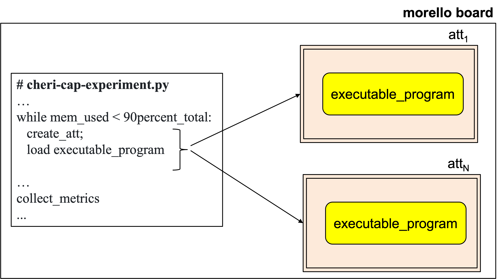

*Figure 1: Memory exhaustion by attestable replicas.*


The graph, shown in Figure 2, shows the behaviour of memory consumption and elapsed time as the number of testable replicas increases on the Morello Board.


*Figure 2: Memory consumption and elapsed time versus number of replicas on the Morello board.*


Imagine that user Alice is conducting the experiment. To create the attestables and collect the metrics, Alice executes the following steps:

1. **Initiation:** In the Morello board, Alice initiates *cheri-cap-experiment.py*.

2. **Launch:** To launch *cheri-cap-experiment.py*, Alice executes:

            $ python3 cheri-cap-experiment.py

3. `python3 cheri-cap-experiment.py` runs incrementally, creating attestable replicas until it detects that the attestables have consumed 90% of the 17,118.4 MB of the Morello Board's memory, that is, about 15,406.5 MB.


**Preliminary observations:**

The results are shown in replication of attestable results and exhibit an unexpected behaviour. We expected memory consumption to increase steadily from 1,628.3 MB, which corresponds to a single attestable replica, to 15,406.5 MB (90% of total memory) consumed by N attestable replicas. The aim was to determine the value of N.

However, unexpectedly, memory consumption increased steadily only up to the creation of 3,800 attestable replicas, which consumed 14,582.5 MB. Beyond that, intriguingly, memory consumption decreases as the number of attestable replicas increases. Note that the last metric shows that 8,991 attestable replicas consume 13,066.4 MB (approximately 76% of the total memory).

We do not have an explanation for that yet. We need to double check measurements. We are showing this preliminary result only to show that this is a pending question in our agenda. The analysis of the time to wipe the memory of the attestable replicas is also pending.


# 2. CPU Performance Tests on the Morello Board

The main aim of this experiment is to measure and analyse the performance of the Morello Board's CPU by comparing the results of identical tests carried out inside and outside a secure enclosure. The tests measured the time required to perform computational operations, including complex mathematical functions, arithmetic operations with integers, floating point operations and matrix manipulation. The complex mathematical functions included sine, cosine, tangent, square root and logarithm. The integer arithmetic tests focused on multiplication, division, subtraction and modulo operations. For floating point operations, the focus was also on multiplication, division and subtraction. The matrix manipulation test involved initialising matrices and performing operations such as multiplication and division. The execution time of each operation was measured and recorded. These tests were repeated 100 times for each operation in both environments - inside the secure compartment and in the Morello Board's normal operating environment - and the results were saved in a CSV format file for each environment. Algorithm 1 details how to carry out the CPU performance tests and record the results.


<pre style="border: 1px solid #ddd; padding: 10px; background-color: #f9f9f9; font-family: monospace;">
Algorithm 1: CPUPerformance

1. perform_tests(log_file, total_time)
2. begin
3.     for test_num in NUM_TESTS do
4.         start_time = capture_time()
5.         execute_operations(WORKLOAD_SIZE)
6.         end_time = capture_time()
7.         cpu_time = calculate_cpu_time(start_time, end_time)
8.         results(log_file, test_num, cpu_time)
9.         total_time += cpu_time
10.    endfor
11. end
</pre>


Execution begins with the `perform_tests` function (line 1), which receives as parameters a log file where the results will be stored and the total accumulated time needed to run the tests. The function enters a repeat loop, repeated the number of times specified by `NUM_TESTS` (line 3), where each iteration represents a test identified by `test_num`. In each iteration, the initial test time is recorded (line 4), followed by the execution of the computational operations determined by `WORKLOAD_SIZE` (line 5). After execution, the final time is recorded (line 6), and the total CPU time used is calculated by subtracting the `start_time` from the `end_time` (line 7). This time is then logged, along with the test number (line 8), and added to `total_time`, which accumulates the total time spent across all tests (line 9).

The code used for the tests is available from the [tee-morello-performance-experiments repository](https://github.com/gca-research-group/tee-morello-performance-experiments/tree/main/cpu-performance).


**Test procedure**

Suppose user Alice is conducting the experiment. To carry out the CPU performance tests and collect the results, Alice takes the following steps:

1. **Start:** Alice compiles and runs the test program in the two scenarios described above:

    - **Inside the compartment:** Alice runs the program `cpu-in-experiment.c` on the Morello Board, using the secure environment.

        - **Compile:**
            `clang-morello -march=morello+c64 -mabi=purecap -o cpu-in-experiment cpu-in-experiment.c -lm`

        - **Run:**
            `proccontrol -m cheric18n -s enable ./cpu-in-experiment`

    - **Outside the compartment:** Alice runs the program `cpu-out-experiment.c` in the Morello Board's normal operating environment.

        - **Compile:**
            `clang-morello -o cpu-out-experiment cpu-out-experiment.c -lm`

        - **Run:** `./cpu-out-experiment`

2. **Execution:** The program iterates automatically through the different types of operations, performing complex mathematical calculations, arithmetic operations with integers, floating point operations, and matrix manipulation.

3. **Repetition:** Each operation is repeated 30 times. The time of each operation is recorded in files in CSV format for both environments.


**Results**

The results of the tests carried out inside the secure compartment were stored in the file `cpu-in-experiment-result.csv`, while the results of the run in the Morello Board's normal environment were stored in `cpu-out-experiment-result.csv`. The Table 1 compares the average execution times for each type of operation in the two environments.

#### Table 1: CPU Time Comparison

| Test Type | CPU Time (ms) - Out Compartment | CPU Time (ms) - In Compartment |
|-----------|----------------------------------|-------------------------------|
| Math      | 46,696                           | 69,998                        |
| Int       | 923                              | 993                           |
| Float     | 816                              | 785                           |
| Array     | 1,419                            | 1,460                         |


**Analysing the results**

According to the Table 1, the results show that, on average, complex mathematical operations within the secure compartment took 69,998 ms, while in the normal operating environment the time was 46,696 ms, representing a difference of approximately 49,74%. For arithmetic operations with integers, the average time was 993 ms inside the secure compartment and 923 ms in the normal operating environment, a difference of 7,58%. For floating point operations, the time inside the safe compartment was 785 ms compared to the normal operating environment (816 ms), showing a slight improvement of 3,80%. As for matrix manipulation operations, the time inside the safe compartment was 1,460 ms, while in the normal operating environment it was 1,419 ms, indicating an increase of 2,89%.

The Figure 3 illustrates the differences in performance between operations conducted within and outside the secure compartment.


*Figure 3: Comparison of CPU performance times in and out of the secure compartment on the Morello board.*

These results suggest that the Morello Board's safe compartment introduces a small performance overhead in more complex operations, such as mathematical calculations. However, for simpler operations, such as floating point, the difference is minimal, with a slight increase in execution time within the secure compartment. This indicates that the safe compartment can be used efficiently in specific scenarios without significantly compromising performance, although the impact is more noticeable in operations that require more processing.


# 3. Memory Performance Tests on the Morello Board

The main aim of this experiment is to measure and analyse the performance of memory operations on a Morello Board by testing memory blocks of different sizes. Specifically, the test evaluates the time required to allocate, write, read and free memory blocks. To carry out this experiment, a C program was implemented - according to the formalism in Algorithm 2 - which automates the memory testing process. The programme runs repeated tests, increasing the size of the blocks at each stage and recording the times of each operation. The results are stored in a file in CSV format. The tests were carried out in two different environments: inside the TEE, where the programme was compiled for the CHERI architecture and run in a secure compartment of the Morello Board; and outside the TEE, where the programme was compiled and run in the normal operating environment of the Morello Board.


<pre style="border: 1px solid #ddd; padding: 10px; background-color: #f9f9f9; font-family: monospace;">
Algorithm 2: MemoryPerformance

1. perform_tests(log_file, total_time)
2. begin
3.     foreach block_size in MIN_BLOCK_SIZE to MAX_BLOCK_SIZE step BLOCK_STEP do
4.         foreach test_num from 1 to NUM_TESTS do
5.             allocation_time = time(malloc(block_size))
6.             write_time = time(write_to_memory(block, block_size))
7.             read_time = time(read_from_memory(block, block_size))
8.             free_time = time(free(block))
9.             log(log_file, block_size, test_num, allocation_time, write_time, read_time, free_time)
10.        endfor
11.    endfor
12. end
</pre>


Algorithm 2 details how to perform memory performance tests and record the results. Execution begins with the `perform_tests` function (line 1), which receives as parameters a log file where the results will be stored and the total accumulated time needed to run the tests. The function enters a repeat loop that iterates over different memory block sizes, defined from `MIN_BLOCK_SIZE` to `MAX_BLOCK_SIZE` with increments specified by `BLOCK_STEP` (line 3). For each block size, another loop is started, repeating the tests the number of times defined by `NUM_TESTS` (line 4). At each iteration, the memory allocation time is measured with the `malloc` function (line 5), followed by the time to write to the block (line 6), the time to read the block (line 7), and, finally, the time to free the memory with the `free` function (line 8). These times are recorded in the log file along with the test number (line 9). After all iterations for all the memory blocks, the process is completed, allowing the performance of the memory allocation, write, read, and free operations to be measured and compared across different block size configurations.


**Experimental Configuration**

1. The memory blocks tested range from 100 MB to 1 GB, with increments of 100 MB at each step. Each test involves 30 iterations per block size. The diagram in the Figure 4 shows the block pattern and the times for each operation associated with different block sizes.


*Figure 4: Memory performance at different block sizes on the Morello board.*


The operations measured are:

      a. Memory allocation: time required to allocate a block of memory.
   
      b. Writing to Memory: time required to write data to the entire allocated memory block.

      c. Memory read: time taken to read the data from the entire memory block.

      d. Memory release: time taken to release the memory block back into the system.
   

2. The code for the experiment we carried out is available in the [tee-morello-performance-experiments repository](https://github.com/gca-research-group/tee-morello-performance-experiments/tree/main/memory-performance).


**Test procedure**

Imagine that user Alice is conducting the experiment. To carry out the memory performance tests and collect the results, Alice performs the following steps:

1. **Start:** Alice compiles and runs the test programme in two different scenarios:

    - **Inside the compartment:** Alice runs the programme `memory-in-experiment-result.c` on the Morello Board, using the secure environment.

        - **Compile:**
            `clang-morello -march=morello+c64 -mabi=purecap -o memory-in-experiment memory-in-experiment.c -lm`

        - **Run:**
            `proccontrol -m cheric18n -s enable ./memory-in-experiment`

    - **Outside the compartment:** Alice runs the programme `memory-out-experiment-result.c` in the normal operating environment of the Morello Board.

        - **Compile:**
            `clang-morello -g -o memory-out-experiment memory-out-experiment.c -lm`

        - **Run:** `./memory-out-experiment`

2. **Execution:** The programme automatically iterates over the memory block sizes, from 100 MB to 1 GB, performing the following sequence for each block size: allocate the block, write to the block, read the block, and release the block.

3. **Repetition:** For each block size, these steps are repeated 30 times, both inside and outside the compartment. The time of each operation is recorded and saved in a CSV file for the environment.


**Results**

For each CSV file, the iteration averages were calculated for each memory block size in the Allocation Time, Write Time, Read Time and Free Time attributes. For each memory block value (100 MB, 200 MB, etc.), the times measured in the iterations were added together and the average was obtained for each operation (allocation, write, read and free). This was done separately for the two files, representing in-compartment and out-of-compartment executions, respectively, as shown in the Tables 2 and 3.


#### Table 2: In Compartment

| Block Size (MB) | Allocation Time (ms) | Write Time (ms) | Read Time (ms) | Free Time (ms) |
|-----------------|----------------------|-----------------|----------------|----------------|
| 100             | 106                  | 295,308         | 282,576        | 97             |
| 200             | 138                  | 590,498         | 565,152        | 272            |
| 300             | 138                  | 885,784         | 847,719        | 318            |
| 400             | 141                  | 1,180,815       | 1,130,297      | 492            |
| 500             | 131                  | 1,476,014       | 1,412,881      | 321            |
| 600             | 168                  | 1,771,086       | 1,695,456      | 399            |
| 700             | 251                  | 2,066,147       | 1,978,022      | 725            |
| 800             | 235                  | 2,361,646       | 2,260,586      | 738            |
| 900             | 312                  | 2,656,590       | 2,543,166      | 1,197          |
| 1000            | 265                  | 2,951,487       | 2,825,741      | 405            |


#### Table 3: Out Compartment

| Block Size (MB) | Allocation Time (ms) | Write Time (ms) | Read Time (ms) | Free Time (ms) |
|-----------------|----------------------|-----------------|----------------|----------------|
| 100             | 2                    | 282,574         | 322,944        | 3              |
| 200             | 2                    | 565,140         | 645,880        | 4              |
| 300             | 1                    | 847,708         | 968,814        | 5              |
| 400             | 3                    | 1,130,294       | 1,291,766      | 7              |
| 500             | 3                    | 1,412,856       | 1,614,708      | 6              |
| 600             | 2                    | 1,695,426       | 1,937,630      | 6              |
| 700             | 2                    | 1,977,999       | 2,260,573      | 8              |
| 800             | 2                    | 2,260,593       | 2,583,527      | 8              |
| 900             | 2                    | 2,543,151       | 2,906,485      | 8              |
| 1000            | 2                    | 2,825,742       | 3,229,433      | 9              |


**Analysing the results**

The results illustrated in the graphs in Figure 5 reveal some trends in relation to the four main operations: allocating, writing, reading and freeing memory.


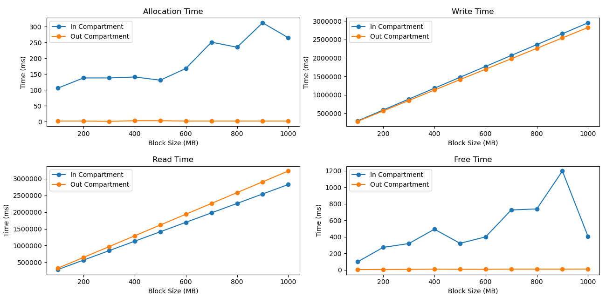

*Figure 5: Performance analysis of memory operations on the Morello board.*


- **Allocation time:** the values resulting from the tests in the secure compartment range from 106 ms for 100 MB blocks to 251 ms for 700 MB blocks, with some variations across block sizes. In the Morello Board's normal operating environment, the allocation time is considerably shorter, ranging from 5 ms (100 MB) to 7 ms (900 MB).

- **Write time:** in both environments, the times follow a linear behaviour as the block size increases. In the secure compartment, the values start at 295,308 ms for 100 MB blocks and reach 2,951,487 ms for 1 GB blocks. In the normal operating environment, the times are slightly longer, ranging from 491,512 ms (100 MB) to 4,903,282 ms (1 GB).

- **Read time:** the results also show a linear behaviour in both environments. Inside the secure compartment, the read time starts at 282,576 ms (100 MB) and increases up to 2,825,741 ms (1 GB). In the normal operating environment, the times vary from 245,263 ms (100 MB) to 2,452,597 ms (1 GB), being slightly longer.

- **Memory release time:** shows similar behaviour in both environments. In the secure compartment, the time varies from 97 ms (100 MB) to 1,197 ms (900 MB), while in the normal operating environment the times are lower, ranging from 4,499 ms (100 MB) to 44,750 ms (1 GB).

Therefore, the results show that the secure environment imposes a greater burden on allocation time, with significant variations compared to the normal operating environment. On the other hand, write time and read time follow similar patterns, with the secure environment showing slightly higher results. However, the memory release time stands out, being significantly higher in the secure compartment. These results indicate that although the secure compartment imposes some overhead, it can still be used efficiently for memory operations.


# 4. Morello Board Pipe Communication Performance Tests

The main objective of this experiment is to measure the performance of communication between processes on the Morello Board using pipes, evaluating the time taken to write and read messages. The experiment was run both inside a secure compartment and outside the compartment, in the normal operating environment of the Morello Board. The aim is to compare the performance of these two scenarios and understand the impact of secure memory compartmentalisation on the communication time between processes.

To conduct this experiment, we developed a C programme that automates the exchange of messages between parent and child processes via a pipe, used here as a communication mechanism between processes. During the experiment, the child process is tasked with writing messages of a predetermined length to the pipe. At the same time, the parent process reads these messages, recording the write and read times. The programme has been specifically configured to test messages of a defined size, with each test timing the writing and reading times. The results of these tests are recorded in a file in CSV format. Algorithm 3 gives a detailed description of the experimental flow.


<pre style="border: 1px solid #ddd; padding: 10px; background-color: #f9f9f9; font-family: monospace;">
Algorithm 3: PipeCommunicationPerformance

1.  start_test(log_file)              
2.  begin
3.      define STRLEN  
4.      define NUM_OF_MSG 
5.      for test_num from 1 to NUM_OF_MSG do
6.          if child_process
7.              start_timer(write_time)     
8.              write(pipe, message of size STRLEN)        
9.              stop_timer(write_time)      
10.             write(pipe, write_time)     
11.         else parent_process
12.             read(pipe, message of size STRLEN)         
13.             read(pipe, write_time)      
14.             start_timer(read_time)      
15.             stop_timer(read_time)       
16.             log(log_file, test_num, write_time, read_time) 
17.         endif
18.     endfor
19. end
</pre>


In Algorithm 3, the `start_test` function (line 1) starts a sequence of operations involving writing and reading messages through a pipe. First, the `STRLEN` and `NUM_OF_MSG` parameters are set in lines 3 and 4, establishing the size of the messages and the total number of messages to be sent. For each test, which iterates from 1 to `NUM_OF_MSG` (line 5), the child process, if active, starts timing the write time (line 7), writes a message of size `STRLEN` to the pipe (line 8), and then records the write time (line 9), sending this time back to the parent process via the pipe (line 10). In parallel, the parent process reads the message and the write time from the pipe (lines 12 and 13), starts counting the read time as soon as it starts reading (line 14), and stops counting when it finishes reading (line 15). The write and read times, along with the test number, are recorded in the log file (line 16). This process is repeated until all the tests have been completed (line 17).


**Experimental Configuration**

1. The experimental configuration used to evaluate communication between processes via a pipe was made up of data blocks, represented by messages, with a standard size of 1024 bytes per message. A total of 100 messages were tested in order to analyse the consistency and efficiency of communication between processes.

The operations measured are:

   - **Writing to memory:** time taken to write data to the pipe.

   - **Memory read:** time taken to read the data sent via the pipe.


2. The code for the experiment we carried out is available in the [tee-morello-performance-experiments repository](https://github.com/gca-research-group/tee-morello-performance-experiments/tree/main/pipe-performance).


**Test procedure**

Imagine that user Alice is conducting the experiment. To carry out the pipe communication tests and collect the results, Alice performs the following steps:

1. **Start:** Alice compiles and runs the test programme in two different scenarios:

    -   **Inside the compartment:** Alice runs the programme `pipe-in-experiment.c` on the Morello Board, using the secure environment.

        - **Compile:**
            `clang-morello -march=morello+c64 -mabi=purecap -o pipe-in-experiment pipe-in-experiment.c`

        - **Run:**
            `proccontrol -m cheric18n -s enable ./pipe-in-experiment`

    - **Outside the compartment:** Alice runs the programme `pipe-out-experiment.c` in the normal operating environment of the Morello Board.

        - **Compile:**
            `clang-morello -g -o pipe-out-experiment pipe-out-experiment.c`

        - **Run:** `./pipe-out-experiment`

2. **Execution:** The programme sends a total of 100 messages, each of a predefined size of 1024 bytes. For each message sent by the child process, the write time is measured and the message, along with the write time, is transmitted via the pipe to the parent process, which in turn records the read time as soon as the message is received.

3. **Repetition:** Each set of write and read operations is repeated 100 times for each environment - inside the compartment and outside the compartment. The times of each operation are recorded in a file in CSV format for each environment.


**Results**

The results of the tests carried out inside the secure compartment were stored in the file `pipe-in-experiment-result.csv`, while the results of the normal ambient execution of the Morello Board were stored in `pipe-out-experiment-result.csv`. The Tables 4 and 5 shows the records for each data set:


#### Table 4: Performance Data Inside the Compartment

| Test | Message Size (Bytes) | Write Time (ms) | Read Time (ms) | Total Time (ms) |
|------|-----------------------|-----------------|----------------|-----------------|
| 1    | 1024                  | 0.016           | 0.161          | 0.177           |
| 2    | 1024                  | 0.003           | 0.068          | 0.071           |
| 3    | 1024                  | 0.003           | 0.075          | 0.078           |
| 4    | 1024                  | 0.003           | 0.077          | 0.080           |
| ...  | ...                   | ...             | ...            | ...             |
| 100  | 1024                  | 0.003           | 0.079          | 0.082           |


#### Table 5: Performance Data Outside the Compartment

| Test | Message Size (Bytes) | Write Time (ms) | Read Time (ms) | Total Time (ms) |
|------|----------------------|-----------------|----------------|-----------------|
| 1    | 1024                 | 0.013           | 0.059          | 0.072           |
| 2    | 1024                 | 0.001           | 0.001          | 0.003           |
| 3    | 1024                 | 0.001           | 0.001          | 0.002           |
| 4    | 1024                 | 0.001           | 0.001          | 0.002           |
| ...  | ...                  | ...             | ...            | ...             |
| 100  | 1024                 | 0.001           | 0.002          | 0.003           |


The Tables 4 and 5 contain information on the test number, the size of the messages, the write and read times, and the total time for each operation.


**Analysing the results**

The graphs in the Figure 7 show the write and read times for each test in the two scenarios, inside and outside the secure environment (compartment) on the Morelo Board.


*Figure 7: Comparison of write and read times for pipe communication in secure and normal environments on the Morello Board.*


As we can see, the graphs reflect variations in write and read times, both inside and outside the safe room environment. There are fluctuations in the times recorded which may point to variability in the pipe's performance under different operating conditions. When comparing the graphs for the two environments, it is possible to notice differences in the times, which suggests that security configurations or differences in the operating environment can significantly influence communication efficiency.


# 5. Testing the Exposure of Sensitive Data in Memory Regions through Direct Memory Access (Memory Scraping)

The main aim of this experiment is to measure and analyse the contents of the memory regions with read and write (RW) permissions of a running target program. This target program is the same one used in the Attestable's performance evaluation experiment, `integration_process`. To do this, the experiment identifies the program's RW memory regions and attempts to directly extract the content stored in these regions, using the Python script `memory_reader.py`, available in the [tee-morello-performance-experiments repository](https://github.com/gca-research-group/tee-morello-performance-experiments/tree/main/security-single-compartment-performance). This experiment evaluates the potential for exposing sensitive data in memory by directly accessing areas where the program may store temporary or sensitive data.


**Experimental Configuration**

The Figure 8 sequence diagram details how a programme's memory regions can be accessed directly from the operating system. To achieve this, the **Memory Reader** first requests the **Cheri OS** for the **PID** of the target process by its name, using the method `getPID(processName)`. In response, **Cheri OS** returns the corresponding **PID**. Next, the **Memory Reader** uses the obtained **PID** to request a list of memory regions associated with the process that have read and write (RW) permissions. This is done through the method `getMemoryAddresses(PID)`, and **Cheri OS** responds with the mapped memory regions. Once the memory regions are retrieved, the **Memory Reader** begins scraping the memory directly. For each RW region, it fetches the starting address by calling `seek(startAddress)` on the **Memory**, and receives an acknowledgement. Then, the **Memory Reader** reads the content from the start to the end address using `read(startAddress to endAddress)`, and the **Memory** returns the decoded data. This process is repeated for all RW regions to ensure complete access to the memory areas that are allowed for reading and writing. Finally, the **Memory Reader** logs the data it has read by calling `output(dataReadFromMemory)`, which records the scraped data for future use.


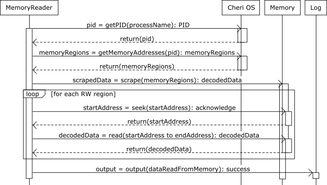

*Figure 8: Sequence diagram detailing the memory scraping process through direct access in the Cheri OS.*


**Test procedure**

To carry out the direct memory reading experiment, Alice performs the following steps on the Morello Board:

1.  **Start:** Alice compiles and runs the programme `memory_reader.py` in two different scenarios:

    -   **Inside the compartment:** Alice compiles and runs the `integration-process-in-experiment.c` programme on the Morello Board, using the secure environment.

        -   **Compile:**
            `clang-morello -march=morello+c64 -mabi=purecap -o integration-process-in-experiment integration_process-in-experiment.c -lssl -lcrypto -lpthread`

        -   **Run:**
            `proccontrol -m cheric18n -s enable ./integration-process-in-experiment`

    -   **Outside the compartment:** Alice compiles and runs the `integration-process-out-experiment.c` programme in the Morello Board's normal operating environment.

        -   **Compile:**
            `clang-morello -o integration_process-out-experiment integration-process-out-experiment.c -lssl -lcrypto -lpthread`

        -   **Run:** `./integration-process-out-experiment`

2.  **Launch:** Alice starts the script that performs direct memory reading with the following command:

    -   **Run:** `python3 memory_reader.py`

3.  **Execution:** `memory_reader.py` cycles through each RW region, directly reading the data between the start and end addresses of each region. Alice observes the results on the terminal output.

**Results**

The Table 6 shows the results of tests carried out to evaluate access to sensitive data stored and processed by
integration_process running in different environments - inside and outside Morello's secure enclosure. Each test varied the user's permission level (root or with reduced permissions), recording whether memory access was successful and whether sensitive data was visible.


#### Table 6: Access Control Test Results for Sensitive Data

| Test | Environment     | User Permissions | Access Result | Sensitive Data Visible |
|------|-----------------|------------------|---------------|------------------------|
| 1    | in Compartment  | Root             | Success       | Yes                    |
| 2    | in Compartment  | Different user   | Failure       | No                     |
| 3    | out Compartment | Root             | Success       | Yes                    |
| 4    | out Compartment | Different user   | Failure       | No                     |


Table 6 metadata:

### Description of Test Parameters

- **Test ID:** Unique identification for each test carried out.
- **Environment:** Indicates whether the test was carried out inside Morello's secure compartment or in the normal operating environment.
- **User Permissions:** Details the user's permission level (e.g., root or a user with reduced permissions).
- **Access Result:** Result of the access, indicating whether the memory region was successfully accessed.
- **Sensitive Data Visible:** Indicates whether the test was able to visualize sensitive data or not.


**Analysing the results**

The graph in the Figure 9 shows the differences in the results of access and visibility of confidential data according to the environment and user permissions.


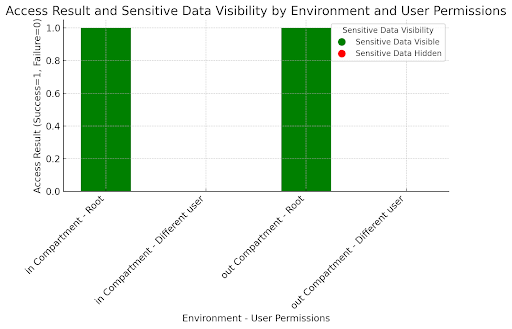

*Figure 9: Differences in access results and visibility of confidential data based on environment and user permissions.*


The results show that access to sensitive data is allowed to any user with root permissions, both in Morello's secure compartment and outside it, indicating that high permissions grant unrestricted access. In contrast, users with reduced permissions are unable to access this data in either environment, demonstrating that the secure enclosure consistently blocks unauthorised access, while the environment outside the enclosure also maintains effective controls.

However, although compartmentalisation is designed to protect sensitive data by restricting access, including to the user who initiated the process, the results indicate that the current configuration may not be sufficient to guarantee complete isolation. This behaviour highlights the importance of investigating further adjustments to the Morello Board's compartmentalisation, especially for contexts where there is a need to protect sensitive data.


# PRINTS

:exclamation: **Just for note-taking purposes.**


**Process memory regions running outside the secure compartment:**

<div style="display: flex; padding: 0; margin: 0; gap: 0;">
    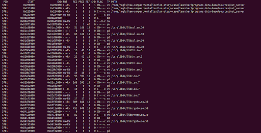
    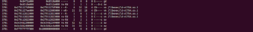
</div>

*Figure 10: Process memory regions running outside the secure compartment.*


**Memory regions of the process running inside the secure compartment:**


<div style="display: flex; padding: 0; margin: 0; gap: 0;">
    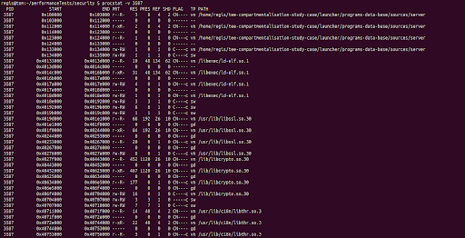
    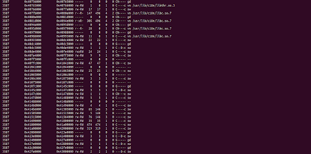
    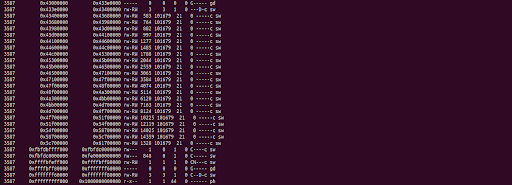
</div>

*Figure 11: Memory regions of the process running inside the secure compartment.*


**Finalisation of the process by the system**

The process runs for a certain period of time (around 1 hour) and is finalised by the system: `killed`.


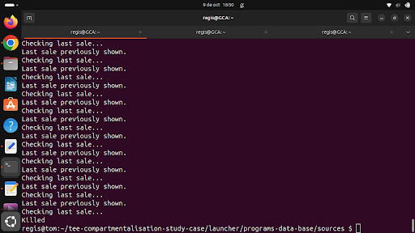

*Figure 12: Finalisation of the process by the system.*


**The morello board crashed at this point.**

Regis needs to contact the morello-board s administrator \[erik\] to reboot.


*Figure 13: The Morello board crashed at this point.*


The remote ssh shell that connects to the morello board crashes when the mem scanner prog tries to read this range of mem add: `0x4a300000 - 0x4bb00000`.

Other ssh shell connections continue working as normal.

There are occasion when the prog manage to crash the whole morello board \[the actual cheriBSD\] , no more shells can be opened. It seem that total crash takes place when the prog tries to read some specific mem ranges \[we dont know which ones cause total crashes; we believe that they are ranges where priviledge soft runs.

This is our preliminary observation.


*Figure 14: client_loop: send disconnect: Broken pipe.*


**Error occurs after server crash and restart \[Erik\].**

**Error accessing process memory:**

    [Errno 2] No such file or directory: /proc/3587/mem

This error occurs because the file `/proc/{pid}/mem`, which the script tries to access to read a process's memory, is not available or cannot be accessed. This may happen if the process does not exist, the PID is incorrect, or the script does not have the necessary permissions to access this path.


![\[Errno 2\] No such file or directory: *Figure 15: \[Errno 2\] No such file or directory: .](figs/error.png)

*Figure 15: \[Errno 2\] No such file or directory: `/proc/3587/mem`.*


**Procedure for running `memory_reader.py` after MB is rebooted.**

Check that /proc is mounted correctly:


*Figure 16: Check that /proc is mounted correctly.*


If it's not mounted, you need to try mounting it:


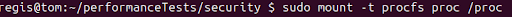

*Figure 17: If it's not mounted, you need to try mounting it.*


After the command to mount /proc, it was simply possible to run the `memory_reader.py` script again.


## Acknowledgements

To **Carlos Molina-Jimenez** ([carlos.molina@cl.cam.ac.uk](mailto:carlos.molina@cl.cam.ac.uk)) from the Computer Lab, University of Cambridge, and **Rafael Zancan-Frantz** ([rzfrantz@unijui.edu.br](mailto:rzfrantz@unijui.edu.br)) from the Applied Computing Research Group, Unijuí University, Brazil, for their guidance in defining the types of experiments and in evaluating the results.


## Corresponding Author

**Regis Rodolfo Schuch**  
*Applied Computing Research (GCA) Group, Unijui University, Brazil*  
[regis.schuch@unijui.edu.br](mailto:regis.schuch@unijui.edu.br)

