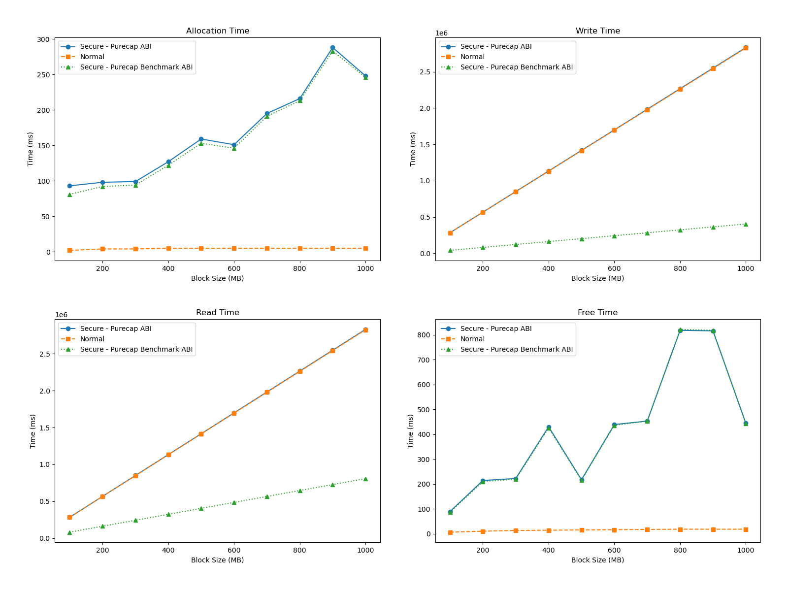
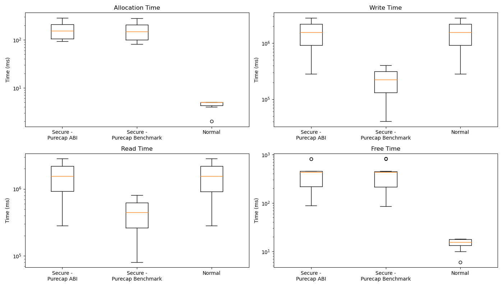
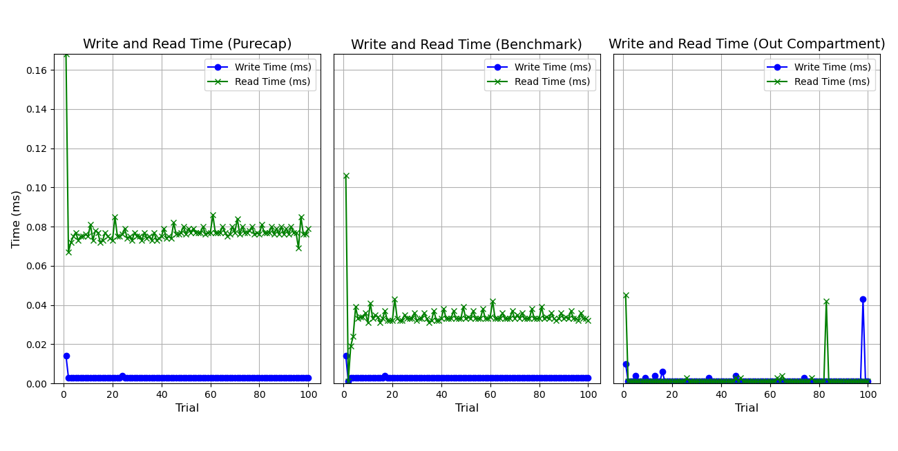

<h1 style="font-size: 2em;">Evaluation of performance and security strengths of library-based compartments created on Morello Boards</h1>

This repository evaluates compartments created using the library-based compartmentalisation tool available on Morello Boards running the cheriBSD 24.5 operating system. It  evaluates the performance costs incurred by the compartments and the strengths of the memory isolation that they provide. It provides links to the Git repositories that store the C and Python codes used in the evaluation and the metrics collected in CSV files. It also includes the plots of the results, a discussion of our interpretation and detailed instructions to encourage practitioners to repeat our experiments and compare their results against ours. 


# 1. Experiments Setup

To run the experiments reported in this document, we use four Morello Boards connected as shown in **Figure 1**.

- Three local Morello Boards are physically located in the William Gates building of the Computer Laboratory.
- A remote Morello Board is physically located in Toronto, within the premises of [TODAQ](https://engineering.todaq.net/), a non-funding partner of the [CAMB project](https://www.cl.cam.ac.uk/research/srg/projects/camb/).

We connect to the remote Morello Board through SSH from a laptop connected to the network of the [Applied Computing Research Group (GCA)](http://gca.unijui.edu.br/) at Unijuí, Brazil.

The figure below shows the main configuration parameters of the Morello Board under evaluation. **Table 1** lists additional parameters and the CheriBSD commands that can be used to double-check the configuration parameters.


*Figure 1: Morello boards used in the evaluation.*

## 1.1. Morello Board Configuration

**Table 1** lists the configuration parameters of the Morello Board used in the experiments, along with CheriBSD commands to verify them.

| **Component**           | **Specification**                                     | **Command**                                        |
|------------------------|-----------------------------------------------------|---------------------------------------------------|
| **Operating System**   | CheriBSD 24.5 (FreeBSD 15.0-CURRENT)                 | `uname -a`                                        |
| **Kernel Version**     | FreeBSD 15.0-CURRENT, releng/24.05                   | `uname -v`                                        |
| **Board**             | Morello System Development Platform                   | `kenv | grep smbios.system.product`              |
| **RAM**               | 17 GB detected (16 GB DDR4, 2933 MT/s, ECC)           | `dmidecode --type memory`                        |
| **Storage**           | SSD                                                  | `camcontrol identify ada0`                       |
| **Architecture**      | aarch64c (with CHERI support)                         | `sysctl hw.machine_arch`                         |
| **Processor Model**   | Research Morello SoC r0p0                            | `sysctl hw.model`                                |
| **Number of CPUs**    | 4                                                    | `sysctl hw.ncpu`                                 |
| **Compiler**         | clang (with Morello support)                          | `clang-morello --version`                        |
| **Tool**              | proccontrol (for CHERI compartments)                  | `proccontrol -m cheric18n -s enable ./binary`    |
| **Python**           | Python 3 (required for Experiments 1, 5, and 6)        | `python3 --version`                              |
| **Scripts Used**     | cheri-cap-experiment.py, cpu-in-experiment.c, memory-in-experiment.c, pipe-in-experiment.c, pipe-trampoline-in-experiment.c, library_a.c, library_b.c, memory_reader.py, integration_process.c | Not applicable |
| **Access**            | Remote via SSH                                       | `ssh -i private_key user@server`                |

---

## 1.2. Compilation and Execution

The inclusion of library-based compartments is determined at compilation and execution time. It is documented in:

- **CHERI Software Compartmentalization** [Robert Watson, 2019](https://www.cl.cam.ac.uk/research/security/ctsrd/cheri/cheri-compartmentalization.html).
- **Library-based Compartmentalisation** [Cheri team, 2022](https://github.com/CTSRD-CHERI/cheripedia/wiki/Library-based-Compartmentalisation).
- **User-level software compartmentalization (experimental)** [Cheri team, 2024](https://ctsrd-cheri.github.io/cheribsd-getting-started/features/c18n.html).
- **Compartmentalization, c18n — Library-based software compartmentalization** [Dapeng Gao, 2024](https://man.cheribsd.org/cgi-bin/man.cgi/c18n).
- **Library-based Compartmentalisation on CHERI** [Dapeng Gao and Robert Watson, Plarch2023](https://github.com/CAMB-DSbD/tee-morello-performance-experiments/blob/main/documents/LibraryBasedCompartmentalisationOnCHERI_Dapeng2023.pdf).
- **Dapeng's Video Presentation** (Plarch2023) provides a summary of the architecture. [Watch here](https://www.youtube.com/watch?v=0Zk0NzfiQJA).


### Userspace Execution Environments

As explained in the [User Level Process Environments](https://ctsrd-cheri.github.io/cheribsd-getting-started/features/processes.html), in CheriBSD 24.05, a user can compile a program to run in three different execution environments:

- **CheriABI processes**: Use `-mabi=purecap`.
- **Benchmark ABI processes**: Use `-mabi=purecap-benchmark`.

A useful example of the compilation of `helloworld.c` can be found [here](https://ctsrd-cheri.github.io/cheribsd-getting-started/helloworld/index.html).

To verify the ABI targeted by the compiler, the following command can be used:

```bash
root# file binary
```

Programs to be run in **library-based compartments** can be compiled with either `-mabi=purecap` or `-mabi=purecap-benchmark`. However, for performance evaluation, the latter is recommended. See [man compartmentalization](https://man.cheribsd.org/cgi-bin/man.cgi/c18n) for details.

---

## 1.3. Compilation and Execution Without Library-Based Compartments

To compile and execute a program **without** using library-based compartments, use:

```bash
$ clang-morello -o hello hello.c

$ ./helloworld
```


## 1.4. Compilation and Execution With Library-Based Compartments

### 1.4.1.  **Compilation for Purecap ABI**

To enable **library-based compartments** during compilation, use:

```bash
$ clang-morello -march=morello+c64 -mabi=purecap -o helloworld helloworld.c
```

#### **Explanation of Compilation Parameters**
- `-march=morello+c64`: Defines the 64-bit Morello architecture.
- `-mabi=purecap`: Targets the **Application Binary Interface (ABI)**, implementing all memory references and pointers as **capabilities**.

To execute the compiled program **within a library-based compartment**, use:

```bash
$ proccontrol -m cheric18n -s enable helloworld
```

The **proccontrol** command enables execution within a **library-based compartment**.

---

### 1.4.2. **Compilation for Purecap-Benchmark ABI**

The compilation and execution process for **purecap-benchmark ABI** is similar to **purecap ABI**, with the exception of using:

```bash
$ clang-morello -march=morello+c64 -mabi=purecap-benchmark -o helloworld helloworld.c

$ proccontrol -m cheric18n -s enable helloworld
```


# 2. Memory performance in the execution of allocate, release, read and write operations

## Experiment Overview

In this experiment, we executed a set of memory operations on large blocks and measured their execution time. The operations evaluated were:

- **malloc**: Time taken to allocate the block of memory.
- **write**: Time taken to write data to fill the entire memory block.
- **read**: Time taken to read the data from the entire memory block.
- **free**: Time taken to release the memory block.

We used blocks of **100 MB, 200 MB, 300 MB, ..., 1000 MB**, which are typical sizes for applications that process images and access databases.


### Memory Operations Execution Code

```c
perform_tests(log_file, total_time)
begin
 foreach block_size in MIN_BLOCK_SIZE to MAX_BLOCK_SIZE step BLOCK_STEP do        
   foreach test_num from 1 to num_of_trials do
      allocation_time = time(malloc(block_size))
      write_time = time(write_to_memory(block, block_size))
      read_time = time(read_from_memory(block, block_size))
      free_time = time(free(block))
      log(log_file, block_size, test_num, allocation_time, write_time, read_time, free_time)
   endfor
 endfor
end
```

### Explanation

The execution starts with the `perform_tests` function, which takes a log file name as input to store performance metrics. The **outer loop** iterates over different block sizes, while the **inner loop** repeats the test multiple times (`num_of_trials`) for statistical consistency. The measured times for **allocation**, **writing**, **reading**, and **freeing** operations are logged.

## Compilation and Execution

The **C program** was executed both **outside compartments** and **inside compartments**.  
The source code for the memory experiment inside compartments is available here:  
[memory-in-experiment.c](https://github.com/gca-research-group/tee-morello-performance-experiments/blob/main/memory-performance/inside-tee-execution/memory-in-experiment.c)


### **Execution Without Compartments**

```bash
clang-morello -o memory-out-experiment memory-out-experiment.c -lm
./memory-out-experiment
```

The collected metrics are stored in:  
[memory-out-experiment-results.csv](https://github.com/gca-research-group/tee-morello-performance-experiments/blob/main/memory-performance/outside-tee-exection/memory-out-experiment-results.csv)

#### **Performance Results (Without Compartments)**

| Block Size (MB) | Allocation Time (ms) | Write Time (ms) | Read Time (ms) | Free Time (ms) |
|----------------|--------------------|----------------|---------------|--------------|
| 100  | 2.27 ± 4.77  | 282,583.77 ± 13.86  | 282,580.70 ± 12.79  | 6.06 ± 4.52   |
| 200  | 3.58 ± 4.19  | 565,164.33 ± 17.12  | 565,163.29 ± 18.85  | 10.29 ± 4.03  |
| 300  | 3.95 ± 1.77  | 847,755.11 ± 21.18  | 847,752.32 ± 64.89  | 13.42 ± 3.66  |
| 400  | 4.51 ± 3.09  | 1,130,330.18 ± 21.00 | 1,130,327.53 ± 28.20 | 14.38 ± 2.27  |
| 500  | 4.56 ± 3.07  | 1,412,907.30 ± 31.49 | 1,412,903.42 ± 28.92 | 15.17 ± 2.37  |
| 600  | 4.69 ± 1.56  | 1,695,492.67 ± 32.97 | 1,695,492.69 ± 30.19 | 16.20 ± 1.28  |
| 700  | 4.80 ± 1.52  | 1,978,083.02 ± 52.24 | 1,978,097.85 ± 79.47 | 17.07 ± 0.86  |
| 800  | 4.71 ± 1.73  | 2,260,662.02 ± 41.09 | 2,260,660.49 ± 53.11 | 17.57 ± 0.62  |
| 900  | 4.54 ± 0.54  | 2,543,248.84 ± 47.19 | 2,543,233.58 ± 42.16 | 17.57 ± 0.97  |
| 1000 | 4.57 ± 0.50  | 2,825,822.71 ± 47.72 | 2,825,817.71 ± 41.68 | 17.80 ± 0.64  |


### **Execution Inside Compartments (Purecap ABI)**

```bash
clang-morello -march=morello+c64 -mabi=purecap -o memory-in-experiment-purecap memory-in-experiment-purecap.c -lm
proccontrol -m cheric18n -s enable memory-in-experiment-purecap
```

Metrics are stored in:  
[memory-in-experiment-purecap-results.csv](https://github.com/CAMB-DSbD/tee-morello-performance-experiments/blob/main/memory-performance/inside-tee-execution-purecap/memory-in-experiment-purecap-results.csv)

### **Performance of Memory Operations in Compartments (Purecap-Benchmark ABI)**

The following table presents the execution time (mean ± standard deviation) of memory operations performed within compartments created for the **purecap-benchmark ABI**.

| Block Size (MB) | Allocation Time (ms) | Write Time (ms) | Read Time (ms) | Free Time (ms) |
|----------------|--------------------|----------------|---------------|--------------|
| 100   | 81 ± 158.99  | 40,369 ± 4.84  | 80,737 ± 7.56  | 86 ± 178.33  |
| 200   | 92 ± 219.79  | 80,737 ± 6.36  | 161,472 ± 10.22  | 210 ± 395.51  |
| 300   | 94 ± 295.34  | 121,105 ± 7.88  | 242,209 ± 12.70  | 219 ± 452.59  |
| 400   | 122 ± 430.07  | 161,472 ± 8.04  | 322,946 ± 17.29  | 425 ± 783.85  |
| 500   | 153 ± 596.27  | 201,842 ± 11.20  | 403,681 ± 14.85  | 215 ± 417.51  |
| 600   | 146 ± 646.07  | 242,210 ± 12.87  | 484,417 ± 17.45  | 436 ± 917.23  |
| 700   | 191 ± 879.02  | 282,579 ± 13.21  | 565,154 ± 18.71  | 453 ± 987.35  |
| 800   | 213 ± 1,088.59  | 322,947 ± 14.35  | 645,893 ± 17.43  | 822 ± 1,529.08  |
| 900   | 283 ± 1,535.56  | 363,315 ± 14.68  | 726,626 ± 17.13  | 818 ± 1,587.88  |
| 1000  | 246 ± 1,538.68  | 403,685 ± 15.61  | 807,368 ± 18.86  | 443 ± 1,004.74  |


## **Comparison of Results**

The following plot compares the execution times of allocate, write, read, and free operations **with and without compartments**.



### **Key Observations:**
- **Allocation Time:** Memory allocation is significantly slower inside compartments. **100 MB takes ~2ms without a compartment but 93ms in Purecap ABI and 81ms in Purecap-Benchmark ABI**.
- **Write Time:** Write operations increase linearly with block size, with execution inside compartments always taking longer.
- **Read Time:** Read operations also take longer inside compartments compared to non-compartmentalized execution.
- **Free Time:** Memory release is significantly delayed inside compartments, increasing execution time variability.

A boxplot visualizing execution time dispersion is shown below:




# 3. Communication Performance Over Pipes
## Experiment Overview

This experiment evaluates how the use of compartments affects the performance of communication over Unix pipes. We implemented a **C program** that establishes communication between a parent and a child process through a pipe, collecting metrics on write and read operations.


The parent process writes a **1024-byte random string** to the pipe, and the child process reads it. This message size is widely used in **inter-process communication applications**.

### Code Execution

The program was executed **inside compartments** and **without compartments**.  
The source code for the pipe experiment inside compartments is available here:  
[pipe-in-experiment.c](https://github.com/gca-research-group/tee-morello-performance-experiments/blob/main/pipe-performance/inside-tee-execution/pipe-in-experiment.c)


#### Compilation and Execution Inside a Compartment

```bash
clang-morello -march=morello+c64 -mabi=purecap -o pipe-in-experiment pipe-in-experiment.c
proccontrol -m cheric18n -s enable pipe-in-experiment
```

#### Compilation and Execution Without a Compartment

```bash
clang-morello -o pipe-out-experiment pipe-out-experiment.c
./pipe-out-experiment
```

### Metrics Collected

The **write time** (time taken by the parent process to write data) and the **read time** (time taken by the child process to read data) were measured. Each operation was repeated **100 times**, following the **Central Limit Theorem**, which states that a **larger sample size** helps detect finer fluctuations in latency patterns.

### Code Implementation

The following pseudocode describes the experiment:

```c
start_test(log_file)              
 begin
   define MESSAGE_SIZE  
   define NUM_OF_TRIALS 
   for test_num from 1 to NUM_OF_TRIALS do
     if parent_process
        start_timer(write_time)     
        write(pipe, message of size MESSAGE_SIZE)        
        stop_timer(write_time)      
        write(pipe, write_time)     
      else 
        read(pipe, message of size MESSAGE_SIZE)         
        read(pipe, write_time)      
        start_timer(read_time)      
        stop_timer(read_time)       
        log(log_file, test_num, write_time, read_time) 
     endif
    endfor
 end
```

## Results

We collected the execution metrics and stored them in CSV files:

- **Inside Compartments (Purecap ABI)**: [pipe-in-experiment-purecap-results.csv](https://github.com/CAMB-DSbD/tee-morello-performance-experiments/blob/main/pipe-performance/inside-tee-execution-purecap/pipe-in-experiment-purecap-results.csv)
- **Inside Compartments (Purecap-Benchmark ABI)**: [pipe-in-experiment-purecap-benchmark-results.csv](https://github.com/CAMB-DSbD/tee-morello-performance-experiments/blob/main/pipe-performance/inside-tee-execution-purecap-benchmark/pipe-in-experiment-purecap-benchmark-results.csv)
- **Outside Compartments**: [pipe-out-experiment-results.csv](https://github.com/CAMB-DSbD/tee-morello-performance-experiments/blob/main/pipe-performance/outside-tee-execution/pipe-out-experiment-results.csv)

### Performance of Write and Read Operations

#### Inside Compartments (Purecap ABI)

| Trial | Message Size (Bytes) | Write Time (ms) | Read Time (ms) | Total Time (ms) |
|-------|----------------------|-----------------|----------------|----------------|
| 1     | 1024                 | 0.016           | 0.161          | 0.177          |
| 2     | 1024                 | 0.003           | 0.068          | 0.071          |
| 3     | 1024                 | 0.003           | 0.075          | 0.078          |
| 4     | 1024                 | 0.003           | 0.077          | 0.080          |
| ...   | ...                  | ...             | ...            | ...            |
| 100   | 1024                 | 0.003           | 0.079          | 0.082          |

#### Inside Compartments (Purecap-Benchmark ABI)

| Trial | Message Size (Bytes) | Write Time (ms) | Read Time (ms) | Total Time (ms) |
|-------|----------------------|-----------------|----------------|----------------|
| 1     | 1024                 | 0.014           | 0.106          | 0.119          |
| 2     | 1024                 | 0.001           | 0.001          | 0.003          |
| 3     | 1024                 | 0.003           | 0.019          | 0.022          |
| 4     | 1024                 | 0.003           | 0.024          | 0.027          |
| ...   | ...                  | ...             | ...            | ...            |
| 100   | 1024                 | 0.003           | 0.032          | 0.035          |

#### Outside Compartments

| Trial | Message Size (Bytes) | Write Time (ms) | Read Time (ms) | Total Time (ms) |
|-------|----------------------|-----------------|----------------|----------------|
| 1     | 1024                 | 0.013           | 0.059          | 0.072          |
| 2     | 1024                 | 0.001           | 0.001          | 0.003          |
| 3     | 1024                 | 0.001           | 0.001          | 0.002          |
| 4     | 1024                 | 0.001           | 0.001          | 0.002          |
| ...   | ...                  | ...             | ...            | ...            |
| 100   | 1024                 | 0.001           | 0.002          | 0.003          |

### Graphical Analysis

The figure below compares write and read times in different configurations.



### Discussion of Results

- **Write Time**: Execution inside compartments consistently shows higher latency. Write time ranges from **0.016 ms to 0.003 ms** in the purecap ABI and **0.014 ms to 0.003 ms** in the purecap-benchmark ABI. Outside compartments, write time is significantly lower, consistently around **0.001 ms**.
- **Read Time**: The effect of compartments is less severe but still noticeable. The first test for purecap ABI shows **0.161 ms**, compared to **0.059 ms** outside compartments. The purecap-benchmark ABI performs slightly better but remains slower than the non-compartmentalised case.


# 4. Python scripts that can help to summarise and visualise results

If needed, these Python scripts can be used to summarise the 
raw collected metrics and present results graphically. They produce aggregated CSV files and comparative plots.

## 4.1 Python scripst for summary views  

- [Summarise CPU performance results](https://github.com/CAMB-DSbD/tee-morello-performance-experiments/tree/main/cpu-performance/summarise-results)
- [Summarise memory performance results](https://github.com/CAMB-DSbD/tee-morello-performance-experiments/tree/main/memory-performance/summarise-results)


## 4.2  Python script for plotting

- [Maximum number of compartments plots](https://github.com/CAMB-DSbD/tee-morello-performance-experiments/tree/main/max_num_of_compartments_performance/plot-graph)
   
- [Memory performance plots](https://github.com/CAMB-DSbD/tee-morello-performance-experiments/tree/main/memory-performance/plot-graph)

- [CPU performance plots](https://github.com/CAMB-DSbD/tee-morello-performance-experiments/tree/main/cpu-performance/plot-graph)   

- [Pipe communications performance plots](https://github.com/CAMB-DSbD/tee-morello-performance-experiments/tree/main/pipe-performance/plot-graph) 
 

_________________________________________________________________________________________________________________________________________________________________

# 5. PDF version of this report

A PDF version of this document is available for download. Please note that the PDF might be slightly behind this page in terms of updates. If it fails to open 
(Safari ver 16.6.1 produces _Error rendering embedded code_), download 
it first and then open it.

[📄 Download PDF Version](https://github.com/CAMB-DSbD/tee-morello-performance-experiments/blob/main/documents/library_based_compartments_evaluation.pdf)
