<h1 style="font-size: 2em;">Evaluation of performance and security strengths of library-based compartments created on Morello Boards</h1>

This report evaluates compartments created using the library-based compartmentalisation tool available on Morello Boards running the cheriBSD 24.5 operating system. It  evaluates the performance costs incurred by the compartments and the strengths of the memory isolation that they provide. It provides links to the Git repositories that store the C and Python codes used in the evaluation and the metrics collected in CSV files. It also includes the plots of the results, a discussion of our interpretation and detailed instructions to encourage practitioners to repeat our experiments and compare their results against ours. 


# 1. Experiments set up

We use a Morello Board, which is physically located in Toronto, within the premises of [TODAQ](https://engineering.todaq.net/), a non-funding partner of the [CAMB project](https://www.cl.cam.ac.uk/research/srg/projects/camb/). A laptop connected to the network of the [Applied Computing Research Group (GCA)](http://gca.unijui.edu.br/) at Unijuí, Brazil, is used to access the Morello Board via an SSH connection. Below is the main configuration of the Morello Board and additional parameters, including the CheriBSD commands required to output these configurations directly from the board. The Figure 1 illustrates the Morello Board's physical location and the network connection used to access it.

<p align="center">
  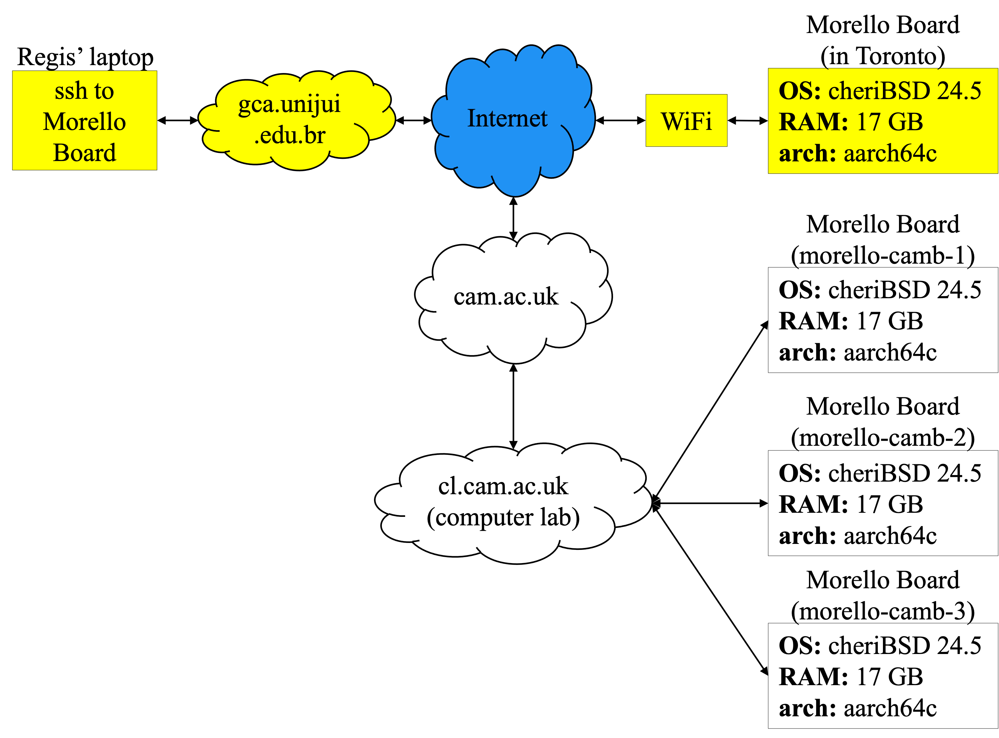
</p>
<p align="center"><em>Figure 1: Morello Boards location.</em></p>


We specify the hardware and software configurations of the Morello Board used in the experiments in Table 1.

<div align="center">
<p><em>Table 1. Morello board configuration parameters used in the experiments and the online cheriBSD commands to output them.</em></p>

| **Component**       | **Specification**                                   | **Command**                                      |
|----------------------|-----------------------------------------------------|-------------------------------------------------|
| Operating System     | CheriBSD 24.5 (FreeBSD 15.0-CURRENT)                | `uname -a`                                      |
| Kernel Version       | FreeBSD 15.0-CURRENT, releng/24.05                  | `uname -v`                                      |
| Board                | Morello System Development Platform                 | `kenv | grep smbios.system.product`             |
| RAM                  | 17 GB detected (16 GB DDR4, 2933 MT/s, ECC)         | `dmidecode --type memory`                       |
| Storage              | SSD                                                | `camcontrol identify ada0`                      |
| Architecture         | aarch64c (with CHERI support)                       | `sysctl hw.machine_arch`                        |
| Processor Model      | Research Morello SoC r0p0                           | `sysctl hw.model`                               |
| Number of CPUs       | 4                                                   | `sysctl hw.ncpu`                                |
| Compiler             | clang (with Morello support)                        | `clang-morello --version`                       |
| Tool                 | proccontrol (for CHERI compartments)                | `proccontrol -m cheric18n -s enable ./binary`   |
| Python               | Python 3 (required for Experiments 1, 5, and 6)     | `python3 --version`                             |
| Scripts used         | `cheri-cap-experiment.py`<br>`cpu-in-experiment.c`<br>`memory-in-experiment.c`<br>`pipe-in-experiment.c`<br>`pipe-trampoline-in-experiment.c`<br>`library_a.c`<br>`library_b.c`<br>`memory_reader.py`<br>`integration_process` | Not applicable                                  |
| Access               | Remote via SSH                                      | `ssh -i private_key user@server`               |

</div>


It is worth explaining that, as shown in the CSV files available in this repository, we repeated the execution of each operation 30 times during our experiments, collected the measurements, and averaged the results. The choice of 30 repetitions was based on the Central Limit Theorem, which suggests that a sample size of 30 is often adequate to yield a statistically meaningful average [Statistics How To 2023](https://www.statisticshowto.com/probability-and-statistics/normal-distributions/central-limit-theorem-definition-examples/).


## 1.1. Compilation and Execution

The inclusion or exclusion of library-based compartments is determined at compilation and execution time, as documented in the manuals:
- [Gao, 2024](https://man.cheribsd.org/cgi-bin/man.cgi/c18n)
- [Cheri Team, 2022](https://github.com/CTSRD-CHERI/cheripedia/wiki/Library-based-%20Compartmentalisation)
- [Watson, 2019b](https://www.cl.cam.ac.uk/research/security/ctsrd/cheri/cheri-compartmentalization.html)


### 1.1.1. Compilation and Execution Without Library-Based Compartments

The normal compilation (without the inclusion of library-based compartments) is demonstrated in the following example for a `helloworld.c` program:

```bash
$ clang-morello -o hello hello.c
```

To execute `helloworld`, the programmer can type:

```bash
$ ./helloworld
```

### 1.1.2. Compilation and Execution With Library-Based Compartments

The following command demonstrates the compilation flags required to enable library-based compartments:

```bash
$ clang-morello -march=morello+c64 -mabi=purecap -o helloworld helloworld.c
```

- The `-march=morello+c64` parameter defines the 64-bit Morello architecture.
- The `-mabi=purecap` flag sets the Application Binary Interface (ABI) for the secure environment, representing all memory references and pointers as capabilities.

To execute the `helloworld` program in a library-based compartment, the programmer can type:

```bash
$ proccontrol -m cheric18n -s enable helloworld
```

The binary is executed with library compartmentalisation enabled using `proccontrol`.

We use the example shown above in subsequent sections to compile and execute the programs used in the evaluation.


# 2. Evaluation of the Maximum Number of Library-Based Compartments

The main aim of this experiment is to measure and analyse how the memory of a Morello Board is consumed by instances (also called replicas) of attestables. To this end, we create and attestable and load it with a C program compiled with the library compartmentalisation tool. We use the enterprise application integration (see yellow box) use case implemented in - [tee-compartimentalisation-study-case](https://github.com/gca-research-group/tee-compartimentalisation-study-case) repository (Repository available at: [https://github.com/gca-research-group/tee-compartimentalisation-study-case](https://github.com/gca-research-group/tee-compartimentalisation-study-case)).

The parameter to measure is the number of attestables that can be created on a Morello Board before consuming 90% of its memory. In addition to the number of attestables, we took the opportunity to collect metrics about the time it takes the operating system to wipe the memory used by the attestable. The setup of the experiment is shown in Figure 2.

<p align="center">
  
</p>
<p align="center"><em>Figure 2: Max number of attestables that can be created before exhausting memory.</em></p>

Imagine that user Alice is conducting the experiment. To create the attestables and collect the metrics, Alice executes the following steps:

1. **Initiation**: Alice initiates `cheri-cap-experiment.py` on a Morello Board.

2. **Launch**: Alice executes `cheri-cap-experiment.py` to launch the attestable:

   [% cheri-cap-experiment.py](https://github.com/gca-research-group/tee-morello-performance-experiments/blob/main/cheri-caps-executable-performance/cheri-cap-experiment.py)

3. `% python3 cheri-cap-experiment.py` runs incrementally, creating attestable replicas until it detects that the attestables have consumed 90% of the 17118.4 MB of the Morello Board's memory, that is, about 15406.5 MB.


## 2.1. Results

The results are logged in the CSV file [cheri-cap-experiment-results.csv](https://github.com/gca-research-group/tee-morello-performance-experiments/blob/main/cheri-caps-executable-performance/cheri-cap-experiment-results.csv), which contains detailed data on the number of compartments, memory usage, and elapsed time.

The first few lines of the CSV file are shown in Table 2 to be read as follows:


<div align="center">
<p><em>Table 2: Metrics of memory consumed by different numbers of attestables and elapsed time.</em></p>

| **Number of Compartments** | **Memory Used (MB)** | **Time Elapsed (ms)** |
|-----------------------------|----------------------|-----------------------|
| 1                           | 1628.40             | 514.99               |
| 2                           | 1631.00             | 3070.37              |
| 3                           | 1634.03             | 5656.81              |
| 4                           | 1637.11             | 8222.68              |
| 5                           | 1640.39             | 10808.39             |
| ...                         | ...                 | ...                  |
| 8991                        | 13066.42            | 26773287.54          |

</div>


The table contains the following measurements:

- **Number of Compartments:** The number of compartments created.
- **Memory Used (MB):** The amount of memory consumed by the given number of compartments.
- **Time Elapsed:** The time elapsed since the beginning of the experiment that is assumed to start at time zero.

Let us assume that the experiment stars at time zero, with 0 number of compartments which has consumed zero MB of memory.

The first row shows that it took 514.00 ms to `cheri-cap-experiment.py` to create one compartment that consumes 1628.40 MB of memory.  
As a second example take the 5th row. It shows that after 10808.39 ms, `cheri-cap-experiment.py` has created 5 compartments that have consumed 1640.39 MB.

The blue line in the plot of Figure 3 illustrates how memory is consumed as the number of compartments increases. The orange line illustrates the elapsed time as the number of compartments increases.

<p align="center">
  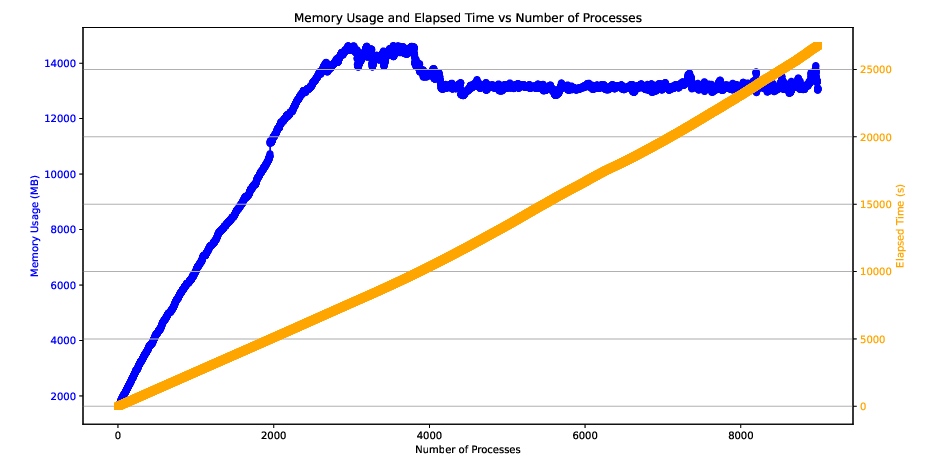
</p>
<p align="center"><em>Figure 3: Memory consumed by incremental replication of compartments and time to create compartments.</em></p>

We initially expected memory consumption to increase steadily from 1,628.3 MB, corresponding to a single attestable replica, to 15,406.5 MB (90% of total memory) consumed by N attestable replicas. The objective was to determine the exact value of N.

However, the results revealed unexpected behaviour: memory consumption increased consistently only until approximately 3,800 attestable replicas consumed 14,582.5 MB. After this point, memory consumption began to decrease as the number of attestable replicas continued to rise. The final data point shows that 8,991 attestable replicas consumed 13,066.4 MB, or roughly 76% of the total memory.

We did not expect the behaviours exhibited by the blue line of Figure 3. We have no sound explanation for it. These preliminary results highlight an area for further exploration. Additionally, the analysis of the time required to wipe the memory of the attestable replicas remains pending.


# 3. Memory performance in the execution of allocate, release, read and write operations

To collect metrics we execute a C program compiled and executed without compartments and with compartments:

- **Compilation and execution without compartments:**  
  [memory-out-experiment.c](https://github.com/gca-research-group/tee-morello-performance-experiments/blob/main/memory-performance/outside-tee-exection/memory-out-experiment.c).

  We have compiled and executed it with the following cheriBSD commands:

  ```bash
  $ clang-morello -o memory-in-experiment memory-in-experiment.c -lm
  
  $ ./memory-in-experiment
  ```

- **Compilation and execution with compartments:**  
  [memory-in-experiment.c](https://github.com/gca-research-group/tee-morello-performance-experiments/blob/main/memory-performance/inside-tee-execution/memory-in-experiment.c).

  ```bash
  $ clang-morello -march=morello+c64 -mabi=purecap -o memory-in-experiment memory-in-experiment.c -lm
  
  $ proccontrol -m cheric18n -s enable memory-in-experiment
  ```

In this experiment, we use the code shown in Algorithm 1. It executes the following operations on large blocks of memory:

a) **allocation:** time required to allocate a block of memory.  
b) **write:** time required to write data to fill the entire memory block.  
c) **read:** time taken to read the data from the entire memory block.  
d) **free:** time taken to release the memory block back into the main memory.

As shown in Figure 4, we use blocks of `100, 200, 300,...,100 000 MB` as large blocks of memory. Blocks of these sizes are typical of applications that process images and access databases.

<p align="center">
  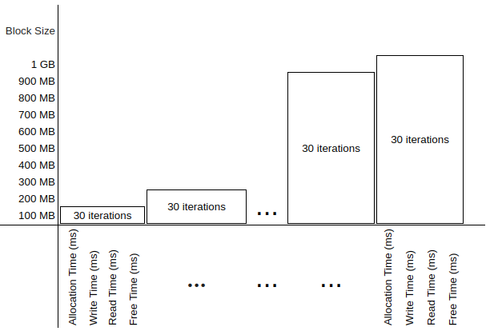
</p>
<p align="center"><em>Figure 4: Performance of memory operations on memory blocks of different sizes.</em></p>


<pre style="border: 1px solid #ddd; padding: 10px; background-color: #f9f9f9; font-family: monospace;">
Algorithm 1: Execution of memory operations and metric collections of their executions

1. perform_tests(log_file, total_time)
2. begin
3.     foreach block_size in MIN_BLOCK_SIZE to MAX_BLOCK_SIZE step BLOCK_STEP do
4.         foreach test_num from 1 to NUM_TESTS do
5.             allocation_time = time(malloc(block_size))
6.             write_time = time(write_to_memory(block, block_size))
7.             read_time = time(read_from_memory(block, block_size))
8.             free_time = time(free(block))
9.             log(log_file, block_size, test_num, allocation_time, write_time, read_time, free_time)
10.        endfor
11.    endfor
12. end
</pre>


Execution begins with the `perform_tests` function (line 1), which receives a log file as an input parameter to store performance metrics, including the total time taken to run the tests. The for-loop (line 3) iterates over memory blocks of different sizes ranging from `MIN_BLOCK_SIZE` to `MAX_BLOCK_SIZE` with increments specified by `BLOCK_STEP`. The inner for-loop (line 4) repeats the test `NUM_TESTS` times for each block size. `NUM_TESTS` is defined by the programmer as a constant.

At each iteration, the memory allocation time is measured with the time function (line 5);   the time to write to the block is measured in line 6, the time to read the block is measured in line and, finally, the time to free the memory is measured in line 8. The metric collected  are recorded in the log file along with the test number (line 9).


## 3.1. Results

The metrics collected are stored in two separate CSV files: [cpu-in-experiment-result.csv](https://github.com/gca-research-group/tee-morello-performance-experiments/blob/main/cpu-performance/inside-tee-execution/cpu_in-experiment-result.csv) for the run inside a compartment. The file [cpu-out-experiment-result.csv](https://github.com/gca-research-group/tee-morello-performance-experiments/blob/main/cpu-performance/outside-tee-exection/cpu-out-experiment-result.csv) collects metrics of the run without compartments. We calculate the average time that it takes to allocate, write, read and free for  each block size of 100 MB, 200 MB, 300 MB, etc.).The results are summarised in Tables 3 and 4.


<div align="center">
<p><em>Table 3: Metrics of runs inside a compartment, including mean and standard deviation.</em></p>

| **Block Size (MB)** | **Allocation Time (ms)** | **Write Time (ms)** | **Read Time (ms)** | **Free Time (ms)** |
|---------------------|--------------------------|---------------------|--------------------|--------------------|
| 100                 | 106 ± 162.81            | 295,308 ± 134.61    | 282,576 ± 9.12     | 97 ± 190.67        |
| 200                 | 138 ± 184.86            | 590,498 ± 258.80    | 565,152 ± 13.51    | 272 ± 453.06       |
| 300                 | 138 ± 197.84            | 885,784 ± 352.15    | 847,719 ± 16.11    | 318 ± 553.84       |
| 400                 | 141 ± 251.11            | 1,180,815 ± 488.16  | 1,130,297 ± 16.14  | 492 ± 837.55       |
| 500                 | 131 ± 287.53            | 1,476,014 ± 534.18  | 1,412,881 ± 21.82  | 321 ± 649.56       |
| 600                 | 168 ± 350.89            | 1,771,086 ± 665.76  | 1,695,456 ± 27.63  | 399 ± 800.15       |
| 700                 | 251 ± 507.21            | 2,066,147 ± 670.82  | 1,978,022 ± 28.73  | 725 ± 1,312.96     |
| 800                 | 235 ± 601.22            | 2,361,646 ± 980.32  | 2,260,586 ± 36.58  | 738 ± 1,365.85     |
| 900                 | 312 ± 878.94            | 2,656,590 ± 881.36  | 2,543,166 ± 48.78  | 1,197 ± 1,903.50   |
| 1000                | 265 ± 878.73            | 2,951,487 ± 1,017.72| 2,825,741 ± 45.21  | 405 ± 921.64       |

</div>


<div align="center">
<p><em>Table 4: Metrics of runs outside a compartment, including mean and standard deviation.</em></p>

| **Block Size (MB)** | **Allocation Time (ms)** | **Write Time (ms)** | **Read Time (ms)** | **Free Time (ms)** |
|---------------------|--------------------------|---------------------|--------------------|--------------------|
| 100                 | 2.37 ± 9.60             | 282,573.6 ± 21.01   | 322,943.5 ± 23.47  | 3.3 ± 2.85         |
| 200                 | 2.47 ± 6.40             | 565,140.4 ± 13.05   | 645,880.3 ± 10.00  | 4.47 ± 2.10        |
| 300                 | 1.43 ± 1.92             | 847,708.1 ± 15.14   | 968,813.5 ± 15.52  | 4.63 ± 1.99        |
| 400                 | 2.9 ± 5.79              | 1,130,294.0 ± 22.28 | 1,291,766.3 ± 22.70| 7.37 ± 3.22        |
| 500                 | 2.63 ± 5.39             | 1,412,856.5 ± 20.91 | 1,614,707.9 ± 23.45| 6.47 ± 1.55        |
| 600                 | 1.83 ± 2.38             | 1,695,426.4 ± 30.26 | 1,937,629.5 ± 29.14| 6.2 ± 1.86         |
| 700                 | 1.97 ± 1.83             | 1,977,999.2 ± 34.40 | 2,260,573.3 ± 36.07| 7.67 ± 1.95        |
| 800                 | 2.4 ± 2.99              | 2,260,592.6 ± 40.55 | 2,583,527.0 ± 30.94| 8.07 ± 1.31        |
| 900                 | 2.1 ± 0.80              | 2,543,150.9 ± 43.68 | 2,906,485.3 ± 52.49| 8.2 ± 1.79         |
| 1000                | 1.97 ± 0.96             | 2,825,742.3 ± 47.44 | 3,229,433.5 ± 44.77| 8.77 ± 2.56        |

</div>


<p align="center">
  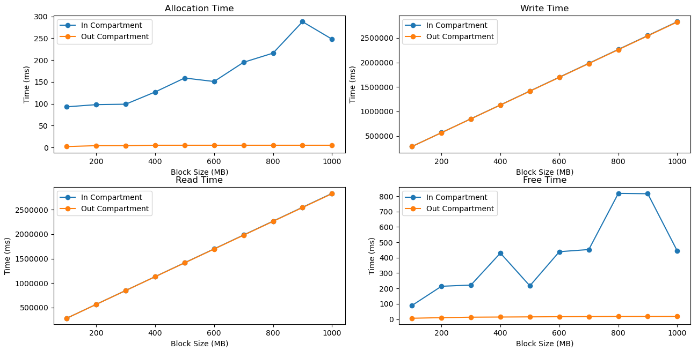
</p>
<p align="center"><em>Figure 5: Time to execute allocate, write, read and release memory operations.</em></p>


- **Allocation time:** A comparison of Table 1 against Table 2 reveals that it takes longer to allocate memory blocks inside compartments. For example, the allocation of 100 MB takes 2 ms without a compartment, while it takes 106 ms inside a compartment. Allocation times vary from 1 to 3 ms without a compartment but from 106 to 265 ms inside a compartment. In contrast, the time to allocate memory within  a compartment varies significantly from 106 to 265 and depends on the size of the block. Times range from 106 ms for 100 MB blocks to 251 ms for 700 MB blocks. In contrast, the time to allocate memory without compartments is shorter, it ranges from 2 to 7 ms for all block sizes.

- **Write time:** Both tables show a linear increase in write time as the block size increases. However, execution inside a compartment takes longer. The difference becomes more evident when the sizes of the blocks increases.

- **Read time:** The time to execute read operations increases linearly in both executions. However, execution within a compartment takes longer than execution without compartments.

- **Free time:** The metrics in the tables show contrasting performances. Table 3 shows that it takes significantly longer to free memory in executions inside a compartment. The times rages from 97 to 1 197 ms. In contrast, Table 4 shows times that range from 3 to 9 ms in executions without compartments.

Plots of the results from Tables 3 and 4 shown in Fig. 6. Full records are available from [memory-in-experiment-result.csv](https://github.com/gca-research-group/tee-morello-performance-experiments/blob/main/memory-performance/inside-tee-execution/memory-in-experiment-resuls.csv) and [memory-out-experiment-result.csv](https://github.com/gca-research-group/tee-morello-performance-experiments/blob/main/memory-performance/outside-tee-exection/memory-out-experiment-resuls.csv).


<p align="center">
  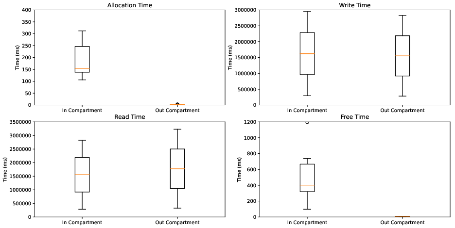
</p>
<p align="center"><em>Figure 6: Dispersion of the time to execute allocate, write, read, and free operations.</em></p>


# 4. CPU performance in the execution of demanding arithmetic operations

We have carried out this experiment to determine if library--based compartments affect the performance of the CPU. Precisely, we have executed a program with functions that involve the execution of CPU--demanding arithmetic operations and collected metrics about execution time. The program that we have implemented for this purpose includes operations with integers (int), floating point (float), arrays, and complex mathematical functions (such as trigonometric and exponential functions) that are known to be CPU--demanding.

We use a C program that compile and run inside a library-based compartment and without compartments.

- **Compilation and execution inside a compartment**

  The program that we use is available from Git:  
  [cpu-in-experiment.c](https://github.com/gca-research-group/tee-morello-performance-experiments/blob/main/cpu-performance/inside-tee-execution/cpu-in-experiment.c)

  We compile and run it as follows:
  ```bash
  $ clang-morello -march=morello+c64 -mabi=purecap -o cpu-in-experiment cpu-in-experiment.c -lm
  
  $ proccontrol -m cheric18n -s enable cpu-in-experiment
  ```

- **Compilation and execution without a compartment**

  The program that we use is available from Git:  
  [cpu-out-experiment.c](https://github.com/gca-research-group/tee-morello-performance-experiments/blob/main/cpu-performance/outside-tee-exection/cpu-out-experiment.c)

  We compile and run it as follows:
  ```bash
  $ clang-morello -o cpu-out-experiment cpu-out-experiment.c -lm
  
  $ ./cpu-out-experiment
  ```

The choice of these operations is based on the variety of typical workloads in computer applications, covering operations that vary in CPU resource usage. Time collection was carried out in both environments, allowing a detailed comparison between performance in the compartmentalised environment and the Morello Board's normal operating environment.

Algorithm 2 contains the code that we have run to produce metrics about the CPU performance and store them in a CSV files.

<pre style="border: 1px solid #ddd; padding: 10px; background-color: #f9f9f9; font-family: monospace;">
Algorithm 2: CPUPerformance

1. perform_tests(log_file, total_time)
2. begin
3.     for test_num in NUM_TESTS do
4.         start_time = capture_time()
5.         execute_operations(WORKLOAD_SIZE)
6.         end_time = capture_time()
7.         cpu_time = calculate_cpu_time(start_time, end_time)
8.         results(log_file, test_num, cpu_time)
9.         total_time += cpu_time
10.    endfor
11. end
</pre>

The execution begins with the perform\_tests function (line 1), which receives the name of as a log file as input parameter to be used to store metrics about the execution of individual operations and the total time to complete the program. The function enters a repeat loop that is repeated the number of times specified by `NUM_TESTS` (line 3), where each iteration represents a test identified by `test_num`. In each iteration, the initial test time is recorded (line 4), followed by the execution of the computational operations determined by `WORKLOAD_SIZE` (line 5). At the end of execution, the final time is recorded (line 6), and the total CPU time elapsed is calculated by subtracting the `start_time` from the `end_time` (line 7). This time is recorded in the log file, along with the test number (line 8), and added to `total_time`, that accumulates the total time spent on all the tests (line 9).


## 4.1. Results

The results collected from the execution inside a compartment are available from [cpu-in-experiment-result.csv](https://github.com/gca-research-group/tee-morello-performance-experiments/blob/main/cpu-performance/inside-tee-execution/cpu_in-experiment-result.csv). Similarly, the results collected from the execution without a compartment are available from [cpu-out-experiment-result.csv](https://github.com/gca-research-group/tee-morello-performance-experiments/blob/main/cpu-performance/outside-tee-exection/cpu-out-experiment-result.csv).

Table 5 compares the average execution times of different operations in both executions.

<div align="center">
<p><em>Table 5: Times to execute CPU operations inside and without a compartment.</em></p>

| Test Type                     | CPU Time (ms) - Normal | CPU Time (ms) - Secure |
|-------------------------------|------------------------|-------------------------|
| Maths (trigon. and exp. func) | 46,696                | 69,998                 |
| Int                           | 923                   | 993                    |
| Float                         | 816                   | 785                    |
| Array                         | 1,419                 | 1,460                  |

</div>


The results show that complex mathematical operations (trigonometric and exponential functions) executed within a compartment took 69,998 ms on average. In contrast, the execution of the same operations without a compartment took only 46,696 ms. This represents a performance cost of approximately 49.74%. However, the execution of arithmetic operations with integers without a compartment takes 923 ms. This figure is similar to the 993 ms that it takes to execute the same operation inside a compartment. The difference is only 7.58%. Unexpectedly, the execution of floating point operations inside a compartment took 785 ms, which is slightly lower than the execution without a compartment, which took 816 ms. The difference is 3.80%. Finally, the execution of array manipulation operations took 1,460 ms inside a compartment. This is not very different from the 1,419 ms that it takes to execute the same operation without a compartment; precisely, the difference is only 2.89%.

As visualised in Fig. 6, these results indicate that there is a noticeable performance cost in the execution of complex math operations inside compartments. However, in the execution of int, float and array operations, the performance is similar with and without compartments; strikingly, it is slightly better in the run inside a compartment.

<p align="center">
  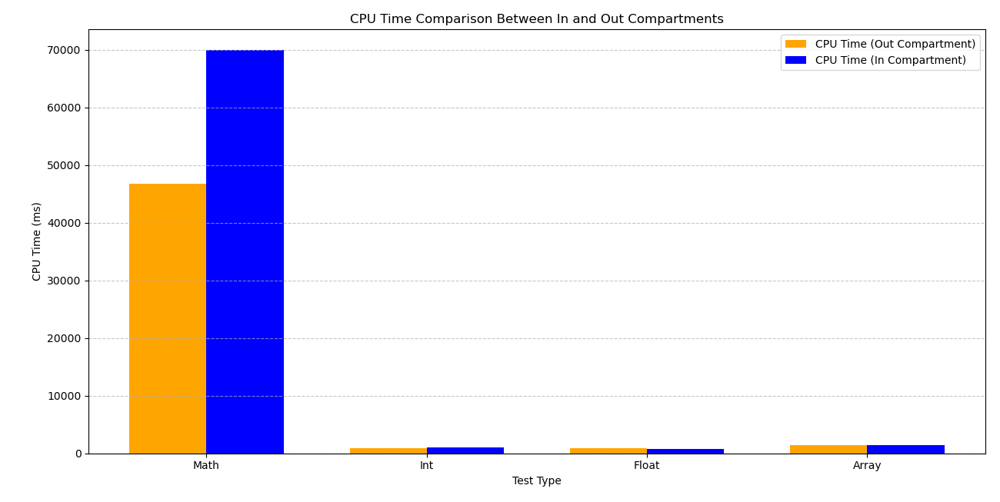
</p>
<p align="center"><em>Figure 6: CPU performance in executions within and without compartments.</em></p>


# 5. Communication performance over pipes

This experiment was conducted to evaluate how the use of compartments affects the performance of communication over Unix pipes. To collect metrics, we have implemented a C program that communicates a parent with a child process over a pipe and collects metrics about writing to and reading from a pipe that interconnected them. As shown in Fig. 7, the parent process writes a message to the pipe and the child process reads it.

We run the C program within a compartment  
[pipe-in-experiment.c](https://github.com/gca-research-group/tee-morello-performance-experiments/blob/main/pipe-performance/inside-tee-execution/pipe-in-experiment-result.c)  
and without compartments  
[pipe-out-experiment.c](https://github.com/gca-research-group/tee-morello-performance-experiments/blob/main/pipe-performance/outside-tee-execution/pipe-out-experiment-result.c).

- **Compilation and execution inside a compartment**

  ```bash
  $ clang-morello -march=morello+c64 -mabi=purecap -o pipe-in-experiment pipe-in-experiment.c
  
  $ proccontrol -m cheric18n -s enable pipe-in-experiment
  ```

- **Compilation and execution without a compartment**

  ```bash
  $ clang-morello -o pipe-out-experiment pipe-out-experiment.c
  
  $ ./pipe-out-experiment
  ```

To collect metrics, the parent process writes a random string of 1024 bytes — a typical size widely used in inter-process communication applications.

<p align="center">
  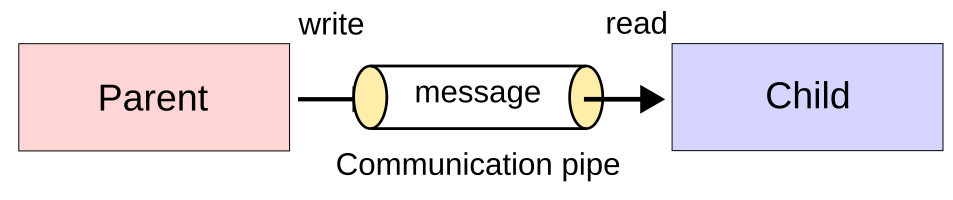
</p>
<p align="center"><em>Figure 7: Parent--child communication over a pipe.</em></p>

We collected metrics about the following operations:
- **write:** Time taken by the parent process to write data to the pipe.
- **read:** Time taken by the child process to read the data from the other end of the pipe.

The code repeats each operation 100 times. This is in line with the principles of the Central Limit Theorem, which states that a larger sample size helps to detect finer fluctuations in latency patterns [Statistics How To 2023](https://www.statisticshowto.com/probability-and-statistics/normal-distributions/central-limit-theorem-definition-examples/).

Algorithm 3 describes the execution of the operations and the settings of timers to collect the metrics.


<pre style="border: 1px solid #ddd; padding: 10px; background-color: #f9f9f9; font-family: monospace;">
Algorithm 3: Pipe Communication Performance

1.  start_test(log_file)              
2.  begin
3.      define STRLEN  
4.      define NUM_OF_MSG 
5.      for test_num from 1 to NUM_OF_MSG do
6.          if parent_process
7.              start_timer(write_time)     
8.              write(pipe, message of size STRLEN)        
9.              stop_timer(write_time)      
10.             write(pipe, write_time)     
11.         else 
12.             read(pipe, message of size STRLEN)         
13.             read(pipe, write_time)      
14.             start_timer(read_time)      
15.             stop_timer(read_time)       
16.             log(log_file, test_num, write_time, read_time) 
17.         endif
18.     endfor
19. end
</pre>

In Algorithm 3, the `start_test` function (line 1) initiates a sequence of operations that measure the performance of pipe communication between the parent and child processes. The parameters `STRLEN` and `NUM_OF_MSG` (lines 3 and 4) establish the message size and the number of messages to be sent, respectively. For each iteration, from 1 to `NUM_OF_MSG` (line 5), the parent starts the write timer (line 7), writes a message of size `STRLEN` to the pipe (line 8), stops the write timer (line 9), and then sends the recorded `write_time` back through the pipe (line 10). The child process, in turn, reads the message and the `write_time` from the pipe (lines 12 and 13). To collect the metrics, the child process starts the read timer before reading (line 14) and stops it upon completing the reading (line 15). The test number, along with the write and read times, is logged in the log file (line 16). The procedure is repeated for each iteration until all messages are written to and read from the pipe (line 17).


## 5.1. Results

We store the data collected from this experiment in two separate CSV files: [ppipe-in-experiment-result.csv](https://github.com/gca-research-group/tee-morello-performance-experiments/blob/main/pipe-performance/inside-tee-execution/pipe-in-experiment-result.csv) for operations executed inside the compartment and [pipe-out-experiment-result.csv](https://github.com/gca-research-group/tee-morello-performance-experiments/blob/main/pipe-performance/outside-tee-execution/pipe-out-experiment-result.csv) for operations executed without a compartment.

Table 6 and Table 7 contain the results of each iteration, including message size, write time, read time, and total time taken for the operations.

<div align="center">
<p><em>Table 6: Time to execute write and read from a pipe inside a compartment.</em></p>

| Test | Message Size (Bytes) | Write Time (ms) | Read Time (ms) | Total Time (ms) |
|------|-----------------------|-----------------|----------------|-----------------|
| 1    | 1024                 | 0.016           | 0.161          | 0.177           |
| 2    | 1024                 | 0.003           | 0.068          | 0.071           |
| 3    | 1024                 | 0.003           | 0.075          | 0.078           |
| 4    | 1024                 | 0.003           | 0.077          | 0.080           |
| ...  | ...                  | ...             | ...            | ...             |
| 100  | 1024                 | 0.003           | 0.079          | 0.082           |

</div>

<div align="center">
<p><em>Table 7: Time to execute write and read from a pipe without a compartment.</em></p>

| Test | Message Size (Bytes) | Write Time (ms) | Read Time (ms) | Total Time (ms) |
|------|-----------------------|-----------------|----------------|-----------------|
| 1    | 1024                 | 0.013           | 0.059          | 0.072           |
| 2    | 1024                 | 0.001           | 0.001          | 0.003           |
| 3    | 1024                 | 0.001           | 0.001          | 0.002           |
| 4    | 1024                 | 0.001           | 0.001          | 0.002           |
| ...  | ...                  | ...             | ...            | ...             |
| 100  | 1024                 | 0.001           | 0.002          | 0.003           |

</div>


The data shows the differences in the performance of inter--process communication (through pipes) inside a compartment and without compartments.

A graphical view of the results is shown in Fig. 8.

<p align="center">
  
</p>
<p align="center"><em>Figure 8: Times to write and read a 1024 byte string from a pipe executed in compartments and without compartments.</em></p>

The figure reveals that compartments affect performance. The write operation executed inside compartments consistently shows a higher latency that ranges from 0.016 ms to 0.003 ms. In contrast, the write time outside compartments is notably shorter, closer to 0.001 ms. This discrepancy highlights the additional computational cost introduced by the compartment.

The effect of the compartment on the performance of the read operation is less severe yet, it is visible. The first test shows a read time of 0.161 ms, compared to 0.059 ms in the execution without compartments. As the tests progress, the execution within the compartment consistently exhibits longer read times. This demonstrates that compartmentalisation introduces delays in inter-process communication.

The results suggest the compartments provide significant benefits in terms of security; yet they incur performance costs; the cost might not be negligible in applications that rely on rapid inter--process communication.


# 6. Evaluation of Trust Models in Single-Compartment Environments
We have conducted this experiment to examine the trust model that the Morello Board implements. It is documented that the current release of the Morello Board implements an asymmetric trust model where the Trusted Computing Based (TCB) is trusted by the applications but the TCB does not trust the applications. It is worth mentioning that the current Morello Board does not support the mutual distrust model where the privileged software and the applications distrust each other.

To the TCB of the current Morello Board belong the firmware and privileged software that includes the bootloader, hypervisor and operating system. The library-based compartments that we examine in this report, consider that the linker belongs to the TCB too [Gao and Watson 202](https://pldi23.sigplan.org/home/plarch-2023).

In this experiment, we use an application written in C [tee-compartmentalisation-study-case](https://github.com/gca-research-group/tee-compartimentalisation-study-case) and run it within a compartment and without compartments to examine memory isolation. We followed the following steps:

1. **Compilation and execution:**

    We compiled and executed the application integration within a compartment and without a compartments:
    
    - **Compilation and execution within a compartment:**
      
      The application integration is available from Git:  
      [integration-process-in-experiment.c](https://github.com/gca-research-group/tee-morello-performance-experiments/blob/main/security-single-compartment-performance/inside-tee-execution/integration_process-in-experiment.c)

      We compile and run it as follows:
      ```bash
      $ clang-morello -march=morello+c64 -mabi=purecap -o integration_process-in-experiment integration_process-in-experiment.c -lssl -lcrypto -lpthread
      
      $ proccontrol -m cheric18n -s enable integration_process-in-experiment
      ```

    - **Compilation and execution without a compartment:**

      The application integration is available from Git:  
      [integration-process-out-experiment.c](https://github.com/gca-research-group/tee-morello-performance-experiments/blob/main/security-single-compartment-performance/outside-tee-execution/integration_process-out-experiment.c)

      We compile and run it as follows:
      ```bash
      $ clang-morello -o integration_process-out-experiment integration_process-out-experiment.c -lssl -lcrypto -lpthread
      
      $ ./integration_process-out-experiment
      ```

2. **Launch python script:** We launched the Python that performs the memory reading.

   ```bash
   $ python3 memory_reader.py
   ```

   The [memory_reader.py](https://github.com/gca-research-group/tee-morello-performance-experiments/blob/main/security-single-compartment-performance/memory_reader.py) script cycles through the memory regions of interest reading the data between the start and end addresses of each region directly.

Fig. 8 shows the steps executed by the `memory_reader.py` script:

1. The Memory Reader requests the Cheri OS for the PID of the target process by its name, using the method `getPID(processName)`.
2. Cheri OS returns the corresponding PID.
3. The `memory_reader.py` provides the PID to `getMemoryAddresses(PID)` to request a list of the memory regions associated to the process that have read and write (RW) permissions.
4. CheriBSD responds with the mapped memory regions.
5. The `memory_reader.py` starts scraping the memory directly.
6. For each RW region, it fetches the starting address by calling `seek(startAddress)`.
7. Acknowledgement is returned.
8. The `memory_reader.py` executes `read(startAddress to endAddress)` to read the content from the starting address to the end address.
9. The decoded data is returned.
10. This cycle is repeated for all RW regions.
11. The `memory_reader.py` executes `output(dataReadFromMemory)` to record the data read from the memory.

<p align="center">
  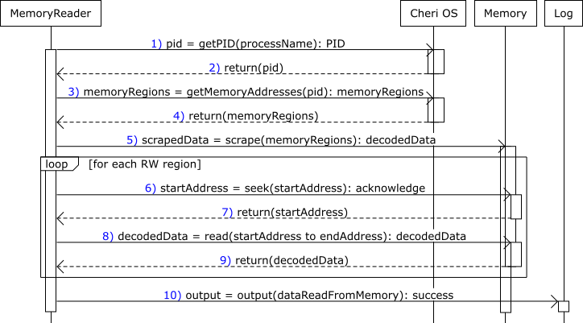
</p>
<p align="center"><em>Figure 8: Procedure to scrap memory regions.</em></p>


## 6.1. Results

Table 8 summarises the results. The columns have the following meaning:

<div align="center">
<p><em>Table 8: Memory isolation in executions within and without compartments.</em></p>

| Test num. | Execution env.   | User privileges | Access  | Sensitive Data Visible |
|-----------|------------------|-----------------|---------|-------------------------|
| 1         | in Compartment   | Root            | Granted | Yes                     |
| 2         | in Compartment   | Ordinary user   | Denied  | No                      |
| 3         | out Compartment  | Root            | Granted | Yes                     |
| 4         | out Compartment  | Ordinary user   | Denied  | No                      |

</div>


- **Test num:** Unique identification number of the test.
- **Execution env.:** The execution environment where the application is executed, either within a compartments or no compartment.
- **User privileges:** The privileges granted to the user that executes the `memory_reader.py` script.
- **Access:** The response of cheriBSD to the `memory_reader.py` script's request to access the memory region.
- **Sensitive Data Visible:** Visibility of the data retrieved from the memory region. Can the `memory_reader.py` script extract information from the data?

The results shown in Table 8 indicate that a user with root privileges has permission to access any memory region, including memory regions allocated to compartments. However, ordinary users are unable to access memory regions allocated to processes, including processes not executed inside compartments.

These results indicate that the Morello Board implements the traditional asymmetric trust model where user applications trust privileged software. Some applications demand the symmetric trust model where privileged software and user applications distrust each other. Examples of technologies that implement mutual distrust are Intel SGX and AWS Nitro Enclaves.


### Observations runs of the experiment

We observed some unexpected behaviours and crashes of the cheriBSD that demanded reboot to recover. We have no sound explanations, we only suspect that these issues are related to the memory managements in the Morello Board.

- **Process terminated by the OS:**  
  We have observed that the application was terminated (i.e. killed) automatically by the cheriBSD OS, approximately, after 1 hour of execution. See Fig. 9. This behaviour seems to be related to the CheriBSD system’s resource management. It seems that the operating system terminates processes that are consuming excessive memory or CPU, possibly in response to an infinite loop or undesirable behaviour. Another speculation is that the CHERI security model abruptly terminates processes that systematically attempt to access protected memory regions, illegally.  

  <p align="center">
    
  </p>
  <p align="center"><em>Figure 9: Abruptly termination of process by the OS.</em></p>

- **Crash of cheriBSD OS:**  
  We have observed systematic crashes of the cheriBSD OS when the `memory_reader.py` script attempted to read a specific range of memory addresses. As shown in Fig. 10, the OS crashed reporting a `Broken pipe` error and the disconnection of the remote SSH shell when the `memory_reader.py` attempted to read addresses in the `0x4a300000` --- `0x4bb00000` range. See Fig. 11.  

  <p align="center">
    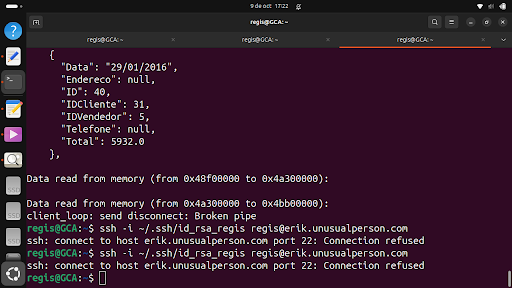
  </p>
  <p align="center"><em>Figure 10: client_loop: send disconnect: Broken pipe.</em></p>

  <p align="center">
    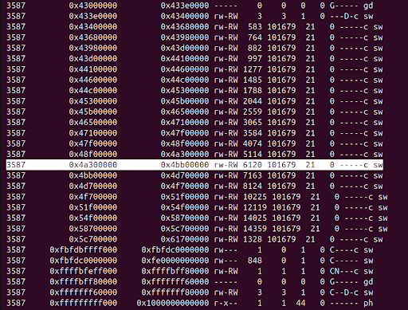
  </p>
  <p align="center"><em>Figure 11: Crashing memory range.</em></p>

  A possible explanation is that the crash is caused by illegal attempts to read memory addresses storing privileged software.  

  This crash raises concerns about a possible failure in memory isolation when accessed by processes, such as the `memory_reader.py` script. Another possibility is that the privileged software running in this memory range is particularly sensitive to illegal read attempts, causing cheriOS crashes. Further investigation is required to determine the exact causes.

- **Error after rebooting the cheriBSD OS:**  
  Attempt to read memory after rebooting to recover from a crash outputs `[Errno 2] No such file or directory: '/proc/PID/mem'` (see Fig. 12). The error indicates that file `/proc/{pid}/mem`, which is used by `memory_reader.py`, is unavailable.

  <p align="center">
    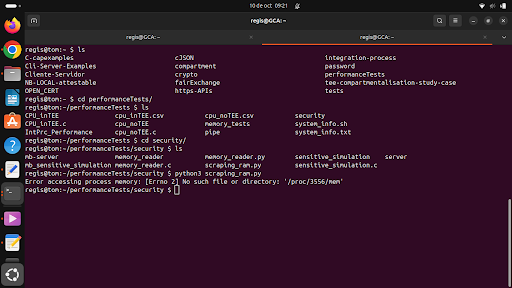
  </p>
  <p align="center"><em>Figure 12: Error after recovering from a crash: [Errno 2] No such file or directory: '/proc/3587/mem'.</em></p>

- **Procedure for running `memory_reader.py` after rebooting:**  
  After rebooting to recover from a crash, it is necessary to verify that the `/proc` file system is mounted correctly mounted, the `mount` command can be used.

  ```bash
  $ mount | fgrep proc
  ```

  The following command can be used to mount `/proc` if it is not mounted.  

  ```bash
  $ mount -t procfs proc /proc
  ```

  Once `proc` is mounted, the `memory_reader.py` script [memory_reader.py](https://github.com/gca-research-group/tee-morello-performance-experiments/blob/main/security-single-compartment-performance/memory_reader.py) script can be executed again.  

  We believe that this behaviour is related to the persistence of cheriBSD configurations after rebooting from crashes. It might be useful to examine how resources are locked and released by cheriBSD after crashes.


# 7. Examination of memory isolation in executions with shared libraries

To explore memory isolation further, we executed a C program that communicates a parent and a child process over a pipe after compiling them using dynamic libraries. In this experiment we have the following C codes:

- `library_a.c`: the parent process that writes a string to one end of the pipe.
- `library_b.c`: the child process that reads the string from the other end of the pipe.
- `pipe-trampoline-in-experiment.c`: the main C program that creates the parent and child process when it is executed within compartments.

The compilation process is divided into two steps: Firstly, each individual module is compiled separately to create a dynamic library. Secondly, the main executable is compiled taking the dynamic libraries as input to create the main executable. In this example, we used two modules and therefore, we produce two dynamic libraries.

1. **Compilation of the parent library:**

   To create the object file `library_a.o` from the source file `library_a.c`, execute:

   ```bash
   $ clang-morello -march=morello+c64 -mabi=purecap -fPIC -c library_a.c -o library_a.o
   ```

   The CHERI-specific settings used enable position-independent code (`-fPIC`), which is needed for creating dynamic libraries.

   To create the dynamic library `liblibrary_a.so` from the object file `library_a.o`, execute:

   ```bash
   $ clang-morello -march=morello+c64 -mabi=purecap -shared -o liblibrary_a.so library_a.o
   ```

   The source C file is available from Git:  
   [library_a.c](https://github.com/gca-research-group/tee-morello-performance-experiments/blob/main/security-multi-compartment-performance/library_a.c).

2. **Compilation of the child library:**

   The procedure to produce the library of the child process is similar.

   To create the object file `library_b.o` from `library_b.c`, execute:

   ```bash
   $ clang-morello -march=morello+c64 -mabi=purecap -fPIC -c library_b.c -o library_b.o
   ```

   To create the dynamic library `liblibrary_b.so` from the object file `library_b.o`, execute:

   ```bash
   $ clang-morello -march=morello+c64 -mabi=purecap -shared -o liblibrary_b.so library_b.o
   ```

   The source file is available from Git:  
   [library_b.c](https://github.com/gca-research-group/tee-morello-performance-experiments/blob/main/security-multi-compartment-performance/library_b.c).

3. **Compilation of the main program:**  
   The main program is compiled and linked with the dynamic libraries (`library_a.so` and `library_b.so`) created above. They are assumed to be located in the current directory specified as `-L.`.

   ```bash
   $ clang-morello -march=morello+c64 -mabi=purecap pipe-trampoline-in-experiment.c -L. -llibrary_a -llibrary_b -o pipe_trampoline
   ```

   The source C file is available from Git:  
   [pipe-trampoline-in-experiment.c](https://github.com/gca-research-group/tee-morello-performance-experiments/blob/main/security-multi-compartment-performance/pipe-trampoline-in-experiment.c).

4. **Execution of the main program:**  
   We executed the main program within a compartment.

   - We set the `LD_LIBRARY_PATH` to enable the program to locate the shared libraries in the current directory.

     ```bash
     $ export LD_LIBRARY_PATH=.
     ```

   - To run `pipe_trampoline` within compartments, we executed the following command:

     ```bash
     $ proccontrol -m cheric18n -s enable ./pipe_trampoline
     ```

## 7.1. Examination of memory isolation

We have performed the following steps to examine memory:

1. **Initiation of the parent and child processes:**  
   We started the `pipe_trampoline` to initiate the parent and the child process. The parent writes a string to one end of the pipe, and the child process reads it from the other end.

2. **Memory reading:**  
   We executed the `memory_reader.py` script available from  
   [memory_reader.py](https://github.com/gca-research-group/tee-morello-performance-experiments/blob/main/security-single-compartment-performance/memory_reader.py)  
   to attempt direct memory reads:

   ```bash
   $ python3 memory_reader.py
   ```

3. **Reading process:**  
   We executed the `memory_reader.py` script. It iterates through each RW memory region associated with the PIDs of the parent and child processes, trying to read the data from each region defined by start and end addresses. We displayed the results on the screen (see Fig. 13).


## 7.2. Results

We have divided the results into three sections.

### 7.2.1. Data read from memory:

The data read from memory is available from [memory-reading-result.txt](https://github.com/gca-research-group/tee-morello-performance-experiments/blob/main/security-multi-compartment-performance/memory-reading-result.txt) and shows data read from memory.

The results indicate that, even when running in a multi-compartment environment, a user with root privileges is able to access data from memory. We were able to extract data, including messages and data blocks.

As a specific example, we can report that the cheriBSD crashed when we tried to access the region `0xfbfdbffff000` to `0xfbfdc0000000` which is marked with `rw---`, that is, it is a protected region.

We have stored some examples of data read in [memory-reading-result.txt](https://github.com/gca-research-group/tee-morello-performance-experiments/blob/main/security-multi-compartment-performance/memory-reading-result.txt).

It is sensible to think that cheriBSD blocked access to the region marked with `rw---` permission. However, the crash of cheriBSD, as a reaction, is intriguing. Further investigation is needed to fully understand the interaction between these permissions and the security policies applied to react to attempts to bypass the permissions.


### 7.2.2. Memory regions:
The memory regions are available from [memory-regions-result.txt](https://github.com/gca-research-group/tee-morello-performance-experiments/blob/main/security-multi-compartment-performance/memory-regions-result.txt) and show different memory regions marked with different access permissions.

Memory regions with `rw-RW` permissions allow read access without crashing the cheriBSD OS; in contrast, regions marked with `rw---` grant read access only to the owner process. Attempts to access these regions from a different process result in crashes; Fig. 13 shows an example. The screenshot shows the content of the memory at crash time.

<p align="center">
  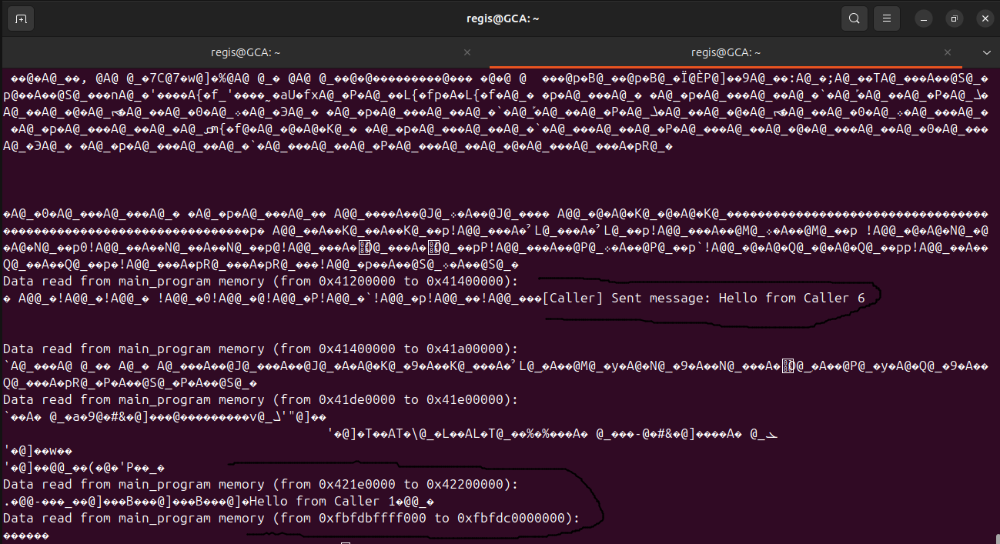
</p>
<p align="center"><em>Figure 13: Memory read error: attempt to read region protected by compartments.</em></p>


### 7.2.3. Execution results:
The execution results are available from [execution-result.txt](https://github.com/gca-research-group/tee-morello-performance-experiments/blob/main/security-multi-compartment-performance/execution-result.txt) and show records of parent-child communication over a pipe.

For example, line 205 (``msg received from child process TKYftt85v0l3d05SosZY1 ... iAbqS7D3VokIx'') shows the child process reading one of the strings with random characters sent by the parent process.

We managed to read this string directly from memory too. It is visible in the last lines of the raw version of the [memory-reading-result.txt](https://github.com/gca-research-group/tee-morello-performance-experiments/blob/main/security-multi-compartment-performance/memory-reading-result.txt) file.


## Acknowledgements

To **Carlos Molina-Jimenez** ([carlos.molina@cl.cam.ac.uk](mailto:carlos.molina@cl.cam.ac.uk)) from the Computer Lab, University of Cambridge, and **Rafael Zancan-Frantz** ([rzfrantz@unijui.edu.br](mailto:rzfrantz@unijui.edu.br)) from the Applied Computing Research Group, Unijuí University, Brazil, for their guidance in defining the types of experiments and in evaluating the results.


## Corresponding Author

**Regis Rodolfo Schuch**  
*Applied Computing Research (GCA) Group, Unijui University, Brazil*  
[regis.schuch@unijui.edu.br](mailto:regis.schuch@unijui.edu.br)

