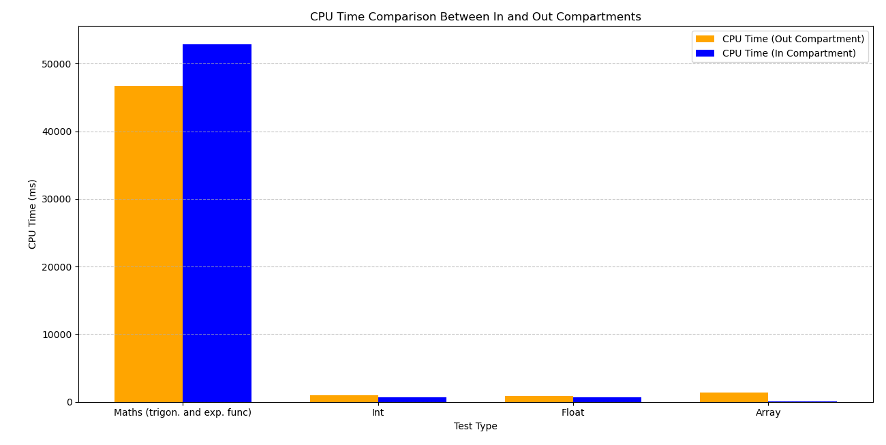
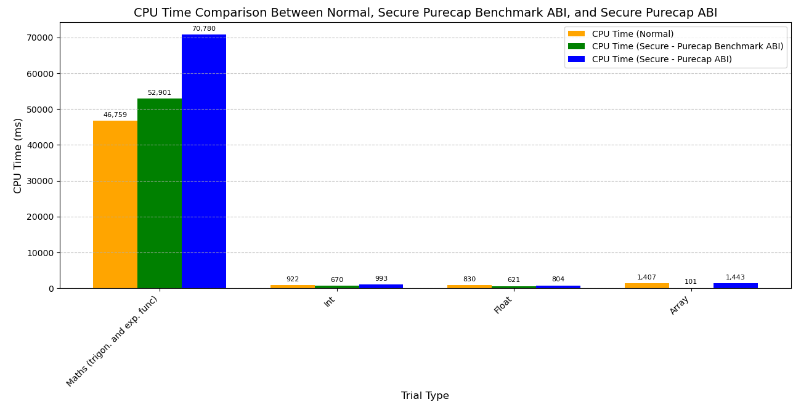

<h1 style="font-size: 2em;">Evaluation of performance and security strengths of library-based compartments created on Morello Boards</h1>

This repository evaluates compartments created using the library-based compartmentalisation tool available on Morello Boards running the cheriBSD 24.5 operating system. It  evaluates the performance costs incurred by the compartments and the strengths of the memory isolation that they provide. It provides links to the Git repositories that store the C and Python codes used in the evaluation and the metrics collected in CSV files. It also includes the plots of the results, a discussion of our interpretation and detailed instructions to encourage practitioners to repeat our experiments and compare their results against ours. 


# 1. Experiments set up

We use a Morello Board, which is physically located in Toronto, within the premises of [TODAQ](https://engineering.todaq.net/), a non-funding partner of the [CAMB project](https://www.cl.cam.ac.uk/research/srg/projects/camb/). A laptop connected to the network of the [Applied Computing Research Group (GCA)](http://gca.unijui.edu.br/) at Unijuí, Brazil, is used to access the Morello Board via an SSH connection. Below is the main configuration of the Morello Board and additional parameters, including the CheriBSD commands required to output these configurations directly from the board. The Fig. 1 illustrates the Morello Board's physical location and the network connection used to access it.

<p align="center">
  
</p>
<p align="center"><em>Figure 1: Morello Boards location.</em></p>


We specify the hardware and software configurations of the Morello Board used in the experiments in Table 1.

<div align="center">
<p><em>Table 1. Morello board configuration parameters used in the experiments and the online cheriBSD commands to output them.</em></p>

| **Component**       | **Specification**                                   | **Command**                                      |
|----------------------|-----------------------------------------------------|-------------------------------------------------|
| Operating System     | CheriBSD 24.5 (FreeBSD 15.0-CURRENT)                | `uname -a`                                      |
| Kernel Version       | FreeBSD 15.0-CURRENT, releng/24.05                  | `uname -v`                                      |
| Board                | Morello System Development Platform                 | `kenv \| grep smbios.system.product`             |
| RAM                  | 17 GB detected (16 GB DDR4, 2933 MT/s, ECC)         | `dmidecode --type memory`                       |
| Storage              | SSD                                                | `camcontrol identify ada0`                      |
| Architecture         | aarch64c (with CHERI support)                       | `sysctl hw.machine_arch`                        |
| Processor Model      | Research Morello SoC r0p0                           | `sysctl hw.model`                               |
| Number of CPUs       | 4                                                   | `sysctl hw.ncpu`                                |
| Compiler             | clang (with Morello support)                        | `clang-morello --version`                       |
| Tool                 | proccontrol (for CHERI compartments)                | `proccontrol -m cheric18n -s enable ./binary`   |
| Python               | Python 3 (required for Experiments 1, 5, and 6)     | `python3 --version`                             |
| Scripts used         | `cheri-cap-experiment.py`<br>`cpu-in-experiment.c`<br>`memory-in-experiment.c`<br>`pipe-in-experiment.c`<br>`pipe-trampoline-in-experiment.c`<br>`library_a.c`<br>`library_b.c`<br>`memory_reader.py`<br>`integration_process.c` | Not applicable                                  |
| Access               | Remote via SSH                                      | `ssh -i private_key user@server`               |

</div>


It is worth explaining that, as shown in the CSV files available in this repository, we repeated the execution of each operation 100 times during our experiments, collected the measurements, and averaged the results. The choice of 100 repetitions was based on the Central Limit Theorem, which suggests that a sample size of 100 is often adequate to yield a statistically meaningful average.


## 1.1. Compilation and Execution

The inclusion or exclusion of library-based compartments is determined at compilation and execution time, as documented in the manuals:
- [Gao, 2024](https://man.cheribsd.org/cgi-bin/man.cgi/c18n)
- [Cheri Team, 2022](https://github.com/CTSRD-CHERI/cheripedia/wiki/Library-based-%20Compartmentalisation)
- [Watson, 2019](https://www.cl.cam.ac.uk/research/security/ctsrd/cheri/cheri-compartmentalization.html)


### 1.1.1. Compilation and Execution Without Library-Based Compartments

The normal compilation (without the inclusion of library-based compartments) is demonstrated in the following example for a `helloworld.c` program:

```bash
$ clang-morello -o hello hello.c
```

To execute `helloworld`, the programmer can type:

```bash
$ ./helloworld
```

### 1.1.2. Compilation and Execution With Library-Based Compartments

The following command demonstrates the compilation flags required to enable library-based compartments:

```bash
$ clang-morello -march=morello+c64 -mabi=purecap -o helloworld helloworld.c
```

- The `-march=morello+c64` parameter defines the 64-bit Morello architecture.
- The `-mabi=purecap` flag sets the Application Binary Interface (ABI) for the secure environment, representing all memory references and pointers as capabilities.

To execute the `helloworld` program in a library-based compartment, the programmer can type:

```bash
$ proccontrol -m cheric18n -s enable helloworld
```

The binary is executed with library compartmentalisation enabled using `proccontrol`.

We use the example shown above in subsequent sections to compile and execute the programs used in the evaluation.


# 2. Memory performance in the execution of allocate, release, read and write operations

# Memory Performance in the Execution of Allocate, Release, Read, and Write Operations

## Experiment Overview

This experiment evaluates memory operations on large blocks, measuring execution time for the following operations:

- **malloc**: Time taken to allocate a memory block.
- **write**: Time taken to write data to fill the memory block.
- **read**: Time taken to read the data from the memory block.
- **free**: Time taken to release the memory block.

### Memory Block Sizes

As shown in the figure below, we evaluate memory blocks ranging from **100 MB to 1000 MB**. These sizes are representative of applications that process large datasets, such as image processing and database management.


## Code Execution

The following pseudocode outlines the experiment:

```c
perform_tests(log_file, total_time)
begin
 foreach block_size in MIN_BLOCK_SIZE to MAX_BLOCK_SIZE step BLOCK_STEP do        
   foreach test_num from 1 to num_of_trials do
      allocation_time= time(malloc(block_size))
      write_time= time(write_to_memory(block, block_size))
      read_time= time(read_from_memory(block, block_size))
      free_time= time(free(block))
      log(log_file, block_size, test_num, allocation_time, write_time, read_time, free_time)
   endfor
 endfor
end


# 4. CPU performance in the execution of demanding arithmetic operations

We have carried out this experiment to determine if library--based compartments affect the performance of the CPU. Precisely, we have executed a program with functions that involve the execution of CPU--demanding arithmetic operations and collected metrics about execution time. The program that we have implemented for this purpose includes operations with integers (int), floating point (float), arrays, and complex mathematical functions (such as trigonometric and exponential functions) that are known to be CPU--demanding.

We use a C program that compile and run inside a library-based compartment and without compartments.

- **Compilation and execution inside a compartment**

  The program that we use is available from Git:  
  [cpu-in-experiment.c](https://github.com/gca-research-group/tee-morello-performance-experiments/blob/main/cpu-performance/inside-tee-execution/cpu-in-experiment.c)

  We compile and run it as follows:
  ```bash
  $ clang-morello -march=morello+c64 -mabi=purecap -o cpu-in-experiment cpu-in-experiment.c -lm
  
  $ proccontrol -m cheric18n -s enable cpu-in-experiment
  ```

- **Compilation and execution without a compartment**

  The program that we use is available from Git:  
  [cpu-out-experiment.c](https://github.com/gca-research-group/tee-morello-performance-experiments/blob/main/cpu-performance/outside-tee-exection/cpu-out-experiment.c)

  We compile and run it as follows:
  ```bash
  $ clang-morello -o cpu-out-experiment cpu-out-experiment.c -lm
  
  $ ./cpu-out-experiment
  ```

The choice of these operations is based on the variety of typical workloads in computer applications, covering operations that vary in CPU resource usage. Time collection was carried out in both environments, allowing a detailed comparison between performance in the compartmentalised environment and the Morello Board's normal operating environment.

Algorithm 2 contains the code that we have run to produce metrics about the CPU performance and store them in a CSV files.

<pre style="border: 1px solid #ddd; padding: 10px; background-color: #f9f9f9; font-family: monospace;">
Algorithm 2: CPUPerformance

1. perform_trials(log_file, total_execution_time)
2. begin
3.     for trial_num in num_of_trials do
4.         start_time = capture_time()
5.         execute_operations(WORKLOAD_SIZE)
6.         end_time = capture_time()
7.         cpu_time = calculate_cpu_time(start_time, end_time)
8.         log_results(log_file, trial_num, cpu_time)
9.         total_execution_time += cpu_time
10.    endfor
11. end
</pre>

The execution begins with the `perform_trials` function (line 1), which receives the name of a log file as an input parameter to be used to store metrics about the execution of individual operations and the total time to complete the program. The function enters a repeat loop that is repeated the number of times specified by `num_of_trials` (line 3), where each iteration represents a trial identified by `trial_num`. In each iteration, the initial trial time is recorded (line 4), followed by the execution of the computational operations determined by `WORKLOAD_SIZE` (line 5). At the end of execution, the final time is recorded (`end_time`, line 6), and the total CPU time elapsed is calculated by subtracting the `start_time` from the `end_time` (line 7). This time is recorded in the log file, along with the trial number (line 8), and added to `total_execution_time`, that accumulates the total time spent on all the trials (line 9).


## 4.1. Results - purecap ABI

The results collected from the execution inside a compartment are available from [cpu-in-experiment-result.csv](https://github.com/gca-research-group/tee-morello-performance-experiments/blob/main/cpu-performance/inside-tee-execution/cpu_in-experiment-result.csv). Similarly, the results collected from the execution without a compartment are available from [cpu-out-experiment-result.csv](https://github.com/gca-research-group/tee-morello-performance-experiments/blob/main/cpu-performance/outside-tee-exection/cpu-out-experiment-result.csv).

Table 5 compares the average execution times of different operations in both executions.

<div align="center">
<p><em>Table 5: Times to execute CPU operations inside and without a compartment.</em></p>

| Trial Type                     | CPU Time (ms) - Normal | CPU Time (ms) - Secure |
|-------------------------------|------------------------|-------------------------|
| Maths (trigon. and exp. func) | 46,759                | 70,780                 |
| Int                           | 922                   | 993                    |
| Float                         | 830                   | 804                    |
| Array                         | 1,407                 | 1,443                  |

</div>


The results show that complex mathematical operations (trigonometric and exponential functions) executed within a compartment took 70,780 ms on average. In contrast, the execution of the same operations without a compartment took only 46,759 ms. This represents a performance cost of approximately 51.33%. However, the execution of arithmetic operations with integers without a compartment takes 922 ms. This figure is similar to the 993 ms that it takes to execute the same operation inside a compartment. The difference is only 7.70%. Unexpectedly, the execution of floating point operations inside a compartment took 804 ms, which is slightly higher than the execution without a compartment, which took 830 ms. The difference is 3.13%. Finally, the execution of array manipulation operations took 1,443 ms inside a compartment. This is not very different from the 1,407 ms that it takes to execute the same operation without a compartment; precisely, the difference is only 2.56%.

As visualised in Fig. 7, these results indicate that there is a noticeable performance cost in the execution of complex math operations inside compartments. However, in the execution of int, float and array operations, the performance is similar with and without compartments; strikingly, the float is is slightly better in the run inside a compartment.

<p align="center">
  
</p>
<p align="center"><em>Figure 7: CPU performance in executions within and without compartments.</em></p>


## 4.2. Results - purecap benchmark ABI

Table 6 compares the average execution times of different operations in both executions.

<div align="center">
<p><em>Table 6: Times to execute CPU operations inside and without a compartment.</em></p>

| Trial Type                     | CPU Time (ms) - Normal | CPU Time (ms) - Secure - Benchmarck |
|-------------------------------|------------------------|-------------------------|
| Maths (trigon. and exp. func) | 46,759                | 52,901                 |
| Int                           | 922                   | 670                    |
| Float                         | 830                   | 621                    |
| Array                         | 1,407                 | 101                    |

</div>

The results show that complex mathematical operations (trigonometric and exponential functions) executed within a compartment took 52,901 ms on average. In contrast, the execution of the same operations without a compartment took only 46,759 ms. This represents a performance cost of approximately 13.12%. However, the execution of arithmetic operations with integers without a compartment takes 922 ms, compared to 670 ms inside a compartment. The difference is a performance gain of 27.32%. Similarly, the execution of floating point operations inside a compartment took 621 ms, which is lower than the execution without a compartment, which took 830 ms. This represents a performance gain of 25.18%. Finally, the execution of array manipulation operations took 101 ms inside a compartment, which is significantly lower than the 1,407 ms that it takes to execute the same operation without a compartment, representing a performance gain of 92.82%.

As visualized in Fig. 8, these results indicate that there is a noticeable performance cost in the execution of complex math operations inside compartments. However, in the execution of int, float, and array operations, the performance is significantly better inside compartments; strikingly, the float operations and array manipulation show substantial performance gains when executed inside a compartment.

<p align="center">
  
</p>
<p align="center"><em>Figure 8: CPU performance in executions within and without compartments.</em></p>


## 4.3. Results - comparison between the three experiments

<div align="center">
<p><em>Table 7: Times to execute CPU operations inside and without a compartment, including benchmark results.</em></p>

| Trial Type                     | CPU Time (ms) - Normal | CPU Time (ms) – Secure – Benchmark | CPU Time (ms) - Secure |
|-------------------------------|------------------------|-------------------------------------|-------------------------|
| Maths (trigon. and exp. func) | 46,759                | 52,901                              | 70,780                 |
| Int                           | 922                   | 670                                 | 993                    |
| Float                         | 830                   | 621                                 | 804                    |
| Array                         | 1,407                 | 101                                 | 1,443                  |

</div>


<p align="center">
  
</p>
<p align="center"><em>Figure 8: CPU performance in executions within and without compartments.</em></p>


# 5. Communication performance over pipes

This experiment was conducted to evaluate how the use of compartments affects the performance of communication over Unix pipes. To collect metrics, we have implemented a C program that communicates a parent with a child process over a pipe and collects metrics about writing to and reading from a pipe that interconnected them. As shown in Fig. 8, the parent process writes a message to the pipe and the child process reads it.

<p align="center">
  
</p>
<p align="center"><em>Figure 8: Parent--child communication over a pipe.</em></p>

We run the C program within a compartment [pipe-in-experiment.c](https://github.com/gca-research-group/tee-morello-performance-experiments/blob/main/pipe-performance/inside-tee-execution/pipe-in-experiment-result.c) and without compartments [pipe-out-experiment.c](https://github.com/gca-research-group/tee-morello-performance-experiments/blob/main/pipe-performance/outside-tee-execution/pipe-out-experiment-result.c).

- **Compilation and execution inside a compartment**

  ```bash
  $ clang-morello -march=morello+c64 -mabi=purecap -o pipe-in-experiment pipe-in-experiment.c
  
  $ proccontrol -m cheric18n -s enable pipe-in-experiment
  ```

- **Compilation and execution without a compartment**

  ```bash
  $ clang-morello -o pipe-out-experiment pipe-out-experiment.c
  
  $ ./pipe-out-experiment
  ```

To collect metrics, the parent process writes a random string of 1024 bytes — a typical size widely used in inter-process communication applications.

We collected metrics about the following operations:
- **write:** Time taken by the parent process to write data to the pipe.
- **read:** Time taken by the child process to read the data from the other end of the pipe.

The code repeats each operation 100 times. This is in line with the principles of the Central Limit Theorem, which states that a larger sample size helps to detect finer fluctuations in latency patterns [Statistics How To 2023](https://www.statisticshowto.com/probability-and-statistics/normal-distributions/central-limit-theorem-definition-examples/).

Algorithm 3 describes the execution of the operations and the settings of timers to collect the metrics.


<pre style="border: 1px solid #ddd; padding: 10px; background-color: #f9f9f9; font-family: monospace;">
Algorithm 3: Pipe Communication Performance

1.  perform_pipe_trial(log_file)              
2.  begin
3.      define MESSAGE_SIZE  
4.      define NUM_OF_TRIALS 
5.      for trial_num from 1 to NUM_OF_TRIALS do
6.          if parent_process
7.              start_timer(write_duration)     
8.              write(pipe, message of size MESSAGE_SIZE)        
9.              stop_timer(write_duration)      
10.             write(pipe, write_duration)     
11.         else 
12.             read(pipe, message of size MESSAGE_SIZE)         
13.             read(pipe, write_duration)      
14.             start_timer(read_duration)      
15.             stop_timer(read_duration)       
16.             log_results(log_file, trial_num, write_duration, read_duration) 
17.         endif
18.     endfor
19. end
</pre>


In Algorithm 3, the `perform_pipe_trial` function (line 1) initiates a sequence of operations that measure the performance of pipe communication between the parent and child processes. The parameters `MESSAGE_SIZE` and `NUM_OF_TRIALS` (lines 3 and 4) establish the message size and the number of trials to be executed, respectively. For each iteration, from 1 to `NUM_OF_TRIALS` (line 5), the parent starts the write timer (line 7), writes a message of size `MESSAGE_SIZE` to the pipe (line 8), stops the write timer (line 9), and then sends the recorded `write_duration` back through the pipe (line 10). The child process, in turn, reads the message and the `write_duration` from the pipe (lines 12 and 13). To collect the metrics, the child process starts the read timer before reading (line 14) and stops it upon completing the reading (line 15). The trial number, along with the write and read durations, is logged in the log file (line 16). The procedure is repeated for each iteration until all trials are completed (line 17).


## 5.1. Results

We store the data collected from this experiment in two separate CSV files: [ppipe-in-experiment-result.csv](https://github.com/gca-research-group/tee-morello-performance-experiments/blob/main/pipe-performance/inside-tee-execution/pipe-in-experiment-result.csv) for operations executed inside the compartment and [pipe-out-experiment-result.csv](https://github.com/gca-research-group/tee-morello-performance-experiments/blob/main/pipe-performance/outside-tee-execution/pipe-out-experiment-result.csv) for operations executed without a compartment.

Table 6 and Table 7 contain the results of each iteration, including message size, write time, read time, and total time taken for the operations.

<div align="center">
<p><em>Table 6: Time to execute write and read from a pipe inside a compartment.</em></p>

| Trial | Message Size (Bytes) | Write Time (ms) | Read Time (ms) | Total Time (ms) |
|------|-----------------------|-----------------|----------------|-----------------|
| 1    | 1024                 | 0.016           | 0.161          | 0.177           |
| 2    | 1024                 | 0.003           | 0.068          | 0.071           |
| 3    | 1024                 | 0.003           | 0.075          | 0.078           |
| 4    | 1024                 | 0.003           | 0.077          | 0.080           |
| ...  | ...                  | ...             | ...            | ...             |
| 100  | 1024                 | 0.003           | 0.079          | 0.082           |

</div>

<div align="center">
<p><em>Table 7: Time to execute write and read from a pipe without a compartment.</em></p>

| Trial | Message Size (Bytes) | Write Time (ms) | Read Time (ms) | Total Time (ms) |
|------|-----------------------|-----------------|----------------|-----------------|
| 1    | 1024                 | 0.013           | 0.059          | 0.072           |
| 2    | 1024                 | 0.001           | 0.001          | 0.003           |
| 3    | 1024                 | 0.001           | 0.001          | 0.002           |
| 4    | 1024                 | 0.001           | 0.001          | 0.002           |
| ...  | ...                  | ...             | ...            | ...             |
| 100  | 1024                 | 0.001           | 0.002          | 0.003           |

</div>


The data shows the differences in the performance of inter-process communication (through pipes) inside a compartment and without compartments. A graphical view of the results is shown in Fig. 9.


<p align="center">
  
</p>
<p align="center"><em>Figure 9: Times to write and read a 1024 byte string from a pipe executed in compartments and without compartments.</em></p>

The figure reveals that compartments affect performance. The write operation executed inside compartments consistently shows a higher latency that ranges from 0.016 ms to 0.003 ms. In contrast, the write time outside compartments is notably shorter, closer to 0.001 ms. This discrepancy highlights the additional computational cost introduced by the compartment.

The effect of the compartment on the performance of the read operation is less severe yet, it is visible. The first test shows a read time of 0.161 ms, compared to 0.059 ms in the execution without compartments. As the tests progress, the execution within the compartment consistently exhibits longer read times. This demonstrates that compartmentalisation introduces delays in inter-process communication.

The results suggest the compartments provide significant benefits in terms of security; yet they incur performance costs; the cost might not be negligible in applications that rely on rapid inter--process communication.


# 6. Evaluation of Trust Models in Single-Compartment Environments
We have conducted this experiment to examine the trust model that the Morello Board implements. It is documented that the current release of the Morello Board implements an asymmetric trust model where the Trusted Computing Based (TCB) is trusted by the applications but the TCB does not trust the applications. It is worth mentioning that the current Morello Board does not support the mutual distrust model where the privileged software and the applications distrust each other.

To the TCB of the current Morello Board belong the firmware and privileged software that includes the bootloader, hypervisor and operating system. The library-based compartments that we examine in this report, consider that the linker belongs to the TCB too [Gao and Watson 202](https://pldi23.sigplan.org/home/plarch-2023).

In this experiment, we use an application written in C [tee-compartmentalisation-study-case](https://github.com/gca-research-group/tee-compartimentalisation-study-case) and run it within a compartment and without compartments to examine memory isolation. We followed the following steps:

1. **Compilation and execution:**

    We compiled and executed the application integration within a compartment and without a compartments:
    
    - **Compilation and execution within a compartment:**
      
      The application integration is available from Git:  
      [integration-process-in-experiment.c](https://github.com/gca-research-group/tee-morello-performance-experiments/blob/main/security-single-compartment-performance/inside-tee-execution/integration_process-in-experiment.c)

      We compile and run it as follows:
      ```bash
      $ clang-morello -march=morello+c64 -mabi=purecap -o integration_process-in-experiment integration_process-in-experiment.c -lssl -lcrypto -lpthread
      
      $ proccontrol -m cheric18n -s enable integration_process-in-experiment
      ```

    - **Compilation and execution without a compartment:**

      The application integration is available from Git:  
      [integration-process-out-experiment.c](https://github.com/gca-research-group/tee-morello-performance-experiments/blob/main/security-single-compartment-performance/outside-tee-execution/integration_process-out-experiment.c)

      We compile and run it as follows:
      ```bash
      $ clang-morello -o integration_process-out-experiment integration_process-out-experiment.c -lssl -lcrypto -lpthread
      
      $ ./integration_process-out-experiment
      ```

2. **Launch python script:** We launched the Python that performs the memory reading.

   ```bash
   $ python3 memory_reader.py
   ```

   The [memory_reader.py](https://github.com/gca-research-group/tee-morello-performance-experiments/blob/main/security-single-compartment-performance/memory_reader.py) script cycles through the memory regions of interest reading the data between the start and end addresses of each region directly.

Fig. 10 shows the steps executed by the `memory_reader.py` script:

1. The Memory Reader requests the Cheri OS for the PID of the target process by its name, using the method `getPID(processName)`.
2. Cheri OS returns the corresponding PID.
3. The `memory_reader.py` provides the PID to `getMemoryAddresses(PID)` to request a list of the memory regions associated to the process that have read and write (RW) permissions.
4. CheriBSD responds with the mapped memory regions.
5. The `memory_reader.py` starts scraping the memory directly.
6. For each RW region, it fetches the starting address by calling `seek(startAddress)`.
7. Acknowledgement is returned.
8. The `memory_reader.py` executes `read(startAddress to endAddress)` to read the content from the starting address to the end address.
9. The decoded data is returned.
10. This cycle is repeated for all RW regions.
11. The `memory_reader.py` executes `output(dataReadFromMemory)` to record the data read from the memory.

<p align="center">
  
</p>
<p align="center"><em>Figure 10: Procedure to scrap memory regions.</em></p>


## 6.1. Results

Table 8 summarises the results. The columns have the following meaning:

<div align="center">
<p><em>Table 8: Memory isolation in executions within and without compartments.</em></p>

| Trial num. | Execution env.   | User privileges | Access  | Sensitive Data Visible |
|-----------|------------------|-----------------|---------|-------------------------|
| 1         | in Compartment   | Root            | Granted | Yes                     |
| 2         | in Compartment   | Ordinary user   | Denied  | No                      |
| 3         | out Compartment  | Root            | Granted | Yes                     |
| 4         | out Compartment  | Ordinary user   | Denied  | No                      |

</div>


- **Trial num:** Unique identification number of the test.
- **Execution env.:** The execution environment where the application is executed, either within a compartments or no compartment.
- **User privileges:** The privileges granted to the user that executes the `memory_reader.py` script.
- **Access:** The response of cheriBSD to the `memory_reader.py` script's request to access the memory region.
- **Sensitive Data Visible:** Visibility of the data retrieved from the memory region. Can the `memory_reader.py` script extract information from the data?

The results shown in Table 8 indicate that a user with root privileges has permission to access any memory region, including memory regions allocated to compartments. However, ordinary users are unable to access memory regions allocated to processes, including processes not executed inside compartments.

These results indicate that the Morello Board implements the traditional asymmetric trust model where user applications trust privileged software. Some applications demand the symmetric trust model where privileged software and user applications distrust each other. Examples of technologies that implement mutual distrust are Intel SGX and AWS Nitro Enclaves.


### Observations runs of the experiment

We observed some unexpected behaviours and crashes of the cheriBSD that demanded reboot to recover. We have no sound explanations, we only suspect that these issues are related to the memory managements in the Morello Board.

- **Process terminated by the OS:**  
  We have observed that the application was terminated (i.e. killed) automatically by the cheriBSD OS, approximately, after 1 hour of execution. See Fig. 11. This behaviour seems to be related to the CheriBSD system’s resource management. It seems that the operating system terminates processes that are consuming excessive memory or CPU, possibly in response to an infinite loop or undesirable behaviour. Another speculation is that the CHERI security model abruptly terminates processes that systematically attempt to access protected memory regions, illegally.  

  <p align="center">
    
  </p>
  <p align="center"><em>Figure 11: Abruptly termination of process by the OS.</em></p>

- **Crash of cheriBSD OS:**  
  We have observed systematic crashes of the cheriBSD OS when the `memory_reader.py` script attempted to read a specific range of memory addresses. As shown in Fig. 12, the OS crashed reporting a `Broken pipe` error and the disconnection of the remote SSH shell when the `memory_reader.py` attempted to read addresses in the `0x4a300000` --- `0x4bb00000` range. See Fig. 13.  

  <p align="center">
    
  </p>
  <p align="center"><em>Figure 12: client_loop: send disconnect: Broken pipe.</em></p>

  <p align="center">
    
  </p>
  <p align="center"><em>Figure 13: Crashing memory range.</em></p>

  A possible explanation is that the crash is caused by illegal attempts to read memory addresses storing privileged software.  

  This crash raises concerns about a possible failure in memory isolation when accessed by processes, such as the `memory_reader.py` script. Another possibility is that the privileged software running in this memory range is particularly sensitive to illegal read attempts, causing cheriOS crashes. Further investigation is required to determine the exact causes.

- **Error after rebooting the cheriBSD OS:**  
  Attempt to read memory after rebooting to recover from a crash outputs `[Errno 2] No such file or directory: '/proc/PID/mem'` (see Fig. 14). The error indicates that file `/proc/{pid}/mem`, which is used by `memory_reader.py`, is unavailable.

  <p align="center">
    
  </p>
  <p align="center"><em>Figure 14: Error after recovering from a crash: [Errno 2] No such file or directory: '/proc/3587/mem'.</em></p>

- **Procedure for running `memory_reader.py` after rebooting:**  
  After rebooting to recover from a crash, it is necessary to verify that the `/proc` file system is mounted correctly mounted, the `mount` command can be used.

  ```bash
  $ mount | fgrep proc
  ```

  The following command can be used to mount `/proc` if it is not mounted.  

  ```bash
  $ mount -t procfs proc /proc
  ```

  Once `proc` is mounted, the `memory_reader.py` script [memory_reader.py](https://github.com/gca-research-group/tee-morello-performance-experiments/blob/main/security-single-compartment-performance/memory_reader.py) script can be executed again.  

  We believe that this behaviour is related to the persistence of cheriBSD configurations after rebooting from crashes. It might be useful to examine how resources are locked and released by cheriBSD after crashes.


# 7. Examination of memory isolation in executions with shared libraries

To explore memory isolation further, we executed a C program that communicates a parent and a child process over a pipe after compiling them using dynamic libraries. In this experiment we have the following C codes:

- `library_a.c`: the parent process that writes a string to one end of the pipe.
- `library_b.c`: the child process that reads the string from the other end of the pipe.
- `pipe-trampoline-in-experiment.c`: the main C program that creates the parent and child process when it is executed within compartments.

The compilation process is divided into two steps: Firstly, each individual module is compiled separately to create a dynamic library. Secondly, the main executable is compiled taking the dynamic libraries as input to create the main executable. In this example, we used two modules and therefore, we produce two dynamic libraries.

1. **Compilation of the parent library:**

   To create the object file `library_a.o` from the source file `library_a.c`, execute:

   ```bash
   $ clang-morello -march=morello+c64 -mabi=purecap -fPIC -c library_a.c -o library_a.o
   ```

   The CHERI-specific settings used enable position-independent code (`-fPIC`), which is needed for creating dynamic libraries.

   To create the dynamic library `liblibrary_a.so` from the object file `library_a.o`, execute:

   ```bash
   $ clang-morello -march=morello+c64 -mabi=purecap -shared -o liblibrary_a.so library_a.o
   ```

   The source C file is available from Git:  
   [library_a.c](https://github.com/gca-research-group/tee-morello-performance-experiments/blob/main/security-multi-compartment-performance/library_a.c).

2. **Compilation of the child library:**

   The procedure to produce the library of the child process is similar.

   To create the object file `library_b.o` from `library_b.c`, execute:

   ```bash
   $ clang-morello -march=morello+c64 -mabi=purecap -fPIC -c library_b.c -o library_b.o
   ```

   To create the dynamic library `liblibrary_b.so` from the object file `library_b.o`, execute:

   ```bash
   $ clang-morello -march=morello+c64 -mabi=purecap -shared -o liblibrary_b.so library_b.o
   ```

   The source file is available from Git:  
   [library_b.c](https://github.com/gca-research-group/tee-morello-performance-experiments/blob/main/security-multi-compartment-performance/library_b.c).

3. **Compilation of the main program:**  
   The main program is compiled and linked with the dynamic libraries (`library_a.so` and `library_b.so`) created above. They are assumed to be located in the current directory specified as `-L.`.

   ```bash
   $ clang-morello -march=morello+c64 -mabi=purecap pipe-trampoline-in-experiment.c -L. -llibrary_a -llibrary_b -o pipe_trampoline
   ```

   The source C file is available from Git:  
   [pipe-trampoline-in-experiment.c](https://github.com/gca-research-group/tee-morello-performance-experiments/blob/main/security-multi-compartment-performance/pipe-trampoline-in-experiment.c).

4. **Execution of the main program:**  
   We executed the main program within a compartment.

   - We set the `LD_LIBRARY_PATH` to enable the program to locate the shared libraries in the current directory.

     ```bash
     $ export LD_LIBRARY_PATH=.
     ```

   - To run `pipe_trampoline` within compartments, we executed the following command:

     ```bash
     $ proccontrol -m cheric18n -s enable ./pipe_trampoline
     ```

## 7.1. Examination of memory isolation

We have performed the following steps to examine memory:

1. **Initiation of the parent and child processes:**  
   We started the `pipe_trampoline` to initiate the parent and the child process. The parent writes a string to one end of the pipe, and the child process reads it from the other end.

2. **Memory reading:**  
   We executed the `memory_reader.py` script available from [memory_reader.py](https://github.com/gca-research-group/tee-morello-performance-experiments/blob/main/security-single-compartment-performance/memory_reader.py) to attempt direct memory reads:

   ```bash
   $ python3 memory_reader.py
   ```

3. **Reading process:**  
   We executed the `memory_reader.py` script. It iterates through each RW memory region associated with the PIDs of the parent and child processes, trying to read the data from each region defined by start and end addresses. We displayed the results on the screen (see Fig. 15).


## 7.2. Results

We have divided the results into three sections.

### 7.2.1. Data read from memory:

The data read from memory is available from [memory-reading-result.txt](https://github.com/gca-research-group/tee-morello-performance-experiments/blob/main/security-multi-compartment-performance/memory-reading-result.txt) and shows data read from memory.

The results indicate that, even when running in a multi-compartment environment, a user with root privileges is able to access data from memory. We were able to extract data, including messages and data blocks.

As a specific example, we can report that the cheriBSD crashed when we tried to access the region `0xfbfdbffff000` to `0xfbfdc0000000` which is marked with `rw---`, that is, it is a protected region.

We have stored some examples of data read in [memory-reading-result.txt](https://github.com/gca-research-group/tee-morello-performance-experiments/blob/main/security-multi-compartment-performance/memory-reading-result.txt).

It is sensible to think that cheriBSD blocked access to the region marked with `rw---` permission. However, the crash of cheriBSD, as a reaction, is intriguing. Further investigation is needed to fully understand the interaction between these permissions and the security policies applied to react to attempts to bypass the permissions.


### 7.2.2. Memory regions:
The memory regions are available from [memory-regions-result.txt](https://github.com/gca-research-group/tee-morello-performance-experiments/blob/main/security-multi-compartment-performance/memory-regions-result.txt) and show different memory regions marked with different access permissions.

Memory regions with `rw-RW` permissions allow read access without crashing the cheriBSD OS; in contrast, regions marked with `rw---` grant read access only to the owner process. Attempts to access these regions from a different process result in crashes; Fig. 15 shows an example. The screenshot shows the content of the memory at crash time.

<p align="center">
  
</p>
<p align="center"><em>Figure 15: Memory read error: attempt to read region protected by compartments.</em></p>


### 7.2.3. Execution results:
The execution results are available from [execution-result.txt](https://github.com/gca-research-group/tee-morello-performance-experiments/blob/main/security-multi-compartment-performance/execution-result.txt) and show records of parent-child communication over a pipe.

For example, line 205 (``msg received from child process TKYftt85v0l3d05SosZY1 ... iAbqS7D3VokIx'') shows the child process reading one of the strings with random characters sent by the parent process.

We managed to read this string directly from memory too. It is visible in the last lines of the raw version of the [memory-reading-result.txt](https://github.com/gca-research-group/tee-morello-performance-experiments/blob/main/security-multi-compartment-performance/memory-reading-result.txt) file.

_________________________________________________________________________________________________________________________________________________________________

# Python scripts that can help to summarise and visualise results

If needed, these Python scripts can be used to summarise the raw collected metrics and present results graphically. They produce aggregated CSV files and comparative plots.

## Scripst for summary views

- [Summarise CPU Results](https://github.com/gca-research-group/tee-morello-performance-experiments/tree/main/cpu-performance/summarise-results)
- [Summarise Memory Results](https://github.com/gca-research-group/tee-morello-performance-experiments/tree/main/memory-performance/summarise-results)


## Script for visual views

- [Maximum Number of Compartments Graph](https://github.com/gca-research-group/tee-morello-performance-experiments/tree/main/cheri-caps-executable-performance/plot-graph)
   
- [Memory Performance Graphs](https://github.com/gca-research-group/tee-morello-performance-experiments/tree/main/memory-performance/plot-graph)

- [CPU Performance Graphs](https://github.com/gca-research-group/tee-morello-performance-experiments/tree/main/cpu-performance/plot-graph)   

- [Pipe Performance Graphs](https://github.com/gca-research-group/tee-morello-performance-experiments/tree/main/pipe-performance/plot-graph) 
 

_________________________________________________________________________________________________________________________________________________________________

# PDF Version

A PDF version of this document is available for download. Please note that the PDF might be slightly behind this page in terms of updates. If it fails to open (Error rendering embedded code), download it first and then open it.

[📄 Download PDF Version](https://github.com/gca-research-group/tee-morello-performance-experiments/blob/main/documents/Library_based_compartments_evaluation.pdf)

_________________________________________________________________________________________________________________________________________________________________


## Acknowledgements

This work is part of the CAMB project under the responsibility of Jon ([jon.crowcroft@cl.cam.ac.uk](mailto:jon.crowcroft@cl.cam.ac.uk)) and Carlos ([carlos.molina@cl.cam.ac.uk](mailto:carlos.molina@cl.cam.ac.uk)) from [The Centre for ReDecentralisation (CRDC)](https://www.cl.cam.ac.uk/research/srg/projects/crdc/) led by Jon.

The experiments and results reported on this web page are being conducted in collaboration with the [Applied Computing Research (GCA) Group](http://gca.unijui.edu.br/member/), Unijuí, Brazil, led by Rafael Z. Frantz ([rzfrantz@unijui.edu.br](mailto:rzfrantz@unijui.edu.br)). The joint effort emerged from a long-term international collaboration between the two research groups and reflects the interest of the GCA in the [Digital Security by Design (DSbD)](https://www.dsbd.tech/) programme activities, particularly in CHERI capabilities and the Morello platform.


## Corresponding Authors

**Regis Rodolfo Schuch**  
*Applied Computing Research (GCA) Group, Unijui University, Brazil*  
[regis.schuch@unijui.edu.br](mailto:regis.schuch@unijui.edu.br)

**Carlos Molina-Jimenez**  
*Computer Lab, University of Cambridge*  
[carlos.molina@cl.cam.ac.uk](mailto:carlos.molina@cl.cam.ac.uk)


