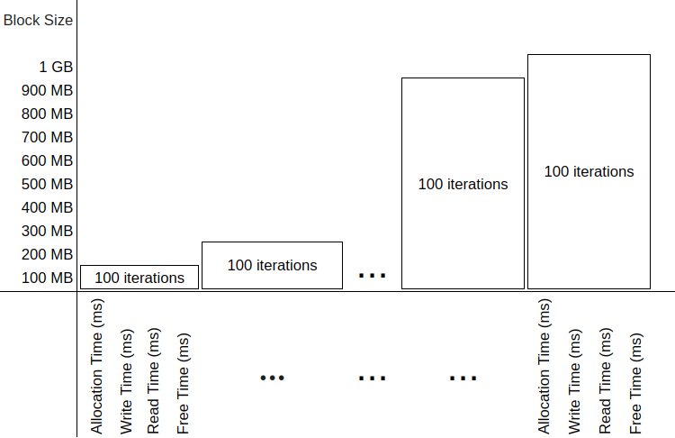

<h1 style="font-size: 2em;">Performance and safety experiments carried out in secure compartments created on a Morello Board</h1>

This repository documents the performance and security evaluation experiments in secure compartments created on a Morello Board with cheriBSD 24.5.

# 1. Evaluation of the number of library-based compartments

In the CAMB project we are interested in using Morello Boards for creating attestables (compartments) to support the execution of exfiltration sensitive processes. The idea is to create attestables to host the executions of the sensitive code of the exfiltration sensitive process. We account for attestables that remain active for several hours
or days. The question that emerges here is how many compartments can be created to run simultaneously on a single Morello Board? To find this limit, we created and run simultaneously on a Morello Board an increasing number of compartments. Within each compartment we deployed and integration process that sent requests to remote applications to retrieve data. We though that the limit depended on the amount of RAM memory of the Morello Board and tried to exhaust it by means of systematically increasing the number of compartments.

## 1.1. Experiment

The main aim of this experiment is to measure and analyse how the memory of a Morello Board is consumed by instances (also called replicas) of attestables. To this end, we loaded the attestable with a C program compiled with the library compartmentalisation tool and loaded in a compartment; precisely, we used the enterprise application integration (see yellow box) use case implemented in - [tee-compartimentalisation-study-case repository] https://github.com/gca-research-group/tee-compartimentalisation-study-case).

The metric to measure is the number of attestables that can be created on a Morello Board before consuming 90% of its memory.

In addition to the number of attestables, we took the opportunity to collect metrics about the time it takes the operating system to wipe the memory used by the attestable.

Some experimental facts:

1.  The Morello board used to conduct the experiment has 17,118,408,704 bytes (approximately 17,118.4 MB). Thus, 90 per cent of its memory is 15,406,567,833.6 bytes (approximately 15,406.5 MB).

2.  In the experiments that we conducted, we loaded code of the EAI implemented in (see yellow box) - [tee-compartimentalisation-study-case repository](https://github.com/gca-research-group/tee-compartimentalisation-study-case).
   
We compiled as shown below:

      $ clang-morello -march=morello+c64 -mabi=purecap -g -o integration_process integration_process.c -L. -lssl -lcrypto -lpthread

4.  `cheri-cap-experiment.py` script is used to create the [replicas of the attestables](https://github.com/gca-research-group/tee-morello-performance-experiments/blob/main/cheri-caps-executable-performance/cheri-cap-experiment-results.csv),
    and collect metrics. We incremented the number of replicas created
    from 1 to N. See replication of attestable results.

The Figure 1 shows the experiment set up:

*Figure 1: Memory exhaustion by attestable replicas.*

The graph, shown in Figure 2, shows the behaviour of memory
consumption and elapsed time as the number of testable replicas
increases on the Morello Board.

*Figure 2: Memory consumption and elapsed time versus number of replicas on the Morello board.*

Imagine that user Alice is conducting the experiment. To create the
attestables and collect the metrics, Alice executes the following steps:

1.  **Initiation:** In the Morello board, Alice initiates
    *cheri-cap-experiment.py*.

2.  **Launch:** To launch *cheri-cap-experiment.py*, Alice executes:

            % python3 cheri-cap-experiment.py

3.  `python3 cheri-cap-experiment.py` runs incrementally, creating
    attestable replicas until it detects that the attestables have
    consumed 90% of the 17,118.4 MB of the Morello Board's memory, that
    is, about 15,406.5 MB.

**Preliminary observations:**

The results are shown in replication of attestable results and exhibit
an unexpected behaviour. We expected memory consumption to increase
steadily from 1,628.3 MB, which corresponds to a single attestable
replica, to 15,406.5 MB (90% of total memory) consumed by N attestable
replicas. The aim was to determine the value of N.

However, unexpectedly, memory consumption increased steadily only up to
the creation of 3,800 attestable replicas, which consumed 14,582.5 MB.
Beyond that, intriguingly, memory consumption decreases as the number of
attestable replicas increases. Note that the last metric shows that
8,991 attestable replicas consume 13,066.4 MB (approximately 76% of the
total memory).

We do not have an explanation for that yet. We need to double check
measurements. We are showing this preliminary result only to show that
this is a pending question in our agenda. The analysis of the time to
wipe the memory of the attestable replicas is also pending.

The cpu-performance and memory-performance folders contain code and
results of some experiments in progress. Cpu-performance is meant to
measure the performance of code running inside attestables in the
computation of some mathematical operations, integer arithmetic,
floating point arithmetic, and array manipulation. Memory-performance is
meant to assess the time it takes an attestable to allocate and free
blocks of memory of different sizes.

# 2. CPU Performance Tests on the Morello Board

The main aim of this experiment is to measure and analyse the
performance of the Morello Board's CPU by comparing the results of
identical tests carried out inside and outside a secure enclosure. The
tests measured the time required to perform computational operations,
including complex mathematical functions, arithmetic operations with
integers, floating point operations and matrix manipulation. The complex
mathematical functions included sine, cosine, tangent, square root and
logarithm. The integer arithmetic tests focused on multiplication,
division, subtraction and modulo operations. For floating point
operations, the focus was also on multiplication, division and
subtraction. The matrix manipulation test involved initialising matrices
and performing operations such as multiplication and division. The
execution time of each operation was measured and recorded. These tests
were repeated 100 times for each operation, in both environments -
inside the secure compartment and in the Morello Board's normal
operating environment - and the results were saved in a CSV format file
for each environment.

<pre style="border: 1px solid #ddd; padding: 10px; background-color: #f9f9f9; font-family: monospace;">
Algorithm 1: CPUPerformance

1. perform_tests(log_file, total_time)
2. begin
3.     for test_num in NUM_TESTS do
4.         start_time = capture_time()
5.         execute_operations(WORKLOAD_SIZE)
6.         end_time = capture_time()
7.         cpu_time = calculate_cpu_time(start_time, end_time)
8.         results(log_file, test_num, cpu_time)
9.         total_time += cpu_time
10.    endfor
11. end
</pre>

Execution begins with the perform_tests function (line 1), which
receives as a parameter a log file where the results will be stored and
the total accumulated time needed to run the tests. The function enters
a repeat loop that is repeated the number of times specified by
NUM_TESTS (line 3), where each iteration represents a test identified by
test_num. In each iteration, the initial test time is recorded (line 4),
followed by the execution of the computational operations determined by
WORKLOAD_SIZE (line 5). At the end of execution, the final time is
recorded (line 6), and the total CPU time used is calculated by
subtracting the start_time from the end_time (line 7). This time is then
recorded in the log file, along with the test number (line 8), and also
added to total_time, which accumulates the total time spent on all the
tests (line 9).

The code used for the tests is available from the [tee-morello-performance-experiments repository](https://github.com/gca-research-group/tee-morello-performance-experiments/tree/main/cpu-performance).

**Test procedure**

Suppose user Alice is conducting the experiment. To carry out the CPU
performance tests and collect the results, Alice takes the following
steps:

1.  **Start:** Alice compiles and runs the test program in the two
    scenarios described above:

    -   **Inside the compartment:** Alice runs the program
        `cpu-in-experiment.c` on the Morello Board, using the secure
        environment.

        -   **Compile:**
            `clang-morello -march=morello+c64 -mabi=purecap -g -o cpu-in-experiment cpu-in-experiment.c -L. -lm`

        -   **Run:**
            `proccontrol -m cheric18n -s enable ./cpu-in-experiment`

    -   **Outside the compartment:** Alice runs the program
        `cpu-out-experiment.c` in the Morello Board's normal operating
        environment.

        -   **Compile:**
            `clang-morello -o cpu-out-experiment cpu-out-experiment.c -lm`

        -   **Run:** `./cpu-out-experiment`

2.  **Execution:** The program iterates automatically through the
    different types of operations, performing complex mathematical
    calculations, arithmetic operations with integers, floating point
    operations, and matrix manipulation.

3.  **Repetition:** Each operation is repeated 30 times. The time of
    each operation is recorded in files in CSV format for both
    environments.

**Results**

The results of the tests carried out inside the secure compartment were
stored in the file `cpu-in-experiment-result.csv`, while the results of
the run in the Morello Board's normal environment were stored in
`cpu-out-experiment-result.csv`. The
Table 1 compares the average execution
times for each type of operation in the two environments.

  
<strong>Table 1. CPU Time Comparison</strong>

  <table>
    <tr>
      <th>Test Type</th>
      <th>CPU Time (ms) - Out Compartment</th>
      <th>CPU Time (ms) - In Compartment</th>
    </tr>
    <tr>
      <td>Math</td>
      <td>46696</td>
      <td>69998</td>
    </tr>
    <tr>
      <td>Int</td>
      <td>923</td>
      <td>993</td>
    </tr>
    <tr>
      <td>Float</td>
      <td>816</td>
      <td>785</td>
    </tr>
    <tr>
      <td>Array</td>
      <td>1419</td>
      <td>1460</td>
    </tr>
  </table>

**Analysing the results**

According to the Table 1, the results show that, on average,
complex mathematical operations within the secure compartment took
69,998 ms, while in the normal operating environment the time was 46,696
ms, representing a difference of approximately 49.74 per cent. For
arithmetic operations with integers, the average time was 993 ms inside
the secure compartment and 923 ms in the normal operating environment, a
difference of 7.58 per cent. For floating point operations, the time
inside the safe compartment was 785 ms compared to the normal operating
environment (816 ms), showing a slight improvement of 3.80 per cent. As
for matrix manipulation operations, the time inside the safe compartment
was 1,460 ms, while in the normal operating environment it was 1,419 ms,
indicating an increase of 2.89 per cent.

The Figure 3 illustrates the differences in
performance between operations conducted within and outside the secure
compartment.

*Figure 3: Comparison of CPU performance times in and out of the secure compartment on the Morello board.*

These results suggest that the Morello Board's safe compartment
introduces a small performance overhead in more complex operations, such
as mathematical calculations. However, for simpler operations, such as
floating point, the difference is minimal, with a slight increase in
execution time within the secure compartment. This indicates that the
safe compartment can be used efficiently in specific scenarios without
significantly compromising performance, although the impact is more
noticeable in operations that require more processing.

# 3. Memory Performance Tests on the Morello Board

The main aim of this experiment is to measure and analyse the
performance of memory operations on a Morello Board by testing memory
blocks of different sizes. Specifically, the test evaluates the time
required to allocate, write, read and free memory blocks. To carry out
this experiment, a C program was implemented - according to the
formalism in Algorithm 2 - which automates the memory testing process.
The programme runs repeated tests, increasing the size of the blocks at
each stage and recording the times of each operation. The results are
stored in a file in CSV format. The tests were carried out in two
different environments: inside the TEE, where the programme was compiled
for the CHERI architecture and run in a secure compartment of the
Morello Board; and outside the TEE, where the programme was compiled and
run in the normal operating environment of the Morello Board.

<pre style="border: 1px solid #ddd; padding: 10px; background-color: #f9f9f9; font-family: monospace;">
Algorithm 2: MemoryPerformance

1. perform_tests(log_file, total_time)
2. begin
3.     foreach block_size in MIN_BLOCK_SIZE to MAX_BLOCK_SIZE step BLOCK_STEP do
4.         foreach test_num from 1 to NUM_TESTS do
5.             allocation_time = time(malloc(block_size))
6.             write_time = time(write_to_memory(block, block_size))
7.             read_time = time(read_from_memory(block, block_size))
8.             free_time = time(free(block))
9.             log(log_file, block_size, test_num, allocation_time, write_time, read_time, free_time)
10.        endfor
11.    endfor
12. end
</pre>

Algorithm 2 details how to perform memory performance tests and record
the results. Execution begins with the perform_tests function (line 1),
which receives as parameters a log file where the results will be stored
and the total accumulated time needed to run the tests. The function
enters a repeat loop that iterates over different memory block sizes,
defined from MIN_BLOCK_SIZE to MAX_BLOCK_SIZE with increments specified
by BLOCK_STEP (line 3). For each block size, another loop is started,
repeating the tests the number of times defined by NUM_TESTS (line 4).
At each iteration, the memory allocation time is measured with the
malloc function (line 5), followed by the time to write to the block
(line 6), the time to read the block (line 7) and, finally, the time to
free the memory with the free function (line 8). These times are
recorded in the log file along with the test number (line 9). After all
the iterations for all the memory blocks, the process is completed,
allowing the performance of the memory allocation, write, read and free
operations to be measured and compared in different block size
configurations.

**Experimental Configuration**

1.  The memory blocks tested range from 100 MB to 1 GB, with increments
    of 100 MB at each step. Each test involves 30 iterations per block
    size. The diagram in the
    Figure 4 shows the block pattern and the
    times for each operation associated with different block sizes.

*Figure 4: Memory performance at different block sizes on the Morello board.*

    The operations measured are:

    A.  Memory allocation: time required to allocate a block of memory.

    B.  Writing to Memory: time required to write data to the entire allocated memory block.

    C.  Memory read: time taken to read the data from the entire memory block.

    D.  Memory release: time taken to release the memory block back into the system.

2.  The code for the experiment we carried out is available in the [tee-morello-performance-experiments repository](https://github.com/gca-research-group/tee-morello-performance-experiments/tree/main/memory-performance).

**Test procedure**

Imagine that user Alice is conducting the experiment. To carry out the
memory performance tests and collect the results, Alice performs the
following steps:

1.  **Start:** Alice compiles and runs the test programme in two
    different scenarios:

    -   **Inside the compartment:** Alice runs the programme
        `memory-in-experiment-result.c` on the Morello Board, using the
        secure environment.

        -   **Compile:**
            `clang-morello -march=morello+c64 -mabi=purecap -g -o memory-in-experiment memory-in-experiment.c -L. -lm`

        -   **Run:**
            `proccontrol -m cheric18n -s enable ./memory-in-experiment`

    -   **Outside the compartment:** Alice runs the programme
        `memory-out-experiment-result.c` in the normal operating
        environment of the Morello Board.

        -   **Compile:**
            `clang-morello -g -o memory-out-experiment memory-out-experiment.c -lm`

        -   **Run:** `./memory-out-experiment`

2.  **Execution:** The programme automatically iterates over the memory
    block sizes, from 100 MB to 1 GB, performing the following sequence
    for each block size: allocate the block, write to the block, read
    the block, and release the block.

3.  **Repetition:** For each block size, these steps are repeated 30
    times, both inside and outside the compartment. The time of each
    operation is recorded and saved in a CSV file for the environment.

**Results**

For each CSV file, the iteration averages were calculated for each
memory block size in the Allocation Time, Write Time, Read Time and Free
Time attributes. For each memory block value (100 MB, 200 MB, etc.), the
times measured in the iterations were added together and the average was
obtained for each operation (allocation, write, read and free). This was
done separately for the two files, representing in-compartment and
out-of-compartment executions, respectively, as shown in the
Tables 2 and 3.

## Table 2: In Compartment

| Block Size (MB) | Allocation Time (ms) | Write Time (ms) | Read Time (ms) | Free Time (ms) |
|-----------------|----------------------|-----------------|----------------|----------------|
| 100             | 106                  | 295.308         | 282.576        | 97             |
| 200             | 138                  | 590.498         | 565.152        | 272            |
| 300             | 138                  | 885.784         | 847.719        | 318            |
| 400             | 141                  | 1,180.815       | 1,130.297      | 492            |
| 500             | 131                  | 1,476.014       | 1,412.881      | 321            |
| 600             | 168                  | 1,771.086       | 1,695.456      | 399            |
| 700             | 251                  | 2,066.147       | 1,978.022      | 725            |
| 800             | 235                  | 2,361.646       | 2,260.586      | 738            |
| 900             | 312                  | 2,656.590       | 2,543.166      | 1,197          |
| 1000            | 265                  | 2,951.487       | 2,825.741      | 405            |

## Table 3: Out Compartment

| Block Size (MB) | Allocation Time (ms) | Write Time (ms) | Read Time (ms) | Free Time (ms) |
|-----------------|----------------------|-----------------|----------------|----------------|
| 100             | 2                    | 282.574         | 322.944        | 3              |
| 200             | 2                    | 565.140         | 645.880        | 4              |
| 300             | 1                    | 847.708         | 968.814        | 5              |
| 400             | 3                    | 1,130.294       | 1,291.766      | 7              |
| 500             | 3                    | 1,412.856       | 1,614.708      | 6              |
| 600             | 2                    | 1,695.426       | 1,937.630      | 6              |
| 700             | 2                    | 1,977.999       | 2,260.573      | 8              |
| 800             | 2                    | 2,260.593       | 2,583.527      | 8              |
| 900             | 2                    | 2,543.151       | 2,906.485      | 8              |
| 1000            | 2                    | 2,825.742       | 3,229.433      | 9              |

**Analysing the results**

The results illustrated in the graphs in
Figure 5 reveal some trends in relation to the
four main operations: allocating, writing, reading and freeing memory.

*Figure 5: Performance analysis of memory operations on the Morello board.*

-   **Allocation time:** the values resulting from the tests in the
    secure compartment range from 106 ms for 100 MB blocks to 251 ms for
    700 MB blocks, with some variations across block sizes. In the
    Morello Board's normal operating environment, the allocation time is
    considerably shorter, ranging from 5 ms (100 MB) to 7 ms (900 MB).

-   **Write time:** in both environments, the times follow a linear
    behaviour as the block size increases. In the secure compartment,
    the values start at 295,308 ms for 100 MB blocks and reach 2,951,487
    ms for 1 GB blocks. In the normal operating environment, the times
    are slightly longer, ranging from 491,512 ms (100 MB) to 4,903,282
    ms (1 GB).

-   **Read time:** the results also show a linear behaviour in both
    environments. Inside the secure compartment, the read time starts at
    282,576 ms (100 MB) and increases up to 2,825,741 ms (1 GB). In the
    normal operating environment, the times vary from 245,263 ms (100
    MB) to 2,452,597 ms (1 GB), being slightly longer.

-   **Memory release time:** shows similar behaviour in both
    environments. In the secure compartment, the time varies from 97 ms
    (100 MB) to 1,197 ms (900 MB), while in the normal operating
    environment the times are lower, ranging from 4,499 ms (100 MB) to
    44,750 ms (1 GB).

Therefore, the results show that the secure environment imposes a
greater burden on allocation time, with significant variations compared
to the normal operating environment. On the other hand, write time and
read time follow similar patterns, with the secure environment showing
slightly higher results. However, the memory release time stands out,
being significantly higher in the secure compartment. These results
indicate that although the secure compartment imposes some overhead, it
can still be used efficiently for memory operations.

# 4. Morello Board Pipe Communication Performance Tests

The main objective of this experiment is to measure the performance of
communication between processes on the Morello Board using pipes,
evaluating the time taken to write and read messages. The experiment was
run both inside a secure compartment and outside the compartment, in the
normal operating environment of the Morello Board. The aim is to compare
the performance of these two scenarios and understand the impact of
secure memory compartmentalisation on the communication time between
processes.

To conduct this experiment, we developed a C programme that automates
the exchange of messages between parent and child processes via a pipe,
used here as a communication mechanism between processes. During the
experiment, the child process is tasked with writing messages of a
predetermined length to the pipe. At the same time, the parent process
reads these messages, recording the write and read times. The programme
has been specifically configured to test messages of a defined size,
with each test timing the writing and reading times. The results of
these tests are recorded in a file in CSV format. Algorithm 3 gives a
detailed description of the experimental flow.

<pre style="border: 1px solid #ddd; padding: 10px; background-color: #f9f9f9; font-family: monospace;">
Algorithm 3: PipeCommunicationPerformance

1.  start_test(log_file)              
2.  begin
3.      define STRLEN  
4.      define NUM_OF_MSG 
5.      for test_num from 1 to NUM_OF_MSG do
6.          if child_process
7.              start_timer(write_time)     
8.              write(pipe, message of size STRLEN)        
9.              stop_timer(write_time)      
10.             write(pipe, write_time)     
11.         else parent_process
12.             read(pipe, message of size STRLEN)         
13.             read(pipe, write_time)      
14.             start_timer(read_time)      
15.             stop_timer(read_time)       
16.             log(log_file, test_num, write_time, read_time) 
17.         endif
18.     endfor
19. end
</pre>

In Algorithm 3, the start_test function (line 1) starts a sequence of
operations involving writing and reading messages through a pipe. First,
the STRLEN and NUM_OF_MSG parameters are set in lines 3 and 4,
establishing the size of the messages and the total number of messages
to be sent. For each test, which iterates from 1 to NUM_OF_MSG (line 5),
the child process, if active, starts timing the write time (line 7),
writes a message of size STRLEN to the pipe (line 8) and then records
the write time (line 9), sending this time back to the parent process
via the pipe (line 10). In parallel, the parent process reads the
message and the write time from the pipe (lines 12 and 13), starts
counting the read time as soon as it starts reading (line 14), and stops
counting when it finishes reading (line 15). The write and read times,
along with the test number, are recorded in the log file (line 16). This
process is repeated until all the tests have been completed (line 17).

**Experimental Configuration**

1.  The following diagram
    (Figure 6) represents the experimental
    configuration used to evaluate communication between processes via a
    pipe. The data blocks, in this case represented by messages, vary by
    a standard size of 1024 bytes per message, and a total of 100
    messages are tested to analyse the consistency and efficiency of
    communication between internal processes.

*Figure 6: Communication of the process via pipe.*

    The operations measured are:

    -   Writing to memory: time taken to write data to the pipe.

    -   Memory read: time taken to read the data sent via the pipe.

2.  The code for the experiment we carried out is available in the
    [tee-morello-performance-experiments
    repository](https://github.com/gca-research-group/tee-morello-performance-experiments/tree/main/pipe-performance).

**Test procedure**

Imagine that user Alice is conducting the experiment. To carry out the
pipe communication tests and collect the results, Alice performs the
following steps:

1.  **Start:** Alice compiles and runs the test programme in two
    different scenarios:

    -   **Inside the compartment:** Alice runs the programme
        `pipe-in-experiment.c` on the Morello Board, using the secure
        environment.

        -   **Compile:**
            `clang-morello -march=morello+c64 -mabi=purecap -g -o pipe-in-experiment pipe-in-experiment.c -L.`

        -   **Run:**
            `proccontrol -m cheric18n -s enable ./pipe-in-experiment`

    -   **Outside the compartment:** Alice runs the programme
        `pipe-out-experiment.c` in the normal operating environment of
        the Morello Board.

        -   **Compile:**
            `clang-morello -g -o pipe-out-experiment pipe-out-experiment.c`

        -   **Run:** `./pipe-out-experiment`

2.  **Execution:** The programme sends a total of 100 messages, each of
    a predefined size of 1024 bytes. For each message sent by the child
    process, the write time is measured and the message, along with the
    write time, is transmitted via the pipe to the parent process, which
    in turn records the read time as soon as the message is received.

3.  **Repetition:** Each set of write and read operations is repeated
    100 times for each environment - inside the compartment and outside
    the compartment. The times of each operation are recorded in a file
    in CSV format for each environment.

**Results**

The results of the tests carried out inside the secure compartment were
stored in the file `pipe-in-experiment-result.csv`, while the results of
the normal ambient execution of the Morello Board were stored in
`pipe-out-experiment-result.csv`. The
Tables 4 and 5 shows the records for each data set:

## Table 4: Performance Data Inside the Compartment

| Test | Message Size (Bytes) | Write Time (ms) | Read Time (ms) | Total Time (ms) |
|------|-----------------------|-----------------|----------------|-----------------|
| 1    | 1024                  | 0.016           | 0.161          | 0.177           |
| 2    | 1024                  | 0.003           | 0.068          | 0.071           |
| 3    | 1024                  | 0.003           | 0.075          | 0.078           |
| 4    | 1024                  | 0.003           | 0.077          | 0.080           |
| ...  | ...                   | ...             | ...            | ...             |
| 100  | 1024                  | 0.003           | 0.079          | 0.082           |

## Table 5: Performance Data Outside the Compartment

| Test | Message Size (Bytes) | Write Time (ms) | Read Time (ms) | Total Time (ms) |
|------|----------------------|-----------------|----------------|-----------------|
| 1    | 1024                 | 0.013           | 0.059          | 0.072           |
| 2    | 1024                 | 0.001           | 0.001          | 0.003           |
| 3    | 1024                 | 0.001           | 0.001          | 0.002           |
| 4    | 1024                 | 0.001           | 0.001          | 0.002           |
| ...  | ...                  | ...             | ...            | ...             |
| 100  | 1024                 | 0.001           | 0.002          | 0.003           |

The Tables 4 and 5 contain information on the test number, the size of the messages, the write and read times, and the total time for each operation.

**Analysing the results**

The graphs in the Figure 7 show the write and read times for each
test in the two scenarios, inside and outside the secure environment
(compartment) on the Morelo Board.

*Figure 7: Comparison of write and read times for pipe communication in secure and normal environments on the Morello Board.*

As we can see, the graphs reflect variations in write and read times,
both inside and outside the safe room environment. There are
fluctuations in the times recorded which may point to variability in the
pipe's performance under different operating conditions. When comparing
the graphs for the two environments, it is possible to notice
differences in the times, which suggests that security configurations or
differences in the operating environment can significantly influence
communication efficiency.

# 5. Testing the Exposure of Sensitive Data in Memory Regions through Direct Memory Access (Memory Scraping)

The main objective of this experiment is to measure and analyze the
contents of the memory regions with read and write (RW) permissions of a
target program running on the CheriBSD 24.05 operating system. This
target program is the same one used in the Attestable's performance
evaluation experiment, `integration_process`. To do this, the experiment
identifies the program's RW memory regions and attempts to directly
extract the content stored in these regions, using the Python script
`memory_reader.py`, available in the
[tee-morello-performance-experiments
repository](https://github.com/gca-research-group/tee-morello-performance-experiments/tree/main/security).
This experiment evaluates the potential for exposing sensitive data in
memory by directly accessing areas where the program may store temporary
or sensitive data.

**Experimental Configuration**

The Figure 8 sequence diagram details how a
programme's memory regions can be accessed directly from the operating
system. To do this, the process implemented through the Memory Reader
code asks the Cheri OS for the PID of the target process by name,
`getPID(processName)`, receiving the PID in response. Memory Reader then
uses this PID to ask Cheri OS for a list of the memory regions that have
read and write (RW) permissions associated with the process,
`getMemoryAddresses(PID)`, and the operating system returns the mapped
regions. The Memory Reader then starts direct memory reading (scraping)
by accessing the process's memory file and, for each RW region listed,
fetches the region's starting address, reads the content between the
starting and ending address, and receives the decoded data. This cycle
is repeated for all RW regions, ensuring that all memory areas
accessible for reading and writing are explored. Finally, the Memory
Reader records the read data in the log, `output(dataReadFromMemory)`.

*Figure 8: Sequence diagram detailing the memory scraping process through direct access in the Cheri OS.*

**Test procedure**

To carry out the direct memory reading experiment, Alice performs the
following steps on the Morello Board:

1.  **Start:** Alice compiles and runs the programme `memory_reader.py`
    in two different scenarios:

    -   **Inside the compartment:** Alice compiles and runs the
        `integration_process.c` programme on the Morello Board, using
        the secure environment.

        -   **Compile:**
            `clang-morello -march=morello+c64 -mabi=purecap -g -o integration_process integration_process.c -L. -lssl -lcrypto -lpthread`

        -   **Run:**
            `proccontrol -m cheric18n -s enable ./integration_process`

    -   **Outside the compartment:** Alice compiles and runs the
        `integration_process.c` programme in the Morello Board's normal
        operating environment.

        -   **Compile:**
            `clang-morello -o integration_process integration_process.c -lssl -lcrypto -lpthread`

        -   **Run:** `./integration_process`

2.  **Launch:** Alice starts the script that performs direct memory
    reading with the following command:

    -   **Run:** `python3 memory_reader.py`

3.  **Execution:** `memory_reader.py` cycles through each RW region,
    directly reading the data between the start and end addresses of
    each region. Alice observes the results on the terminal output.

**Results**

The Table 6 shows the results of tests carried
out to evaluate access to sensitive data stored and processed by
integration_process running in different environments - inside and
outside Morello's secure enclosure. Each test varied the user's
permission level (root or with reduced permissions), recording whether
memory access was successful and whether sensitive data was visible.

## Table 6: Access Control Test Results for Sensitive Data

| Test | Environment     | User Permissions | Access Result | Sensitive Data Visible |
|------|-----------------|------------------|---------------|------------------------|
| 1    | in Compartment  | Root             | Success       | Yes                    |
| 2    | in Compartment  | Different user   | Failure       | No                     |
| 3    | out Compartment | Root             | Success       | Yes                    |
| 4    | out Compartment | Different user   | Failure       | No                     |

Table 6 metadata:

### Description of Test Parameters

- **Test ID:** Unique identification for each test carried out.
- **Environment:** Indicates whether the test was carried out inside Morello's secure compartment or in the normal operating environment.
- **User Permissions:** Details the user's permission level (e.g., root or a user with reduced permissions).
- **Access Result:** Result of the access, indicating whether the memory region was successfully accessed.
- **Sensitive Data Visible:** Indicates whether the test was able to visualize sensitive data or not.

**Analysing the results**

The graph in the Figure 9 shows the differences in the results
of access and visibility of confidential data according to the
environment and user permissions.

*Figure 9: Differences in access results and visibility of confidential data based on environment and user permissions.*

The results show that access to sensitive data is allowed to any user
with root permissions, both in Morello's secure compartment and outside
it, indicating that high permissions grant unrestricted access. In
contrast, users with reduced permissions are unable to access this data
in either environment, demonstrating that the secure enclosure
consistently blocks unauthorised access, while the environment outside
the enclosure also maintains effective controls.

However, although compartmentalisation is designed to protect sensitive
data by restricting access, including to the user who initiated the
process, the results indicate that the current configuration may not be
sufficient to guarantee complete isolation. This behaviour highlights
the importance of investigating further adjustments to the Morello
Board's compartmentalisation, especially for contexts where there is a
need to protect sensitive data.

# PRINTS

**Process memory regions running outside the secure compartment:**

*Figure 10: Process memory regions running outside the secure compartment.*

**Memory regions of the process running inside the secure compartment:**

*Figure 11: Memory regions of the process running inside the secure compartment.*

**Finalisation of the process by the system**

The process runs for a certain period of time (around 1 hour) and is
finalised by the system: `killed`.

*Figure 12: Finalisation of the process by the system.*

**The morello board crashed at this point.**

Regis needs to contact the morello-board s administrator \[erik\] to
reboot.

*Figure 13: The Morello board crashed at this point.*

The remote ssh shell that connects to the morello board crashes when the
mem scanner prog tries to read this range of mem add: 0x4a300000 -
0x4bb00000.

Other ssh shell connections continue working as normal.

There are occasion when the prog manage to crash the whole morello board
\[the actual cheriBSD\] , no more shells can be opened. It seem that
total crash takes place when the prog tries to read some specific mem
ranges \[we dont know which ones cause total crashes; we believe that
they are ranges where priviledge soft runs.

This is our preliminary observation.

*Figure 14: client_loop: send disconnect: Broken pipe.*

**Error occurs after server crash and restart \[Erik\].**

**Error accessing process memory:**

    [Errno 2] No such file or directory: '/proc/3587/mem'

This error occurs because the file `/proc/{pid}/mem`, which the script
tries to access to read a process's memory, is not available or cannot
be accessed. This may happen if the process does not exist, the PID is
incorrect, or the script does not have the necessary permissions to
access this path.

![\[Errno 2\] No such file or directory: '/proc/3587/mem'.](figs/error.png)

*Figure 15: \[Errno 2\] No such file or directory: '/proc/3587/mem'.*

**Procedure for running `memory_reader.py` after MB is rebooted.**

Check that /proc is mounted correctly:

*Figure 16: Check that /proc is mounted correctly.*

If it's not mounted, you need to try mounting it:

*Figure 17: If it's not mounted, you need to try mounting it.*

After the command to mount /proc, it was simply possible to run the
memory_reader.py script again.
